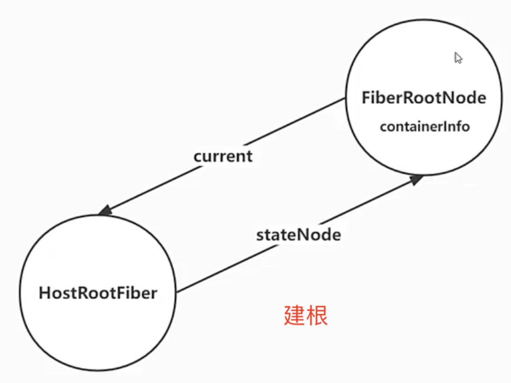
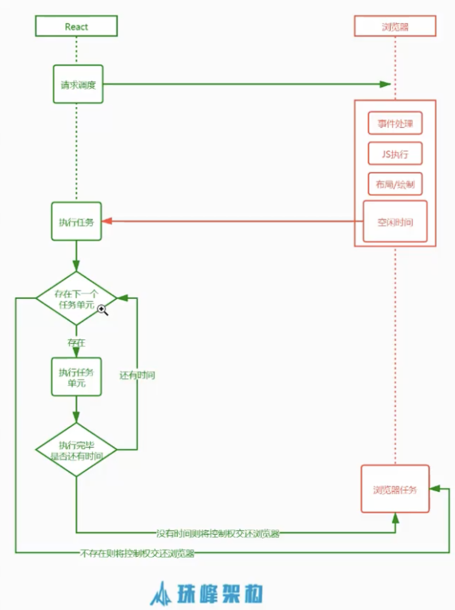
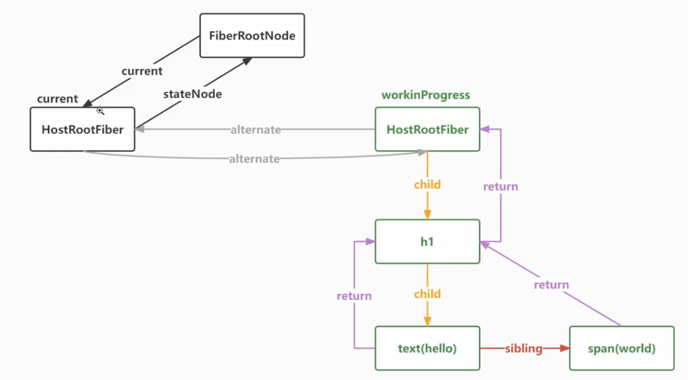
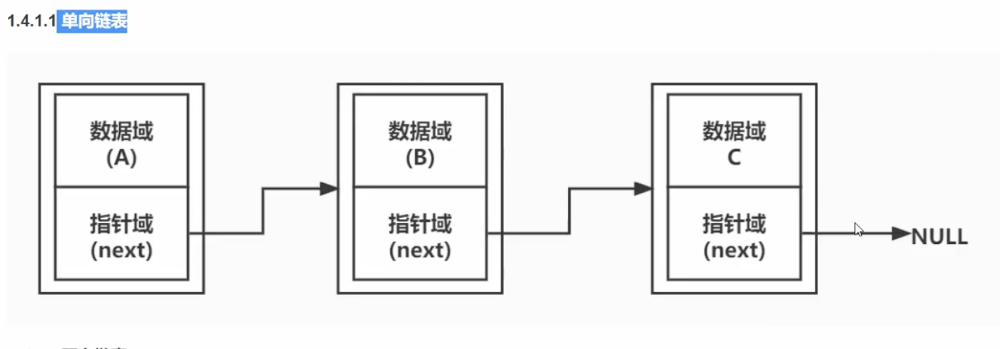
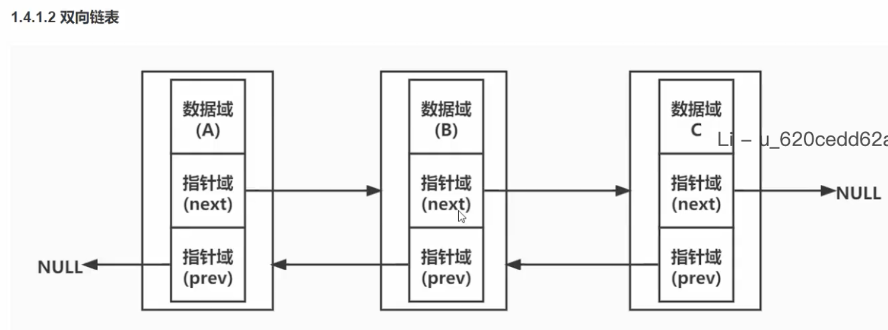
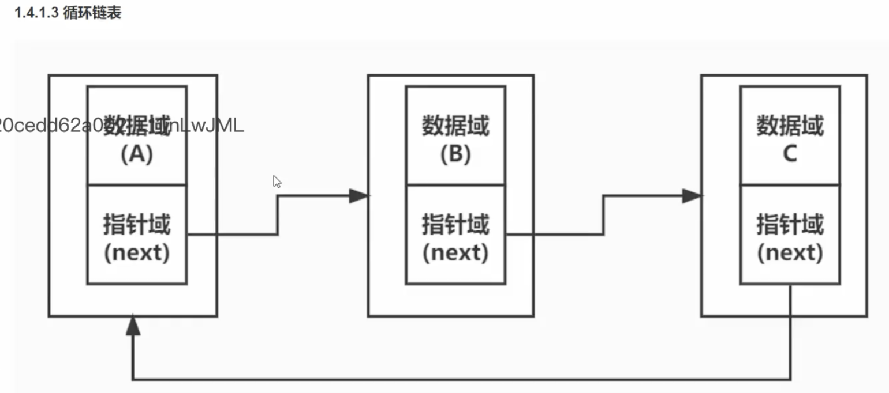
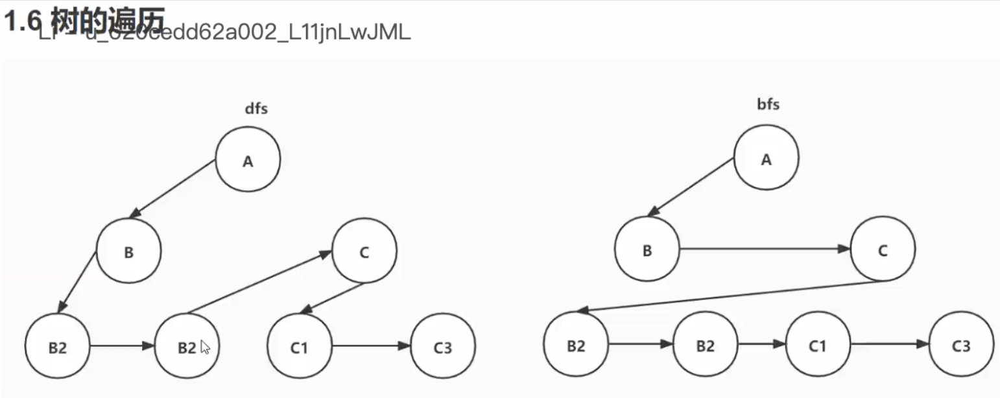
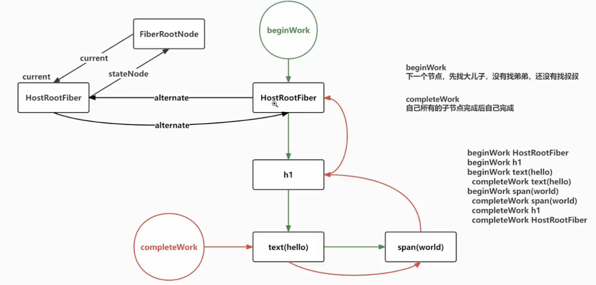

# React18.2 源码学习

## 1 创建根方法 createRoot

### 1.1 解决路径别名在 vscode 中无法跳转问题-[jsconfig.json](../../public/react18-learn/jsconfig.json)

```json
{
  "compilerOptions": {
    "baseUrl": "./",
    "paths": {
      "react/*": ["src/react/*"],
      "react-dom/*": ["src/react-dom/*"],
      "react-reconciler/*": ["src/react-reconciler/*"],
      "scheduler/*": ["src/scheduler/*"],
      "shared/*": ["src/shared/*"]
    }
  },
  "exclude": ["node_modules", "dist"]
}
```

### 1.2 在 main.jsx 中使用 jsx 并渲染页面-[src/main.jsx](../../public/react18-learn/src/main.jsx)

```js
import { createRoot } from 'react-dom/client'
let element = (
  <h1>
    hello <span style={{ color: 'red' }}>world</span>
  </h1>
)
debugger
const root = createRoot(document.getElementById('root'))
root.render(element)
```

### 1.3 引入创建根方法 createRoot-[src/react-dom/client.js](../../public/react18-learn/src/react-dom/client.js)

```js
export { createRoot } from './src/client/ReactDOMRoot'
```

### 1.4 引入创建根方法实现方法 createRoot-[src/react-dom/src/client/ReactDOMRoot.js](../../public/react18-learn/src/react-dom/src/client/ReactDOMRoot.js)

```js
import { createContainer } from 'react-reconciler/src/ReactFiberReconciler'

function ReactDOMRoot(internalRoot) {
  this._internalRoot = internalRoot
}

export function createRoot(container) {
  // dev#root
  const root = createContainer(container)
  return new ReactDOMRoot(root)
}
```

### 1.5 建根图片

- 

## 2 创建根方法 createRoot & FiberRootNode & 时间切片演示

### 2.1 创建方法 createContainer-[src/react-reconciler/src/ReactFiberReconciler.js](../../public/react18-learn/src/react-reconciler/src/ReactFiberReconciler.js)

```js
import { createFiberRoot } from './ReactFiberRoot'
export function createContainer(containerInfo) {
  return createFiberRoot(containerInfo)
}
```

### 2.2 创建 FiberRoot 方法-createFiberRoot-[src/react-reconciler/src/ReactFiberRoot.js](../../public/react18-learn/src/react-reconciler/src/ReactFiberRoot.js)

```js
function FiberRootNode(containerInfo) {
  this.containerInfo = containerInfo
}

export function createFiberRoot(containerInfo) {
  const root = new FiberRootNode(containerInfo)
  return root
}
```

### 2.3 FiberRootNode 解释

- FiberRootNode = containerInfo
- FiberRootNode 本质是一个真实的容器 DOM 节点（div#root）
- FiberRootNode 是一个真实 DOM
- 打印查看 FiberRootNode
- [src/main.jsx](../../public/react18-learn/src/main.jsx)

```js
console.log(root) //ReactDOMRoot > _internalRoot > containerInfo
```

### 2.4 fiber 解决问题

1. 性能瓶颈
   1. JS 任务执行时间过长
      1. 浏览器刷新频率为 60Hz,大概 16.6 毫秒渲染一次，而 JS 线程和渲染线程是互斥的，所以如果 JS 线程执行任务时间超过 16.6ms 的话，就会导致掉帧，导致卡顿，解决方案就是 React 利用空闲的时间进行更新，不影响渲染进行的渲染
      2. 把一个耗时任务切分成一个个小任务，分布在每一帧里的方式就叫时间切片
2. 屏幕刷新率
   1. 目前大多数设备的屏幕刷新率为 60 次/秒
   2. 浏览器渲染动画或页面的每一帧的速率也需要跟设备屏幕的刷新率保持一致
   3. 页面是一帧一帧绘制出来的，当每秒绘制的帧数(FPS)达到 60 时，页面是流畅的,小于这个值时，用户会感觉到卡顿
   4. 每个帧的预算时间是 16.66 毫秒 (1 秒/60)
   5. 1s 60 帧，所以每一帧分到的时间是 1000/60 16 ms,所以我们书写代码时力求不让一帧的工作量超过 16ms
3. 帧
   1. 每个帧的开头包括样式计算、布局和绘制
   2. JavaScript 执行 Javascript 引擎和页面渲染引擎在同一个渲染线程,GUI 渲染和 Javascript 执行两者是互斥的
   3. 如果某个任务执行时间过长，浏览器会推迟渲染
   4. 
4. requestIdleCallback
   1. 我们希望快速响应用户，让用户觉得够快，不能阻塞用户的交互
   2. requestIdleCallback 使开发者能够在主事件循环上执行后台和低优先级工作，而不会影响延迟关键事件，如动画和输入响应
   3. 正常帧任务完成后没超过 16 ms,说明时间有富余，此时就会执行 requestIdleCallback 里注册的任务
   4. 

### 2.5 时间切片演示-requestIdleCallback-[doc/6.requestIdleCallback.html](../../public/react18-learn/doc/6.requestIdleCallback.html)

```html
<title>requestIdleCallback</title>
<script>
  function sleep(duration) {
    for (var t = Date.now(); Date.now() - t <= duration; ) {}
  }
  const work = [
    () => {
      console.log('第 1 个任务开始')
      sleep(20)
      console.log('第 1 个任务结束')
    },
    () => {
      console.log('第 2 个任务开始')
      sleep(20)
      console.log('第 2 个任务结束')
    },
    () => {
      console.log('第 3 个任务开始')
      sleep(20)
      console.log('第 3 个任务结束')
    },
  ]
  requestIdleCallback(workLoop)
  function workLoop(deadline) {}
</script>
```

## 3 时间切片演示-fiber-React 与浏览器合作式调度图示

### 3.1 workLoop-时间切片演示-requestIdleCallback-[doc/6.requestIdleCallback.html](../../public/react18-learn/doc/6.requestIdleCallback.html)

```js
function workLoop(deadline) {
  // 因为一倾是 16.6ms,浏览器执行完高优先级之后，如果还有时间，会执行 workLoop，timeRemaining 获取此倾剩下的时间
  console.log('本帧的剩余时间是 ', deadline.timeRemaining())
  while (deadline.timeRemaining() > 1 && works.length > 0) {
    performUnitOfWork()
  }
}
function performUnitOfWork() {
  let work = works.shift() // 取出任务数组中的第一个任务
  work()
}
```

### 3.2 剩余任务但时间不够处理-workLoop-时间切片演示-requestIdleCallback-[doc/6.requestIdleCallback.html](../../public/react18-learn/doc/6.requestIdleCallback.html)

```js
requestIdleCallback(workLoop)
function workLoop(deadline) {
  // 因为一倾是 16.6ms,浏览器执行完高优先级之后，如果还有时间，会执行 workLoop，timeRemaining 获取此倾剩下的时间
  console.log('本帧的剩余时间是 ', deadline.timeRemaining())
  while (deadline.timeRemaining() > 1 && works.length > 0) {
    performUnitOfWork()
  }
  // 剩余任务但时间不够处理
  if (works.length > 0) {
    console.log(
      `只剩下 ${deadline.timeRemaining()}ms, 时间不够了, 等待浏览器下次空闲的时候再帮我调用`
    )
    requestIdleCallback(workLoop)
  }
}
```

- 调试：浏览器打开 6.requestIdleCallback.html

### 3.3 React 模拟 requestIdleCallback 而非使用的原因

1. 兼容性问题
2. 执行时间不可控，React 把每帧执行时间定为 5ms
3. 调度为合作式调度，是用户和浏览器双方的合作

### 3.4 fiber 优势

1. 我们可以通过某些调度策略合理分配 CPU 资源，从而提高用户的响应速度
2. 通过 Fiber 架构，让自己的调和过程变成可被中断。适时地让出 CPU 执行权，除了可以让浏览器及时地响应用户的交互
3. Fiber 是一个执行单元,每次执行完一个执行单元，React 就会检查现在还剩多少时间，如果没有时间就将控制权让出去

### 3.5 React 与浏览器合作式调度图示



## 4 React 遍历 Fiber 顺序 & 单向链表 & 双向链表 & 循环链表 & DFS & 树的遍历 & beginWork-completeWrok

### 4.1 React 遍历 Fiber 顺序

- Fiber 是一种数据结构
- React 目前的做法是使用链表,每个虚拟节点内部表示为一个 Fiber 公从顶点开始遍历
- 如果有第一个儿子，先遍历第一个儿子
- 如果没有第一个儿子，标志着此节点遍历完成
- 如果有弟弟遍历弟弟
- 如果有没有下一个弟弟，返回父节点标识完成父节点遍历，如果有叔叔遍历叔叔
- 没有父节点遍历结束
- 

### 4.2 图示-单向链表 & 双向链表 & 循环链表

- 
- 
- 

### 4.3 深度优先(DFS)

- 深度优先搜索英文缩写为 DFS 即 Depth First search
- 其过程简要来说是对每一个可能的分支路径深入到不能再深入为止，而且每个节点只能访问一次
- 应用场景
  - React 虚拟 DOM 的构建
  - React 的 fiber 树构建

```js
function dfs(node) {
  console.log('node.name:', node.name)
  node.children &&
    node.children.forEach((child) => {
      dfs(child)
    })
}
```

### 4.4 树的遍历-深度和广度



### 4.5 beginWork-completeWrok-执行时机图示



## 5 构建 FiberRootNode 和 HostRootFiber & 构建 HostRootFiber & 创建 Fiber 的 tag & 实际创建 FiberNode 方法 & 增加组件和文本类型的 tag

### 5.1 构建 FiberRootNode 和 HostRootFiber-[src/react-reconciler/src/ReactFiberRoot.js](../../public/react18-learn/src/react-reconciler/src/ReactFiberRoot.js)

```js
export function createFiberRoot(containerInfo) {
  const root = new FiberRootNode(containerInfo)
  // HostRoot指的就是根节点 div#root
  const uninitializedFiber = createHostRootFiber()
  // 根容器的 current 指向当前的根
  root.current = uninitializedFiber
  // 根 fiber 的 stateNode，也就是真实 DOM 节点指向 FiberRootNode
  uninitializedFiber.stateNode = root
  return root
}
```

### 5.2 构建 HostRootFiber-方法 createHostRootFiber-[src/react-reconciler/src/ReactFiber.js](../../public/react18-learn/src/react-reconciler/src/ReactFiber.js)

```js
import { HostRoot } from './ReactWorkTags'
export function createHostRootFiber() {
  return createFiber(HostRoot)
}
```

### 5.3 创建 Fiber 的 tag-HostRoot-[src/react-reconciler/src/ReactWorkTags.js](../../public/react18-learn/src/react-reconciler/src/ReactWorkTags.js)

```js
// 根 Fiber 的 tag
// 每种虚拟 DOM 都会对应自己的 fiber tag 类型
export const HostRoot = 3
```

### 5.4 实际创建 FiberNode 方法-createFiber & ReactFiber-[src/react-reconciler/src/ReactFiber.js](../../public/react18-learn/src/react-reconciler/src/ReactFiber.js)

```js
import { HostRoot } from './ReactWorkTags'
function FiberNode(tag, pendingProps, key) {}
export function createFiber(tag, pendingProps, key) {
  return new FiberNode(tag, pendingProps, key)
}
export function createHostRootFiber() {
  return createFiber(HostRoot)
}
```

### 5.5 增加组件和文本类型的 tag-HostComponent & HostText-[src/react-reconciler/src/ReactWorkTags.js](../../public/react18-learn/src/react-reconciler/src/ReactWorkTags.js)

```js
// 根 Fiber 的 tag
// 每种虚拟 DOM 都会对应自己的 fiber tag 类型
export const HostRoot = 3
export const HostComponent = 5
export const HostText = 6
```
