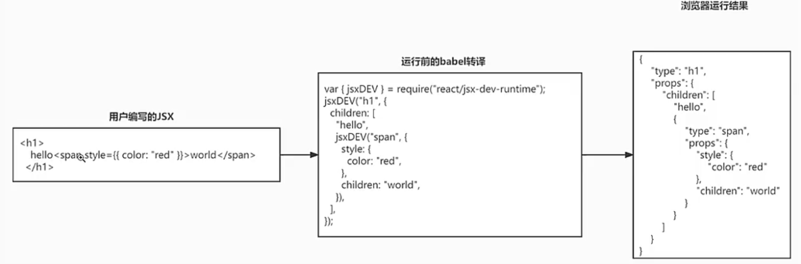

# React18.2 源码学习

## 1 初始化

### 1.1 初始化项目 react18-learn

```bash
mkdir public/react18-learn
cd public/react18-learn
npm init -y
npm i vite @vitejs/plugin-react --save
# react18.2 源码: https://github.com/facebook/react.git
```

### 1.2 vite 配置文件-[vite.config.js](../../public/react18-learn/vite.config.js)

```js
import react from '@vitejs/plugin-react'
import { defineConfig } from 'vite'

export default defineConfig({
  plugins: [react()],
})
```

### 1.3 渲染页面-[index.html](../../public/react18-learn/index.html)

```html
<div id="root"></div>
<script type="module" src="/src/main.jsx"></script>
```

### 1.4 主入口-[src/main.jsx](../../public/react18-learn/src/main.jsx)

```js
console.log('main')
```

### 1.5 脚本执行命令 dev-[package.json](../../public/react18-learn/package.json)

```js
"scripts": {
  "dev": "vite --force"
},
```

## 2 初始化 & react17-jsx 处理

### 2.1 验证脚本命令正确

```bash
npm run dev
# 控制台打印 main
```

### 2.2 react18.2 源码结构

```js
- react18.2-debugger/src/react/packages/
-- react
-- react-dom
-- react-reconciler
-- scheduler
-- shared

- main.jsx
- index.html
- vite.config.js
```

### 2.3 文档补充-React17 以前处理 jsx-[doc/1.react17-before.js](../../public/react18-learn/doc/1.react17-before.js)

```js
// React17 以前，babel 转换写法
const babel = require('@babel/core')
const sourceCode = `
  <h1>
    hello <span style={{ color: 'red' }}>world</span>
  </h1>
`
const result = babel.transform(sourceCode, {
  plugins: [['@babel/plugin-transform-react-jsx', { runtime: 'classic' }]],
})
console.log('result.code:', result.code)
```

### 2.4 安装依赖包并执行

```bash
npm i @babel/core @babel/plugin-transform-react-jsx --save

node doc/1.react17-before.js
```

### 2.5 输出内容

```js
React.createElement(
  'h1',
  null,
  'hello ',
  React.createElement(
    'span',
    {
      style: {
        color: 'red',
      },
    },
    'world'
  )
)
```

## 3 React17 以后处理 jsx & jsx 解析方法 jsxDEV

### 3.1 文档补充-React17 以后处理 jsx-[doc/2.react17-after.js](../../public/react18-learn/doc/2.react17-after.js)

```js
const babel = require('@babel/core')
const sourceCode = `
  <h1>
    hello <span style={{ color: 'red' }}>world</span>
  </h1>
`
const result = babel.transform(sourceCode, {
  plugins: [['@babel/plugin-transform-react-jsx', { runtime: 'automatic' }]],
})
console.log('result.code:', result.code)

/**
import { jsx } from 'react/jsx-runtime'
jsx('h1', {
  children: ['hello', jsx('span', {
    style: {
      color: 'red'
    },
    children: 'world'
  })]
})
// React.createElement = jsx
*/
```

### 3.2 React18 使用 automatic 取代 classic 原因

- 之前开发者需要在代码中手动引入 React，React18 无需此操作

### 3.3 jsx 编译图



### 3.4 jsx 开发运行时文件中引入 jsxDEV-[src/react/jsx-dev-runtime.js](../../public/react18-learn/src/react/jsx-dev-runtime.js)

```js
export { jsxDEV } from './src/jsx/ReactJSXElement'
```

### 3.5 创建 jsx 解析方法 jsxDEV-[src/react/src/jsx/ReactJSXElement.js](../../public/react18-learn/src/react/src/jsx/ReactJSXElement.js)

```js
export function jsxDEV(type, config) {
  let propName // 属性名
  const props = {} // 属性对象
  let key = null // 每个虚拟 DOM 可以有一个可选的 key，用以区分一个父节点下不同子节点
  let ref = null // 引入，后面可以通过这实现获取真实 DOM 的需求
}
```

## 4 完善 jsxDEV & 创建 React 元素的方法 ReactElement & 引入自定义 hasOwnProperty 方法

### 4.1 完善 jsxDEV-赋值 key 和 ref-[src/react/src/jsx/ReactJSXElement.js](../../public/react18-learn/src/react/src/jsx/ReactJSXElement.js)

```js
function hasValidKey(config) {
  return config.key !== undefined
}
function hasValidRef(config) {
  return config.ref !== undefined
}
export function jsxDEV(type, config) {
  // ...
  if (hasValidKey(config)) {
    key = config.key
  }
  if (hasValidRef(config)) {
    ref = config.ref
  }
}
```

### 4.2 完善 jsxDEV-定义验证 config 自有元素常量 RESERVER_PROPS-[src/react/src/jsx/ReactJSXElement.js](../../public/react18-learn/src/react/src/jsx/ReactJSXElement.js)

```js
const RESERVER_PROPS = {
  key: true,
  ref: true,
  __self: true,
  __source: true,
}
```

### 4.3 完善 jsxDEV-赋值 props 对象-[src/react/src/jsx/ReactJSXElement.js](../../public/react18-learn/src/react/src/jsx/ReactJSXElement.js)

```js
export function jsxDEV(type, config) {
  // ...
  for (propName in config) {
    if (
      Object.prototype.hasOwnProperty.call(config, propName) &&
      !RESERVER_PROPS.hasOwnProperty(propName)
    ) {
      props[propName] = config[propName]
    }
  }
  return ReactElement(type, key, ref, props)
}
```

### 4.4 创建 React 元素的方法 ReactElement-[src/react/src/jsx/ReactJSXElement.js](../../public/react18-learn/src/react/src/jsx/ReactJSXElement.js)

- React 元素，又称虚拟 DOM；

```js
import { REACT_ELEMENT_TYPE } from 'shared/ReactSymbols'
function ReactElement(type, key, ref, props) {
  return {
    $$typeof: REACT_ELEMENT_TYPE, // React 元素，又称虚拟 DOM
    type, // h1, span
    key, // 唯一标识
    ref, // 用以获取真实 DOM 元素，最后说明
    props, // 属性 children, style, id, ...
  }
}
```

### 4.5 引入自定义 hasOwnProperty 方法-[src/react/src/jsx/ReactJSXElement.js](../../public/react18-learn/src/react/src/jsx/ReactJSXElement.js)

```js
import hasOwnProperty from 'shared/hasOwnProperty'
```

## 5 完善引入变量 hasOwnProperty & REACT_ELEMENT_TYPE & 配置源码文件夹别名

### 5.1 创建自定义 hasOwnProperty 方法-[src/shared/hasOwnProperty.js](../../public/react18-learn/src/shared/hasOwnProperty.js)

```js
const { hasOwnProperty } = Object.prototype
export default hasOwnProperty
```

### 5.2 修改 jsxDEV 方法中 hasOwnProperty 使用-[src/react/src/jsx/ReactJSXElement.js](../../public/react18-learn/src/react/src/jsx/ReactJSXElement.js)

```js
export function jsxDEV(type, config) {
  // ...
  for (propName in config) {
    if (
      hasOwnProperty.call(config, propName) &&
      !RESERVER_PROPS.hasOwnProperty(propName)
    ) {
      props[propName] = config[propName]
    }
  }
  return ReactElement(type, key, ref, props)
}
```

### 5.3 定义常量 REACT_ELEMENT_TYPE 表示 React 元素-[src/shared/ReactSymbols.js](../../public/react18-learn/src/shared/ReactSymbols.js)

```js
// 表示此虚拟 DOM 的类型是一个 React 元素
export const REACT_ELEMENT_TYPE = Symbol.for('react.element')
```

### 5.4 引入常量 REACT_ELEMENT_TYPE-[src/react/src/jsx/ReactJSXElement.js](../../public/react18-learn/src/react/src/jsx/ReactJSXElement.js)

```js
import { REACT_ELEMENT_TYPE } from 'shared/ReactSymbols'
```

### 5.5 vite 配置文件-配置源码文件地址别名-[vite.config.js](../../public/react18-learn/vite.config.js)

```js
import react from '@vitejs/plugin-react'
import path from 'path'
import { defineConfig } from 'vite'

export default defineConfig({
  resolve: {
    alias: {
      react: path.resolve('src/react'),
      'react-dom': path.resolve('src/react-dom'),
      'react-reconciler': path.resolve('src/react-reconciler'),
      scheduler: path.resolve('src/scheduler'),
      shared: path.resolve('src/shared'),
    },
  },
  plugins: [react()],
})
```
