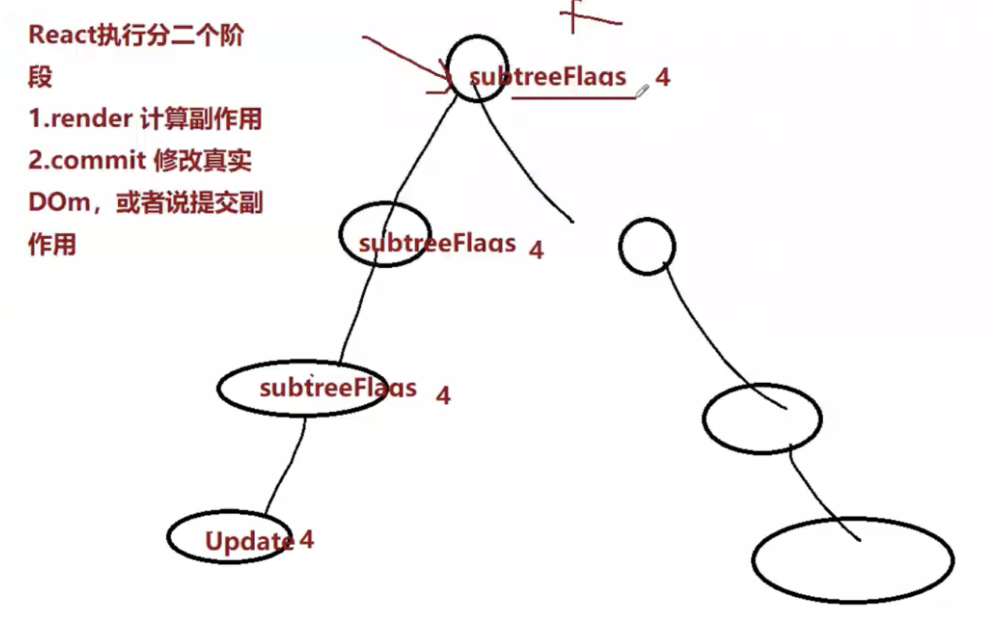
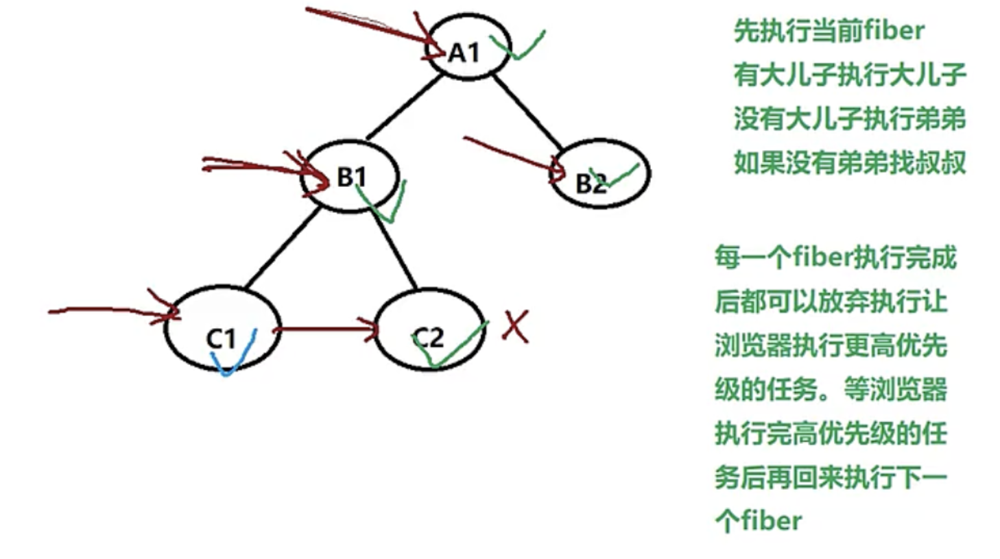

# React18.2 源码学习

## 1 构建 FiberNode 属性 & 二进制比较 & 创建判断操作类型的二进制常量

### 1.1 构建 FiberNode 属性-[src/react-reconciler/src/ReactFiber.js](../../public/react18-learn/src/react-reconciler/src/ReactFiber.js)

```js
/**
 * @param {*} tag - fiber 的类型 函数组件0; 类组件 1; 原生组件 5; 根元素 3;
 * @param {*} pendingProps - 新属性，等待处理或者说生效的属性
 * @param {*} key - 唯一标识
 */
export function FiberNode(tag, pendingProps, key) {
  this.tag = tag
  this.key = key
  this.type = null // fiber类型，来自于虚拟 DOM 节点的 type - span div p
  // 每个虚拟 DOM => Fiber 节点 => 真实 DOM
  this.stateNode = null // 此 fiber 对应的真实 DOM 节点 h1 => 真实的 h1DOM

  this.return = null // 指向父节点
  this.child = null // 指向第一个子节点
  this.sibling = null // 指向弟弟

  // fiber 来处 - 通过虚拟 DOM 节点创建，虚拟 DOM 会提供 pendingProps 用来创建 fiber 节点的属性
  this.pendingProps = pendingProps // 等待生效的属性
  this.memoizedProps = null // 已经生效的属性
}
// ...
```

### 1.2 补充 FiberNode 属性-[src/react-reconciler/src/ReactFiber.js](../../public/react18-learn/src/react-reconciler/src/ReactFiber.js)

```js
export function FiberNode(tag, pendingProps, key) {
  // ...
  // 每个 fiber 还会有自己的状态，每一种 fiber 状态存的类型是不一样的
  // 类组件对应的 fiber 存的就是类实例的状态, Hostroot 存的就是要渲染的元素
  this.memoizedstate = null
  // 每个 fiber 身上可能还有更新队列
  this.updateQueue = null
  // 副作用的标识，表示要针对此 fiber 节点进行何种操作
  this.flags = NoFlags
  // 子节点对应的副作用标识
  this.subtreeFlags = NoFlags
  //替身，轮替
  this.alternate = null
}
```

### 1.3 二进制比较-文档-[doc/6.js](../../public/react18-learn/doc/6.js)

```js
// 在 React 进行 DOM DIFF 的时候会计算要执行的操作
const Placement = 0b001 // 1
const Update = 0b010 // 2

let flags = 0b00
// 增加操作
flags |= Placement
flags |= Update
console.log(flags.toString(2)) // 11
console.log(flags) // 3

// 0b011 & 0b110 => 0b010
flags = flags & ~Placement
console.log(flags.toString(2)) // 10
console.log(flags) // 2

// 判断是否包含
console.log((flags & Placement) === Placement) // false
console.log((flags & Update) === Update) // true

console.log((flags & Placement) === 0) // true
console.log((flags & Update) === 0) // false
```

### 1.4 创建判断操作类型的二进制常量-NoFlags&Placement&Update-[src/react-reconciler/src/ReactFiberFlags.js](../../public/react18-learn/src/react-reconciler/src/ReactFiberFlags.js)

```js
export const NoFlags = 0b0000000000000000000000000 // 0
export const Placement = 0b0000000000000000000000010 // 2
export const Update = 0b0000000000000000000000100 // 4
```

### 1.5 引入 NoFlags-[src/react-reconciler/src/ReactFiber.js](../../public/react18-learn/src/react-reconciler/src/ReactFiber.js)

```js
import { NoFlags } from './ReactFiberFlags'
```

## 2 双缓冲技术 & React 执行步骤 & 初始化更新队列方法-initialUpdateQueue

### 2.1 双缓冲技术

- 双缓冲技术是在内存或显存中开辟一块与屏幕一样大小的存储区域，作为缓冲屏幕。
- 将下一帧要显示的图像绘制到这个缓冲屏幕上面，在显示的时候将虚拟屏幕中的数据复制到可见视频缓存区里面去

### 2.2 React 执行步骤：渲染+提交

- 
- 副作用：任务；
  - React18 之前会收集 effect，之后删除所有 effect，不再进行收集；
  - React18 子节点的副作用会冒泡给父节点，直至递归到 root 节点进行统一执行
- 非根节点创建
  - 顺序：虚拟 DOM -> fiber 节点 -> 真实 DOM
- 根节点：执行前已经建好节点 -> document.getElementById('root')
- current 指是当前根容器的现在正在显示的或者说已经渲染好的 fiber 树
- fiber 是一个数据结构，为什么需要有这样一个数据结构？
  - 因为希望把构建 fiber 树的过程，或者说渲染的过程变成可中断，可暂停和恢复的过程

### 2.3 引入初始化更新队列方法-initialUpdateQueue-[src/react-reconciler/src/ReactFiberRoot.js](../../public/react18-learn/src/react-reconciler/src/ReactFiberRoot.js)

```js
import { createHostRootFiber } from './ReactFiber'
import { initialUpdateQueue } from './ReactFiberClassUpdateQueue' // +

function FiberRootNode(containerInfo) {
  this.containerInfo = containerInfo
}

export function createFiberRoot(containerInfo) {
  const root = new FiberRootNode(containerInfo)
  // HostRoot指的就是根节点 div#root
  const uninitializedFiber = createHostRootFiber()
  // 根容器的 current 指向当前的根
  root.current = uninitializedFiber
  // 根 fiber 的 stateNode，也就是真实 DOM 节点指向 FiberRootNode
  uninitializedFiber.stateNode = root
  initialUpdateQueue(uninitializedFiber) // +
  return root
}
```

### 2.4 定义初始化更新队列方法-initialUpdateQueue-[src/react-reconciler/src/ReactFiberClassUpdateQueue.js](../../public/react18-learn/src/react-reconciler/src/ReactFiberClassUpdateQueue.js)

```js
export function initialUpdateQueue(fiber) {
  // 创建一个新的更新队列
  // pending其实是一个循环链表
  const queue = {
    shared: {
      pending: null,
    },
  }
  fiber.updateQueue = queue
}
```

### 2.5 更新队列的原理-initialUpdateQueue-[doc/7.js](../../public/react18-learn/doc/7.js)

```js
function initialUpdateQueue(fiber) {
  // 创建一个新的更新队列
  // pending其实是一个循环链表
  const queue = {
    shared: {
      pending: null,
    },
  }
  fiber.updateQueue = queue
}

function createUpdate() {
  return {}
}

function enqueueUpdate(fiber, update) {
  const updateQueue = fiber.updateQueue
  const shared = updateQueue.shared
  const pending = shared.pending
  if (pending === null) {
    update.next = update
  } else {
    // 如果更新队列不为空的话，取出第一个更新
    update.next = pending.next
    // 然后让原来队列的最后一个的 next 指向新的 next
    pending.next = update
  }
  // pending 指向链表最后一个元素
  updateQueue.shared.pending = update
}

let fiber = { memoizedState: { id: 1 } }
initialUpdateQueue(fiber)
let update1 = createUpdate()
update1.payload = { name: 'zhufeng' }
enqueueUpdate(fiber, update1)

let update2 = createUpdate()
update2.payload = { age: 14 }
enqueueUpdate(fiber, update2)

// 基于老状态，计算新状态
processUpdateQueue(fiber)
console.log('fiber.memoizedState:', fiber.memoizedState)
```

## 3 更新队列的原理-基于老状态，计算新状态 & React 使用 fiber 前后渲染原理

### 3.1 基于老状态，计算新状态 & 调试-processUpdateQueue-更新队列的原理-[doc/7.js](../../public/react18-learn/doc/7.js)

```js
// function enqueueUpdate() {}

function processUpdateQueue(fiber) {
  const queue = fiber.updateQueue
  const pending = queue.shared.pending
  if (pending !== null) {
    queue.shared.pending = null
    // 最后一个更新
    const lastPendingUpdate = pending
    const firstPendingUpdate = lastPendingUpdate.next
    // 把环状链表剪开
    lastPendingUpdate.next = null
    let newState = fiber.memoizedState
    let update = firstPendingUpdate
    while (update) {
      newState = getStateFromUpdate(update, newState)
      update = update.next
    }
    fiber.memoizedState = newState
  }
}

function getStateFromUpdate(update, newState) {
  return Object.assign({}, newState, update.payload)
}

// let fiber = { memoizedState: { id: 1 } }
// 打印: fiber.memoizedState: { id: 1, name: 'zhufeng', age: 14 }
```

### 3.2 React 未使用使用 fiber 代码演示-更新队列的原理-[doc/8-old-render.js](../../public/react18-learn/doc/8-old-render.js)

```js
/* 
// 定义一个虚拟 DOM
let element = (
  <div id="A1">
    <div id="B1">
      <div id="B2"></div>
    </div>
  </div>
)
*/
let vDOM = {
  type: 'div',
  key: 'A1',
  props: {
    id: 'A1',
    children: [
      {
        type: 'div',
        key: 'B1',
        props: {
          id: 'B1',
          children: [
            {
              type: 'div',
              key: 'B2',
              props: { id: 'B2' },
            },
          ],
        },
      },
    ],
  },
}

// 以前我们直接把 vdom 渲染成了真实 DOM
function render(vdom, container) {
  // 根据虚拟 DOM 生成真实 DOM
  let dom = document.createElement(vdom.type)
  // 把除 children 以外的属性拷贝到真实 DOM 上
  Object.keys(vdom.props)
    .filter((key) => key !== 'children')
    .forEach((key) => {
      dom[key] = vdom.props[key]
    })
  // 把此虚拟 DOM 的子节点，也渲染到父节点真实 DOM 上
  if (Array.isArray(vdom.props.children)) {
    vdom.props.children.forEach((child) => render(child, dom))
  }
  container.appendChild(dom)
}
```

### 3.3 引入 html & 调试-React 未使用 fiber 代码演示-更新队列的原理-[doc/8-old-render.html](../../public/react18-learn/doc/8-old-render.html)

```html
<div id="root"></div>
<script src="./8-old-render.js"></script>
<script>
  render(vDOM, document.getElementById('root'))
</script>
```

### 3.4 React 使用 fiber 代码演示 & 调试-更新队列的原理-[doc/9-new-render.js](../../public/react18-learn/doc/9-new-render.js)

```js
// 1. 把虚拟 DOM 构建成 fiber 树
let A1 = { type: 'div', props: { id: 'A1' } }
let B1 = { type: 'div', props: { id: 'B1' }, return: A1 }
let B2 = { type: 'div', props: { id: 'B2' }, return: A1 }
let C1 = { type: 'div', props: { id: 'C1' }, return: B1 }
let C2 = { type: 'div', props: { id: 'C2' }, return: B1 }
// A1 的第一个子节点 B1
A1.child = B1
// B1 的弟弟是 B2
B1.sibling = B2
// B1 的第一个子节点 C1
B1.child = C1
// C1的弟弟是 C2
C1.sibling = C2

// 下一个工作单元
let nextUnitOfWork = null
// render 工作循环
function workLoop() {
  while (nextUnitOfWork) {
    // 执行一个任务并返回下一个任务
    nextUnitOfWork = performUnitOfWork(nextUnitOfWork)
  }
  console.log('render 阶段结束')
}

function performUnitOfWork(fiber) {
  // A1
  let child = beginWork(fiber)
  // 如果执行完 A1 之后，会返回 A1 的第一个子节点
  if (child) {
    return child
  }
  while (fiber) {
    // 如果没有子节点说明当前节点已经完成了渲染工作
    completeUnitOfWork(fiber) // 可以结束此 fiber 的渲染了
    if (fiber.sibling) {
      // 如果它有弟弟就返回弟弟
      return fiber.sibling
    }
    fiber = fiber.return // 如果没有弟弟让爸爸完成，然后找叔叔
  }
}

function beginWork(fiber) {
  console.log('beginWork', fiber.props.id)
  return fiber.child
}

function completeUnitOfWork(fiber) {
  console.log('completeUnitOfWork', fiber.props.id)
}

nextUnitOfWork = A1
workLoop()
/**
  打印:
  beginWork A1
  beginWork B1
  beginWork C1
  completeUnitOfWork C1
  beginWork C2
  completeUnitOfWork C2
  completeUnitOfWork B1
  beginWork B2
  completeUnitOfWork B2
  completeUnitOfWork A1
  render 阶段结束
 */
```

### 3.5 fiber 渲染执行顺序图



## 4 深度/广度 & 前中后序 & 调用更新容器

### 4.1 深度/广度优先遍历-[doc/10-dfs-bfs.js](../../public/react18-learn/doc/10-dfs-bfs.js)

```js
const root = {
  name: 'A1',
  key: 'A1',
  children: [
    {
      name: 'B1',
      children: [
        {
          name: 'C1',
          children: [{ name: 'D1' }, { name: 'D2' }],
        },
      ],
    },
    {
      name: 'B2',
      children: [
        {
          name: 'C2',
          children: [{ name: 'D3' }],
        },
      ],
    },
  ],
}

function dfs(node) {
  console.log(node.name)
  /**
    A1
    B1
    C1
    D1
    D2
    B2
    C2
    D3
   */
  node.children?.forEach(dfs)
}
// dfs(root)

function bfs(node) {
  const stack = []
  stack.push(node)
  let current
  while ((current = stack.shift())) {
    console.log(current.name)
    /**
      A1
      B1
      B2
      C1
      C2
      D1
      D2
      D3
     */
    current.children?.forEach((child) => {
      stack.push(child)
    })
  }
}
bfs(root)
```

### 4.2 前中后序

- 前中后序表示根节点是先打印还是中间打印还是后打印

### 4.3 前中后序代码-二叉树遍历-[doc/11-tree-foreach.js](../../public/react18-learn/doc/11-tree-foreach.js)

```js
let tree = {
  name: 'A',
  left: {
    name: 'B',
    left: { name: 'B1' },
    right: { name: 'B2' },
  },
  right: {
    name: 'C',
    left: { name: 'C1' },
    right: { name: 'C2' },
  },
}
function dfs(node) {
  /**
    A
    B
    B1
    B2
    C
    C1
    C2
   */
  console.log(node.name) // 前序
  node.left && dfs(node.left)
  /**
    B1
    B
    B2
    A
    C1
    C
    C2
   */
  // console.log(node.name) // 中序
  node.right && dfs(node.right)
  /**
    B1
    B2
    B
    C1
    C2
    C
    A
   */
  // console.log(node.name) // 后序
}
dfs(tree)
```

### 4.4 [src/main.jsx](../../public/react18-learn/src/main.jsx)

```js
// const root
// 把 element 虚拟 DOM 渲染到容器中
root.render(element)
```

### 4.5 调用更新容器-updateContainer-[src/react-dom/src/client/ReactDOMRoot.js](../../public/react18-learn/src/react-dom/src/client/ReactDOMRoot.js)

```js
import {
  createContainer,
  updateContainer,
} from 'react-reconciler/src/ReactFiberReconciler'

// function ReactDOMRoot(internalRoot) ...

ReactDOMRoot.prototype.render = function (children) {
  const root = this._internalRoot
  updateContainer(children, root)
}

// export function createRoot(container) {}
```

## 5 updateContainer & enqueueUpdate & markUpdatelaneFromFiberToRoot

### 5.1 定义更新容器方法-updateContainer-[src/react-reconciler/src/ReactFiberReconciler.js](../../public/react18-learn/src/react-reconciler/src/ReactFiberReconciler.js)

```js
import { createUpdate, enqueueUpdate } from './ReactFiberClassUpdateQueue' // +
// export function createContainer(containerInfo) {} ...
/**
 * 更新容器，把虚拟 dom element 变成真实 DOM 插入到 container 容器中
 * @param {*} element 虚拟 DOM
 * @param {*} container DOM 容器 FiberRootNode containerInfo div#root
 */
export function updateContainer(element, container) {
  // 获取当前的根 fiber
  const current = container.current
  // 创建更新
  const update = createUpdate()
  // 要更新的虚拟 DOM
  update.payload = { element }
  // 把此更新对象添加到 current 这个根 Fiber 的更新队列上
  enqueueUpdate(current, update)
}
```

### 5.2 Fiber 的更新队列更新-enqueueUpdate-[src/react-reconciler/src/ReactFiberClassUpdateQueue.js](../../public/react18-learn/src/react-reconciler/src/ReactFiberClassUpdateQueue.js)

```js
export function createUpdate() {
  const update = {}
  return update
}

export function enqueueUpdate(fiber, update) {
  const updateQueue = fiber.updateQueue
  const pending = updateQueue.pending
  if (pending == null) {
    update.next = update
  } else {
    update.next = pending.next
    pending.next = update
  }
  // pending 要指向最后一个更新，最后一个更新 next 指向第一个更新
  // 单向循环链表
  updateQueue.shared.pending = update
}
```

### 5.3 调用更新优先级方法（占位实际不处理）-markUpdatelaneFromFiberToRoot-[src/react-reconciler/src/ReactFiberClassUpdateQueue.js](../../public/react18-learn/src/react-reconciler/src/ReactFiberClassUpdateQueue.js)

```js
import { markUpdateLaneFromFiberToRoot } from './ReactFiberConcurrentUpdates' // +
function enqueueUpdate(fiber, update) {
  // ...
  // 返回根节点 从当前的 fiber 直接到根节点
  // 待写逻辑：更新优先级（最后）
  return markUpdatelaneFromFiberToRoot(fiber)
}
```

### 5.4 创建更新优先级方法（占位实际不处理）-markUpdatelaneFromFiberToRoot-[src/react-reconciler/src/ReactFiberConcurrentUpdates.js](../../public/react18-learn/src/react-reconciler/src/ReactFiberConcurrentUpdates.js)

```js
import { HostRoot } from './ReactWorkTags'
/**
 * 本来此文件要处理更新优先级的
 * 目前现在只实现向上找到根节点
 */
export function markUpdateLaneFromFiberToRoot(sourceFiber) {
  let node = sourceFiber // 当前fiber
  let parent = sourceFiber.return // 当前 fiber 的父 fiber
  while (parent !== null) {
    node = parent
    parent = parent.return
  }
  // 一直找到 parent 为 null
  if (node.tag === HostRoot) {
    return node.stateNode
  }
  return null
}
```

### 5.5 补充更新容器方法-enqueueUpdate-[src/react-reconciler/src/ReactFiberClassUpdateQueue.js](../../public/react18-learn/src/react-reconciler/src/ReactFiberClassUpdateQueue.js)

```js
function enqueueUpdate(fiber, update) {
  // ...
  // ...
  let root = markUpdateLaneFromFiberToRoot(fiber)
  return root
}
```
