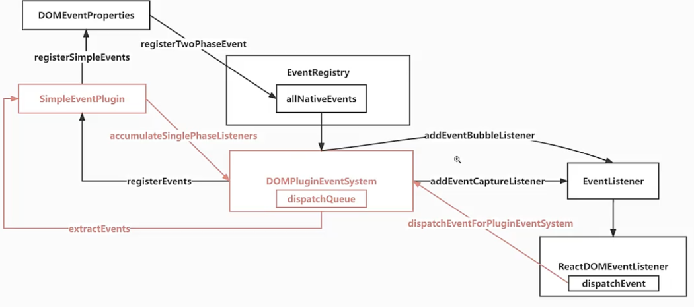

# React18.2 源码学习

## 1 事件

### 1.1 事件执行回调函数注释-dispatchEvent-[src/react-dom-bindings/src/events/ReactDOMEventListener.js](../../public/react18-learn/src/react-dom-bindings/src/events/ReactDOMEventListener.js)

```js
import { getEventTarget } from './getEventTarget'

/**
 * description:
 * @param {string} domEventName
 * @param {number} eventSystemFlags
 * @param {DOMElement} container
 * @return {boolean}
 */
export function dispatchEvent(
  domEventName,
  eventSystemFlags,
  container,
  nativeEvent
) {
  const nativeEventTarget = getEventTarget(nativeEvent)
}
```

### 1.2 事件对象获取方法创建-getEventTarget-[src/react-dom-bindings/src/events/getEventTarget.js](../../public/react18-learn/src/react-dom-bindings/src/events/getEventTarget.js)

```js
function getEventTarget(nativeEvent) {
  const target = nativeEvent.target || nativeEvent.srcElement || window
  return target
}
export default getEventTarget
```

### 1.3 真实节点对应 fiber 节点获取方法引入-getClosestInstanceFromNode-[src/react-dom-bindings/src/events/ReactDOMEventListener.js](../../public/react18-learn/src/react-dom-bindings/src/events/ReactDOMEventListener.js)

```js
import { getClosestInstanceFromNode } from '../client/ReactDOMComponentTree'
```

### 1.4 真实节点对应 fiber 节点获取函数创建-getClosestInstanceFromNode-[src/react-dom-bindings/src/client/ReactDOMComponentTree.js](../../public/react18-learn/src/react-dom-bindings/src/client/ReactDOMComponentTree.js)

```js
const randomKey = Math.random().toString(36).slice(2)
const internalInstanceKey = '__reactFiber$' + randomKey
/**
 * 从真实的 DOM 节点上获取它对应的 fiber 节点
 * @param {*} targetNode
 */
export function getClosestInstanceFromNode(targetNode) {
  const targetInst = targetNode[internalInstanceKey]
  return targetInst
}
/**
 * 提前缓存 fiber 节点的实例到 DOM 节点上
 * @param {*} hostInst
 * @param {*} node
 */
export function precacheFiberNode(hostInst, node) {
  node[internalInstanceKey] = hostInst
}
```

### 1.5 实例生成函数补充-precacheFiberNode-[src/react-dom-bindings/src/client/ReactDOMHostConfig.js](../../public/react18-learn/src/react-dom-bindings/src/client/ReactDOMHostConfig.js)

```js
import { precacheFiberNode } from './ReactDOMComponentTree'

export function createInstance(type, props, internalInstanceHandle) {
  const domElement = document.createElement(type)
  precacheFiberNode(internalInstanceHandle, domElement) // +
  return domElement
}
```

## 2 事件

### 2.1 委托给容器的回调函数补充-dispatchEvent-[src/react-dom-bindings/src/events/ReactDOMEventListener.js](../../public/react18-learn/src/react-dom-bindings/src/events/ReactDOMEventListener.js)

```js
import { dispatchEventForPluginEventSystem } from './DOMPluginEventSystem'
/**
 * 此方法就是委托给容器的回调，当容器#root 在捕获或者说冒泡阶段处理事件的时候会执行
 * @param {string} domEventName
 * @param {number} eventSystemFlags
 * @param {HTMLElement} targetContainer
 * @return {*} nativeEvent
 */
export function dispatchEvent(
  domEventName,
  eventSystemFlags,
  targetContainer,
  nativeEvent
) {
  // 获取事件源，它是一个真实 DOM
  const nativeEventTarget = getEventTarget(nativeEvent)
  const targetInst = getClosestInstanceFromNode(nativeEventTarget)
  dispatchEventForPluginEventSystem(
    domEventName, // click
    eventSystemFlags, // 0 4
    nativeEvent, // 原生事件
    targetInst, // 此真实 DOM 对应的 fiber
    targetContainer // 目标容器
  )
}
```

### 2.2 根据插件系统派发事件函数创建-dispatchEventForPluginEventSystem-[src/react-dom-bindings/src/events/DOMPluginEventSystem.js](../../public/react18-learn/src/react-dom-bindings/src/events/DOMPluginEventSystem.js)

```js
import getEventTarget from './getEventTarget'

export function dispatchEventForPluginEventSystem(
  domEventName,
  eventSystemFlags,
  nativeEvent,
  targetInst,
  targetContainer
) {
  dispatchEventForPlugins(
    domEventName,
    eventSystemFlags,
    nativeEvent,
    targetInst,
    targetContainer
  )
}
function dispatchEventForPlugins(
  domEventName,
  eventSystemFlags,
  nativeEvent,
  targetInst,
  targetContainer
) {
  const nativeEventTarget = getEventTarget(nativeEvent)
}
```

### 2.3 fiber 属性缓存到 DOM 节点函数创建-updateFiberProps-[src/react-dom-bindings/src/client/ReactDOMComponentTree.js](../../public/react18-learn/src/react-dom-bindings/src/client/ReactDOMComponentTree.js)

```js
const internalPropsKey = '__reactProps$' + randomKey

export function updateFiberProps(node, props) {
  node[internalPropsKey] = props
}
```

### 2.4 fiber 属性缓存到 DOM 节点函数调用-updateFiberProps-[src/react-dom-bindings/src/client/ReactDOMHostConfig.js](../../public/react18-learn/src/react-dom-bindings/src/client/ReactDOMHostConfig.js)

```js
import { updateFiberProps } from './ReactDOMComponentTree'

export function createInstance(type, props, internalInstanceHandle) {
  // ...
  updateFiberProps(domElement, props)
  return domElement
}
```

### 2.5 fiber 属性从 DOM 节点获取函数-getFiberCurrentPropsFromNode-[src/react-dom-bindings/src/client/ReactDOMComponentTree.js](../../public/react18-learn/src/react-dom-bindings/src/client/ReactDOMComponentTree.js)

```js
export function getFiberCurrentPropsFromNode(node) {
  return node[internalPropsKey] || null
}
```

- 浏览器查看元素中 onclick="()=>console.log('xxxxx')"

## 3 事件

### 3.1 根据插件系统派发事件函数创建-dispatchEventForPluginEventSystem-[src/react-dom-bindings/src/events/DOMPluginEventSystem.js](../../public/react18-learn/src/react-dom-bindings/src/events/DOMPluginEventSystem.js)

```js
/**
 * 自下而上的存储事件
 */
function dispatchEventForPlugins(
  domEventName,
  eventSystemFlags,
  nativeEvent,
  targetInst,
  targetContainer
) {
  const nativeEventTarget = getEventTarget(nativeEvent)
  // 派发事件的数组
  const dispatchQueue = []
  extractEvents(
    dispatchQueue,
    domEventName,
    targetInst,
    nativeEvent,
    nativeEventTarget,
    eventSystemFlags,
    targetContainer
  )
  console.log('dispatchQueue', dispatchQueue)
}

function extractEvents(
  dispatchQueue,
  domEventName,
  targetInst,
  nativeEvent,
  nativeEventTarget,
  eventSystemFlags,
  targetContainer
) {
  SimpleEventPlugin.extractEvents(
    dispatchQueue,
    domEventName,
    targetInst,
    nativeEvent,
    nativeEventTarget,
    eventSystemFlags,
    targetContainer
  )
}
```

<!-- function dispatchEventForPlugins(domEventName, eventSystemFlags, nativeEvent
const nativeEventTarget = getEventTarget(nativeEvent); -->

### 3.2 事件提前函数创建-extractEvents-[src/react-dom-bindings/src/events/plugins/SimpleEventPlugin.js](../../public/react18-learn/src/react-dom-bindings/src/events/plugins/SimpleEventPlugin.js)

```js
import { accumulateSinglePhaseListeners } from '../DOMPluginEventSystem'
import {
  registerSimpleEvents,
  topLevelEventsToReactNames,
} from '../DOMEventProperties'
import { IS_CAPTURE_PHASE } from '../EventSystemFlags'

export function extractEvents(
  dispatchQueue,
  domEventName,
  targetInst,
  nativeEvent,
  nativeEventTarget,
  eventSystemFlags,
  targetContainer
) {
  //通过map映射查找对应的属性
  const reactName = topLevelEventsToReactNames.get(domEventName) //click=>onClick
  const isCapturePhase = (eventSystemFlags & IS_CAPTURE_PHASE) !== 0
  const listeners = accumulateSinglePhaseListeners(
    targetInst,
    reactName,
    nativeEvent.type,
    isCapturePhase
  )
  console.log('listeners:', listeners)
  console.log('listeners.length:', listeners.length)
}
```

### 3.3 事件监听列表计算函数创建-accumulateSinglePhaseListeners-[src/react-dom-bindings/src/events/DOMPluginEventSystem.js](../../public/react18-learn/src/react-dom-bindings/src/events/DOMPluginEventSystem.js)

```js
import getListener from './getListener'
import { HostComponent } from 'react-reconciler/src/ReactWorkTags'

export function accumulateSinglePhaseListeners(
  targetFiber,
  reactName,
  nativeEventType,
  isCapturePhase
) {
  const captureName = reactName + 'Capture'
  const reactEventName = isCapturePhase ? captureName : reactName
  const listeners = []
  let instance = targetFiber
  while (instance !== null) {
    const { stateNode, tag } = instance
    if (tag === HostComponent && stateNode !== null) {
      const listener = getListener(instance, reactEventName)
      if (listener) {
        listeners.push(listener)
      }
    }
    instance = instance.return
  }
  return listeners
}
```

### 3.4 fiber 上对应回调函数获取函数创建-getListener-[src/react-dom-bindings/src/events/getListener.js](../../public/react18-learn/src/react-dom-bindings/src/events/getListener.js)

```js
import { getFiberCurrentPropsFromNode } from '../client/ReactDOMComponentTree'

/**
 * description: 获取 fiber 上对应回调函数
 * @param {*} inst
 * @param {*} registrationName
 * @returns
 */
export default function getListener(inst, registrationName) {
  const { stateNode } = inst
  if (stateNode === null) return null
  const props = getFiberCurrentPropsFromNode(stateNode)
  if (props == null) return null
  const listener = props[registrationName] //props.onClick
  return listener
}
```

- 浏览器打印：两个捕获，两个冒泡

### 3.5 问题解答补充-[doc/14.question.md](../../public/react18-learn/doc/14.question.md)

```md
### 没写 onClickCapture 就代表我们没有触发冒泡阶段么?

- 如果没写 onClickCapture 属性，就表示在捕获阶段什么都不做

### React 为什么使用合成事件

- 合成事件是浏览器原生事件的一种模拟，它模拟了原生事件的行为，但是它并不是真正的原生事件，它是由浏览器自己模拟出来的，所以我们称之为合成事件
- 好处-性能高，可以屏蔽浏览器的差异
```

## 4 事件

### 4.1 事件架构图

- 
- 枢纽-DOMPluginEventSystem

### 4.2 组件函数修改-FunctionComponent-[src/main.jsx](../../public/react18-learn/src/main.jsx)

```js
function FunctionComponent() {
  return (
    // hooks 用到更新，更新需要事件触发
    <h1
      onClick={() => console.log('ParentBubble')}
      onClickCapture={() => console.log('ParentCapture')}
    >
      <span
        onClick={() => console.log('ChildBubble')}
        onClickCapture={() => console.log('ChildCapture')}
      >
        world
      </span>
    </h1>
  )
}
```

- 浏览器查看 SimpleEventPlugin.js 文件中的 listeners 是否存在

### 4.3 真实 DOM 创建函数注释说明-createInstance-[src/react-dom-bindings/src/client/ReactDOMHostConfig.js](../../public/react18-learn/src/react-dom-bindings/src/client/ReactDOMHostConfig.js)

```js
/**
 * 在原生组件初次挂载的时候，会通过此方法创建真实DOM
 * @param {*} type 类型 span
 * @param {*} props 属性
 * @param {*} internalInstanceHandle - DOM 对应 fiber
 */
export function createInstance(type, props, internalInstanceHandle) {
  const domElement = document.createElement(type)
  // 预先缓存 fiber 节点到 DOM 元素上
  precacheFiberNode(internalInstanceHandle, domElement)
  // 把属性直接保存在 DOMElement 的属性上
  updateFiberProps(domElement, props)
  return domElement
}
```

### 4.4 回调函数添加到派发队列函数注释说明-extractEvents-[src/react-dom-bindings/src/events/plugins/SimpleEventPlugin.js](../../public/react18-learn/src/react-dom-bindings/src/events/plugins/SimpleEventPlugin.js)

```js
/**
 * 回调函数添加到派发队列
 * @param {*} dispatchQueue - 派发队列，放置监听函数
 * @param {*} domEventName - DOM 事件名，click
 * @param {*} targetInst - 目标 fiber
 * @param {*} nativeEvent - 原生事件
 * @param {*} nativeEventTarget - 原生事件源
 * @param {*} eventSystemFlags - 事件系统标志：0-冒泡；4-捕获；
 * @param {*} targetContainer - 目标容器，div#root
 */
function extractEvents(
  dispatchQueue,
  domEventName,
  targetInst,
  nativeEvent,
  nativeEventTarget, // click => onClick
  eventSystemFlags,
  targetContainer
) {
  // ...
}
```

### 4.5 组件函数修改-FunctionComponent-[src/main.jsx](../../public/react18-learn/src/main.jsx)

```js
function FunctionComponent() {
  return (
    // hooks 用到更新，更新需要事件触发
    <h1
      onClick={(event) => console.log('ParentBubble')}
      onClickCapture={(event) => console.log('ParentCapture')}
    >
      <span
        onClick={(event) => console.log('ChildBubble')}
        onClickCapture={(event) => console.log('ChildCapture')}
      >
        world
      </span>
    </h1>
  )
}
```

## 5 事件

### 5.1 回调函数添加到派发队列函数合成事件逻辑-extractEvents-[src/react-dom-bindings/src/events/plugins/SimpleEventPlugin.js](../../public/react18-learn/src/react-dom-bindings/src/events/plugins/SimpleEventPlugin.js)

```js
function extractEvents(
  dispatchQueue,
  domEventName,
  targetInst,
  nativeEvent,
  nativeEventTarget,
  eventSystemFlags,
  targetContainer
) {
  // ... const listeners = ...
  // 如果有要执行的监听函数的话 [onClickCapture,onclickCapture]=[ChildCapture,ParentCapture]
  if (listeners.length > 0) {
    // 合成事件实例
    const event = new SyntheticEventCtor(
      reactName.targetInst,
      nativeEvent.type,
      isCapturePhase
    )
    dispatchQueue.push({
      event,
      listeners, // 监听函数数组
    })
  }
}
```

### 5.2 回调函数添加到派发队列函数合成事件构建逻辑-extractEvents-[src/react-dom-bindings/src/events/plugins/SimpleEventPlugin.js](../../public/react18-learn/src/react-dom-bindings/src/events/plugins/SimpleEventPlugin.js)

```js
import { SyntheticMouseEvent } from '../SyntheticEvents'

function extractEvents(
  dispatchQueue,
  domEventName,
  targetInst,
  nativeEvent,
  nativeEventTarget,
  eventSystemFlags,
  targetContainer
) {
  // const reactName =...
  let SyntheticEventCtor // 合成事件的构建函数
  switch (domEventName) {
    case 'click':
      SyntheticEventCtor = SyntheticMouseEvent
      break
    default:
      break
  }
  // const isCapturePhase =...
}
```

### 5.3 合成事件生成函数创建-createSyntheticEvent-[src/react-dom-bindings/src/events/SyntheticEvents.js](../../public/react18-learn/src/react-dom-bindings/src/events/SyntheticEvents.js)

```js
const MouseEventInterface = {
  clickX: 0,
  clickY: 0,
}

function createSyntheticEvent(inter) {
  // 合成事件基类
  function SyntheticBaseEvent(
    reactName,
    reactEventType,
    targetInst,
    nativeEvent,
    nativeEventTarget
  ) {
    //...
  }
  return SyntheticBaseEvent
}

export const SyntheticMouseEvent = createSyntheticEvent(MouseEventInterface)
```

### 5.4 合成事件基类函数补充-SyntheticBaseEvent-[src/react-dom-bindings/src/events/SyntheticEvents.js](../../public/react18-learn/src/react-dom-bindings/src/events/SyntheticEvents.js)

```js
function functionThatReturnsTrue() {
  return true
}
function functionThatReturnsFalse() {
  return false
}

/**
 * 合成事件基类
 * @param {*} reactName - React 属性名 onClick
 * @param {*} reactEventType - click
 * @param {*} targetInst - 事件源对应的 fiber 实例
 * @param {*} nativeEvent - 原生事件对象
 * @param {*} nativeEventTarget - 原生事件源 span 事件源对应的那个真实 DOM 元素
 */
function SyntheticBaseEvent(
  reactName,
  reactEventType,
  targetInst,
  nativeEvent,
  nativeEventTarget
) {
  this._reactName = reactName
  this.type = reactEventType
  this._targetInst = targetInst
  this.nativeEvent = nativeEvent
  this.target = nativeEventTarget
  for (const propName in inter) {
    if (!inter.hasOwnProperty(propName)) {
      continue
    }
    this[propName] = inter[propName]
  }
  // 是否已经阻止默认事件
  this.isDefaultPrevented = functionThatReturnsFalse
  // 是否已经阻止继续传播
  this.isPropagationStopped = functionThatReturnsFalse
  return this
}
```

### 5.5 覆盖默认事件-SyntheticBaseEvent-[src/react-dom-bindings/src/events/SyntheticEvents.js](../../public/react18-learn/src/react-dom-bindings/src/events/SyntheticEvents.js)

```js
import assign from 'shared/assign'

function createSyntheticEvent(inter) {
  // 合成事件基类
  // function SyntheticBaseEvent...
  assign(SyntheticBaseEvent.prototype, {
    preventDefault() {
      const event = this.nativeEvent
      if (event.preventDefault) {
        event.preventDefault()
      } else {
        event.returnValue = false
      }
      this.isDefaultPrevented = functionThatReturnsTrue
    },
    stopPropagation() {
      const event = this.nativeEvent
      if (event.stopPropagation) {
        event.stopPropagation()
      } else {
        event.cancelBubble = true
      }
      this.isPropagationStopped = functionThatReturnsTrue
    },
  })
  return SyntheticBaseEvent
}
```
