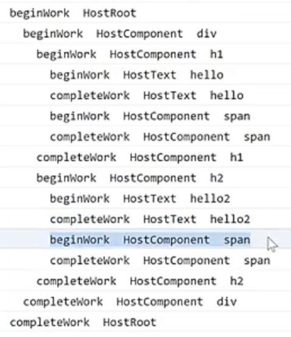
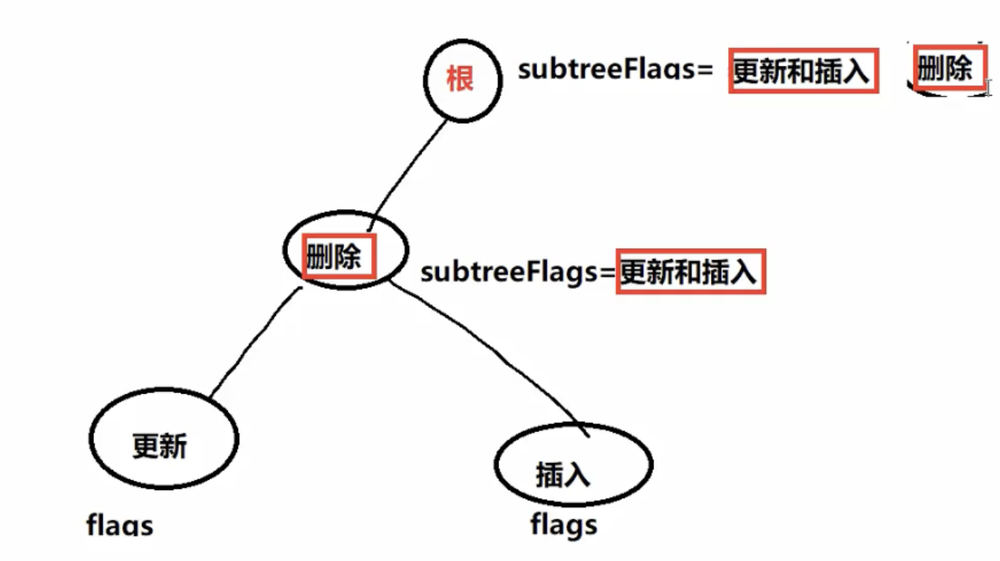

# React18.2 源码学习

## 1 performUnitOfWork & completeUnitOfWork & completeWork

### 1.1 执行一个工作单元-补充-performUnitOfWork-[src/react-reconciler/src/ReactFiberWorkLoop.js](../../public/react18-learn/src/react-reconciler/src/ReactFiberWorkLoop.js)

```js
/**
 * 执行一个工作单元
 * @param {*} unitOfWork
 */
function performUnitOfWork(unitOfWork) {
  // 获取新的 fiber 对应的老 fiber
  const current = unitOfWork.alternate
  // 完成当前 fiber 的子 fiber 链表构建后
  const next = beginWork(current, unitOfWork)
  unitOfWork.memoizedProps = unitOfwork.pendingProps
  if (next === null) {
    // 如果没有子节点表示当前的 fiber 已经完成了 // +
    completeUnitOfWork(unitOfWork) // +
  } else {
    // 如果有子节点, 就让子节点成为下一个工作单元
    workInProgress = next
  }
}
```

### 1.2 完成工作单元方法-创建-completeUnitOfWork-[src/react-reconciler/src/ReactFiberWorkLoop.js](../../public/react18-learn/src/react-reconciler/src/ReactFiberWorkLoop.js)

```js
import { completeWork } from './ReactFiberCompleteWork'

// ...

function completeUnitOfWork(unitOfWork) {
  let completedWork = unitOfWork
  do {
    const current = completedWork.alternate
    const returnFiber = completedWork.return
    // 执行此 fiber 的完成工作, 如果是原生组件的话就是创建真实的 DOM 节点
    completeWork(current, completedWork)
  } while (null)
}
```

### 1.3 执行 fiber 完成工作方法-创建-completeWork-[src/react-reconciler/src/ReactFiberCompleteWork.js](../../public/react18-learn/src/react-reconciler/src/ReactFiberCompleteWork.js)

```js
import logger from 'shared/logger'
export function completeWork(current, workInProgress) {
  logger('completeWork', workInProgress)
}
```

### 1.4 完成工作单元方法-补充-completeUnitOfWork-[src/react-reconciler/src/ReactFiberWorkLoop.js](../../public/react18-learn/src/react-reconciler/src/ReactFiberWorkLoop.js)

```js
import { completeWork } from './ReactFiberCompleteWork'

// ...

function completeUnitOfWork(unitOfWork) {
  let completedWork = unitOfWork
  do {
    // ...
    // 如果有弟弟, 就构建弟弟对应的 fiber 子链表
    const siblingFiber = completedWork.sibling
    if (siblingFiber !== null) {
      workInProgress = siblingFiber
      return
    }
    // 如果没有弟弟, 说明这当前完成的就是父 fiber 的最后一个节点
    // 也就是说一个父 fiber,所有的子 fiber 全部完成了
    completedWork = returnFiber
    workInProgress = completedWork
  } while (completedWork !== null)
}
```

### 1.5 调试查看

- 浏览器正确打印：
- beginwork HostRoot
- beginWork HostComponent h1
- beginWork HostText hello
- completeWork HostText hello
- beginWork HostComponent span
- completeWork HostComponent span
- completeWork HostComponent h1
- completeWork HostRoot

## 2 日志文件增加缩进用以调试方便

### 2.1 入口文件-Fix-[src/main.jsx](../../public/react18-learn/src/main.jsx)

```jsx
import { createRoot } from 'react-dom/client'
let element = (
  <div>
    <h1>
      hello <span style={{ color: 'red' }}>world</span>
    </h1>
    <h2>
      hello2 <span style={{ color: 'blue' }}>world2</span>
    </h2>
  </div>
)
const root = createRoot(document.getElementById('root'))
// 把 element 虚拟 DOM 渲染到容器中
root.render(element)
```

### 2.2 日志文件增加缩进-补充-[src/shared/logger.js](../../public/react18-learn/src/shared/logger.js)

```js
// ...

let indent = { number: 0 }
export { indent }
```

### 2.3 补充 beginWork 日志缩进-[src/react-reconciler/src/ReactFiberBeginWork.js](../../public/react18-learn/src/react-reconciler/src/ReactFiberBeginWork.js)

```js
import logger, { indent } from 'shared/logger'

function beginWork(current, workInProgress) {
  logger(' '.repeat(indent.number) + 'beginWork', workInProgress)
  indent.number += 2

  // ...
}
```

### 2.4 补充 completeWork 日志缩进-[src/react-reconciler/src/ReactFiberCompleteWork.js](../../public/react18-learn/src/react-reconciler/src/ReactFiberCompleteWork.js)

```js
import logger, { indent } from 'shared/logger'

export function completeWork(current, workInProgress) {
  indent.number -= 2
  logger(' '.repeat(indent.number) + 'completeWork', workInProgress)
}
```

### 2.5 调试查看

- 浏览器正确打印：
- 

## 3 completeWork & createTextInstance & bubbleProperties

### 3.1 入口文件-Fix-[src/main.jsx](../../public/react18-learn/src/main.jsx)

```jsx
import { createRoot } from 'react-dom/client'
let element = (
  <h1>
    hello <span style={{ color: 'red' }}>world</span>
  </h1>
)
const root = createRoot(document.getElementById('root'))
// 把 element 虚拟 DOM 渲染到容器中
root.render(element)
```

### 3.2 完成节点方法-Add-completeWork-[src/react-reconciler/src/ReactFiberCompleteWork.js](../../public/react18-learn/src/react-reconciler/src/ReactFiberCompleteWork.js)

```js
import { createTextInstance } from 'react-dom-bindings/src/client/ReactDOMHostConfig'
import logger, { indent } from 'shared/logger'
import { HostText } from './ReactWorkTags'

/**
 * 完成一个 fiber 节点
 * @param {*} current - 老 fiber
 * @param {*} workInProgress - 新的构建的 fiber
 */
export function completeWork(current, workInProgress) {
  indent.number -= 2
  logger(' '.repeat(indent.number) + 'completeWork', workInProgress)
  const newProps = workInProgress.pendingProps
  switch (workInProgress.tag) {
    case HostText:
      // 如果完成的 fiber 是文本节点, 那就创建真实的文本节点
      const newText = newProps
      workInProgress.stateNode = createTextInstance(newText)
  }
}
```

### 3.3 文本节点创建真实 DOM 方法-Create-createTextInstance-[src/react-dom-bindings/src/client/ReactDOMHostConfig.js](../../public/react18-learn/src/react-dom-bindings/src/client/ReactDOMHostConfig.js)

```js
export function createTextInstance(content) {
  return document.createTextNode(content)
}
```

### 3.4 属性向上冒泡方法-Create&Callback-bubbleProperties-[src/react-reconciler/src/ReactFiberCompleteWork.js](../../public/react18-learn/src/react-reconciler/src/ReactFiberCompleteWork.js)

```js
export function completeWork(current, workInProgress) {
  // ...

  switch (workInProgress.tag) {
    case HostText:
      // 如果完成的 fiber 是文本节点, 那就创建真实的文本节点
      const newText = newProps
      workInProgress.stateNode = createTextInstance(newText)
      // 向上冒泡属性
      bubbleProperties(workInProgress)
  }
}

function bubbleProperties(completedWork) {
  let subtreeFlags = NoFlags
  // 遍历当前 fiber 的所有子节点, 把所有的子节的副作用, 以及子节点的子节点的副作用全部合并
  let child = completedWork.child
  while (child !== null) {
    subtreeFlags |= child.subtreeFlags
    subtreeFlags |= child.flags
    child = child.sibling
  }
  completedWork.subtreeFlags = subtreeFlags
}
```

### 3.5 更新和插入图示

- 
- 副作用冒泡到根节点进行统一处理
- React18 把副作用挂在 fiber 上

## 4 completeWork & createInstance & appendAllChildren & appendInitialChild

### 4.1 原生节点逻辑-完成节点方法-Add-completeWork-[src/react-reconciler/src/ReactFiberCompleteWork.js](../../public/react18-learn/src/react-reconciler/src/ReactFiberCompleteWork.js)

```js
import {
  createInstance,
  createTextInstance,
} from 'react-dom-bindings/src/client/ReactDOMHostConfig'

export function completeWork(current, workInProgress) {
  // ...
  switch (workInProgress.tag) {
    // 如果完成的是原生节点的话
    case HostComponent:
      // 创建真实的 DOM 节点
      const { type } = workInProgress
      const instance = createInstance(type, newProps, workInProgress)
      break
    case HostText:
    // ...
  }
}
```

### 4.2 创建元素节点方法-Create-createInstance-[src/react-dom-bindings/src/client/ReactDOMHostConfig.js](../../public/react18-learn/src/react-dom-bindings/src/client/ReactDOMHostConfig.js)

```js
export function createInstance(type) {
  const domElement = document.createElement(type)
  // updateFiberProps(domElement, props)
  return domElement
}
```

### 4.3 把子节点挂载到父节点身上方法-Create&Callback-appendAllChildren-[src/react-reconciler/src/ReactFiberCompleteWork.js](../../public/react18-learn/src/react-reconciler/src/ReactFiberCompleteWork.js)

```js
import {
  appendInitialChild,
  createInstance,
  createTextInstance,
} from 'react-dom-bindings/src/client/ReactDOMHostConfig'

/**
 * 把当前的完成的 fiber 所有的子节点对应的真实 DOM 都挂载到自己父 parent 真实 DOM 节点上
 * @param {*} parent - 当前完成的 fiber 真实的 DOM 节点
 * @param {*} workInProgress - 完成的 fiber
 */
function appendAllChildren(parent, workInProgress) {
  let node = workInProgress.child
  while (node) {
    appendInitialChild(parent, node.stateNode)
    node = node.sibling
  }
}
export function completeWork(current, workInProgress) {
  // ...
  switch (workInProgress.tag) {
    // 如果完成的是原生节点的话
    case HostComponent:
      // 创建真实的 DOM 节点
      const { type } = workInProgress
      const instance = createInstance(type, newProps, workInProgress)
      workInProgress.stateNode = instance
      // 把自己所有的儿子都添加到自己的身上
      appendAllChildren(instance, workInProgress)

      break
    case HostText:
    // ...
  }
}
```

### 4.4 原生子节点插入到父节点方法-Create-appendInitialChild-[src/react-dom-bindings/src/client/ReactDOMHostConfig.js](../../public/react18-learn/src/react-dom-bindings/src/client/ReactDOMHostConfig.js)

```js
// ...
export function appendInitialChild(parent, child) {
  parent.appendChild(child)
}
```

### 4.5 判断插入节点为函数组件或原生组件处理逻辑-Fix-appendAllChildren-[src/react-reconciler/src/ReactFiberCompleteWork.js](../../public/react18-learn/src/react-reconciler/src/ReactFiberCompleteWork.js)

```js
function appendAllChildren(parent, workInProgress) {
  let node = workInProgress.child
  while (node) {
    // 如果子节点类型是一个原生节点或者是一个文件节点
    if (node.tag === HostComponent || node.tag === HostText) {
      appendInitialchild(parent, node.stateNode)
      // 如果第一个儿子不是一个原生节点, 说明它可能是一个函数组件
    } else if (node.child !== null) {
      node = node.child
      continue
    }
    if (node === workInProgress) {
      return
    }
    // 如果当前的节点没有弟弟
    while (node.sibling === null) {
      if (node.return === null || node.return === workInProgress) {
        return
      }
      // 回到父节点
      node = node.return
    }
    node = node.sibling
  }
}
```

## 5 finalizeInitialChildren & setInitialProperties & setInitialDOMProperties

### 5.1 调用 finalizeInitialChildren-[src/react-reconciler/src/ReactFiberCompleteWork.js](../../public/react18-learn/src/react-reconciler/src/ReactFiberCompleteWork.js)

```js
export function completeWork(current, workInProgress) {
  // ...
  switch (workInProgress.tag) {
    // 如果完成的是原生节点的话
    case HostComponent:
      // 创建真实的 DOM 节点
      const { type } = workInProgress
      const instance = createInstance(type, newProps, workInProgress)
      // 把自己所有的儿子都添加到自己的身上
      appendAllChildren(instance, workInProgress)
      workInProgress.stateNode = instance
      finalizeInitialChildren(instance, type, newProps)
      bubbleProperties(workInProgress)
      break
    case HostText:
    // ...
  }
}
```

### 5.2 创建 finalizeInitialChildren-[src/react-dom-bindings/src/client/ReactDOMHostConfig.js](../../public/react18-learn/src/react-dom-bindings/src/client/ReactDOMHostConfig.js)

```js
import { setInitialProperties } from './ReactDOMComponent'

export function finalizeInitialChildren(domElement, type, props) {
  setInitialProperties(domElement, type, props)
}
```

### 5.3 创建 setInitialProperties-[src/react-dom-bindings/src/client/ReactDOMComponent.js](../../public/react18-learn/src/react-dom-bindings/src/client/ReactDOMComponent.js)

```js
export function setInitialProperties(domElement, tag, props) {
  setInitialDOMProperties(tag, domElement, props)
}
```

### 5.4 入口文件-Fix-[src/main.jsx](../../public/react18-learn/src/main.jsx)

```js
<h1 id="container">
```

### 5.5 设置初始化属性方法 Create-setInitialDOMProperties-[src/react-dom-bindings/src/client/ReactDOMComponent.js](../../public/react18-learn/src/react-dom-bindings/src/client/ReactDOMComponent.js)

```js
import { setValueForStyles } from './CSSPropertyOperations'
const STYLE = 'style'
const CHILDREN = 'children'

function setInitialDOMProperties(tag, domElement, nextProps) {
  for (const propKey in nextProps) {
    if (nextProps.hasOwnProperty(propKey)) {
      const nextProp = nextProps[propKey]
      if (propKey === STYLE) {
        setValueForStyles(domElement, nextProp)
      }
    }
  }
}
```
