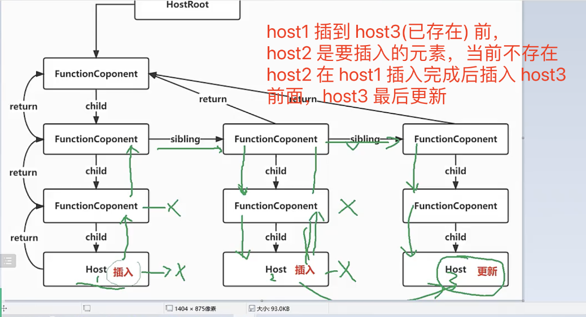
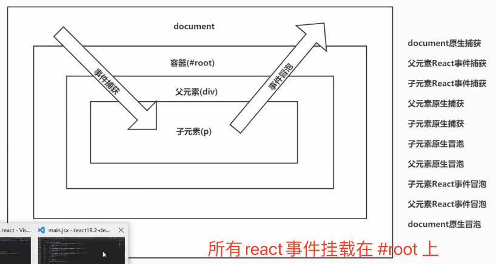

# React18.2 源码学习

## 1 fiber 提交逻辑-commitWork

### 1.1 节点插入更新逻辑图示

- 

### 1.2 要插入的锚点查找方法-getHostSibling-[src/react-reconciler/src/ReactFiberCommitWork.js](../../public/react18-learn/src/react-reconciler/src/ReactFiberCommitWork.js)

```js
/**
 * 找到要插入的锚点
 * 找到可以插在它的前面的那个 fiber 对应的真实 DOM
 * @param {*} fiber
 */
function getHostSibling(fiber) {
  let node = fiber
  siblings: while (true) {
    while (node.sibling === null) {
      if (node.return === null || isHostParent(node.return)) {
        return null
      }
      node = node.return
    }
    node = node.sibling
    // 如果弟弟不是原生节点也不是文本节点
    while (node.tag !== HostComponent && node.tag !== HostText) {
      // 如果此节点是一个将要插入的新的节点，找它的弟弟
      if (node.flags & Placement) {
        continue siblings
      } else {
        node = node.child
      }
    }
    if (!(node.flags & Placement)) {
      return node.stateNode
    }
  }
}
```

### 1.3 传递参数-getHostSibling-[src/react-reconciler/src/ReactFiberCommitWork.js](../../public/react18-learn/src/react-reconciler/src/ReactFiberCommitWork.js)

```js
function commitPlacement(finishedWork) {
  // ...

  const before = getHostSibling(finishedWork)
}
```

### 1.4 跳出到指定 while 循环-[doc/13.while.continue.js](../../public/react18-learn/doc/13.while.continue.js)

```js
siblings: while (true) {
  console.log('1')
  while (true) {
    console.log('2')
    continue siblings
  }
}
```

### 1.5 问题解答-[doc/14.question.md](../../public/react18-learn/doc/14.question.md)

```md
## effect 副作用

- 就是对 DOM 节点的操作-增删改查
```

## 2 fiber 提交逻辑-commitWork

### 2.1 节点完成后打印方法调用-printFinishedWork-[src/react-reconciler/src/ReactFiberWorkLoop.js](../../public/react18-learn/src/react-reconciler/src/ReactFiberWorkLoop.js)

```js
function commitRoot(root) {
  const { finishedWork } = root
  printFinishedWork(finishedWork) // +++++++++++
}
```

### 2.2 节点完成后打印方法创建-printFinishedWork-[src/react-reconciler/src/ReactFiberWorkLoop.js](../../public/react18-learn/src/react-reconciler/src/ReactFiberWorkLoop.js)

```js
function printFinishedWork(fiber) {
  let child = fiber.child
  while (child) {
    printFinishedWork(child)
    child = child.sibling
  }
  if (fiber.flags !== 0) {
    console.log(
      getFlags(fiber.flags),
      getTag(fiber.tag),
      fiber.type,
      fiber.memoizedProps
    )
  }
}
```

### 2.3 标签对应含义获取方法创建-getTag-[src/react-reconciler/src/ReactFiberWorkLoop.js](../../public/react18-learn/src/react-reconciler/src/ReactFiberWorkLoop.js)

```js
import { HostComponent, HostRoot, HostText } from './ReactWorkTags'

function getTag(tag) {
  switch (tag) {
    case HostRoot:
      return 'HostRoot'
    case HostComponent:
      return 'HostComponent'
    case HostText:
      return 'HostText'
    default:
      break
  }
}
```

### 2.4 操作对应含义获取方法创建-getFlags-[src/react-reconciler/src/ReactFiberWorkLoop.js](../../public/react18-learn/src/react-reconciler/src/ReactFiberWorkLoop.js)

```js
import { MutationMask, NoFlags, Placement, Update } from './ReactFiberFlags'

function getFlags(flags) {
  switch (flags) {
    case Placement:
      return '插入'
    case Update:
      return '更新'
    default:
      return flags
  }
}
```

### 2.5 浏览器打印结果查看正确

- 页面成功渲染 helloworld
- 控制台打印结果: 插入 HostComponent h1 {...}

## 3 函数组件处理逻辑

### 3.1 是否跟踪副作用设置并查看浏览器打印结果-[src/react-reconciler/src/ReactChildFiber.js](../../public/react18-learn/src/react-reconciler/src/ReactChildFiber.js)

```js
function createChildReconciler(shouldTrackSideEffects) {
  shouldTrackSideEffects = true
  // ...
}
```

- 浏览器打印：
  - 插入 HostText null hello
  - 插入 HostComponent span {}
  - 插入 HostComponent h1 {}
- 查看完成后删除 `shouldTrackSideEffects = true`

### 3.2 定义函数组件-[src/main.jsx](../../public/react18-learn/src/main.jsx)

```jsx
import { createRoot } from 'react-dom/client'

let element = <FunctionComponent></FunctionComponent>
// old let element = React.createElement(FunctionComponent)
// new let element = jsx(FunctionComponent)
const root = createRoot(document.getElementById('root'))
// 把 element 虚拟 DOM 渲染到容器中
root.render(element)

function FunctionComponent() {
  return (
    <h1 id="container">
      hello <span style={{ color: 'red' }}>world</span>
    </h1>
  )
}
```

### 3.3 函数组件标签新增-[src/react-reconciler/src/ReactWorkTags.js](../../public/react18-learn/src/react-reconciler/src/ReactWorkTags.js)

```js
export const FunctionComponent = 0 //函数组件
```

### 3.4 函数组件处理逻辑-beginWork-[src/react-reconciler/src/ReactFiberBeginWork.js](../../public/react18-learn/src/react-reconciler/src/ReactFiberBeginWork.js)

```js
import {
  HostComponent,
  HostRoot,
  HostText,
  IndeterminateComponent,
} from './ReactWorkTags'

export function beginWork(current, workInProgress) {
  logger(' '.repeat(indent.number) + 'beginWork', workInProgress)
  indent.number += 2
  switch (workInProgress.tag) {
    // 因为在 React 里组件其实有两种，一种是函数组件，一种是类组件，但是它们都是都是函数
    case IndeterminateComponent:
      return mountIndeterminateComponent(
        current,
        workInProgress,
        workInProgress.type
      )
    case HostRoot:
      return updateHostRoot(current, workInProgress)
    case HostComponent:
      return updateHostComponent(current, workInProgress)
    case HostText:
      return null
    default:
      return null
  }
}
```

### 3.5 挂载函数组件处理方法-mountIndeterminateComponent-[src/react-reconciler/src/ReactFiberBeginWork.js](../../public/react18-learn/src/react-reconciler/src/ReactFiberBeginWork.js)

```js
/**
 * 挂载函数组件
 * @param {*} current - 老 fiber
 * @param {*} workInProgress 新的 fiber
 * @param {*} Component 组件类型，也就是函数组件的定义
 */
export function mountIndeterminateComponent(
  current,
  workInProgress,
  Component
) {
  const props = workInProgress.pendingProps
  const value = Component(props)
  workInProgress.tag = FunctionComponent
  reconcileChildren(current, workInProgress, value)
  return workInProgress.child
}
```

## 4 函数组件处理逻辑

### 4.1 类组件标签新增-ClassComponent-[src/react-reconciler/src/ReactWorkTags.js](../../public/react18-learn/src/react-reconciler/src/ReactWorkTags.js)

```js
export const ClassComponent = 1 //类组件
```

### 4.2 函数组件判断增加-commitMutationEffectsOnFiber-[src/react-reconciler/src/ReactFiberCommitWork.js](../../public/react18-learn/src/react-reconciler/src/ReactFiberCommitWork.js)

```js
import {
  FunctionComponent,
  HostComponent,
  HostRoot,
  HostText,
} from './ReactWorkTags'

export function commitMutationEffectsOnFiber(finishedWork, root) {
  switch (finishedWork.tag) {
    case FunctionComponent:
    case HostRoot:
    // ...
  }
}
```

### 4.3 函数组件渲染方法调用-renderWithHooks-[src/react-reconciler/src/ReactFiberBeginWork.js](../../public/react18-learn/src/react-reconciler/src/ReactFiberBeginWork.js)

```js
import { FunctionComponent } from './ReactWorkTags'
import { renderWithHooks } from 'react-reconciler/src/ReactFiberHooks'

export function mountIndeterminateComponent(
  current,
  workInProgress,
  Component
) {
  const props = workInProgress.pendingProps
  // const value = Component(props)
  const value = renderWithHooks(current, workInProgress, Component, props) // ++++++++++++++
  workInProgress.tag = FunctionComponent
  reconcileChildren(current, workInProgress, value)
  return workInProgress.child
}
```

### 4.4 函数组件渲染方法创建-renderWithHooks-[src/react-reconciler/src/ReactFiberHooks.js](../../public/react18-learn/src/react-reconciler/src/ReactFiberHooks.js)

```js
/**
 * 函数组件渲染
 * @param {*} current - 老 fiber
 * @param {*} workInProgress - 新 fiber
 * @param {*} Component - 组件定义
 * @param {*} props - 组件属性
 * @returns 虚拟 DOM 或者说 React 元素
 */
export function renderWithHooks(current, workInProgress, Component, props) {
  const children = Component(props)
  return children
}
```

- 浏览器调试结果查看正确

### 4.5 入口文件引入-createRoot-[src/main.jsx](../../public/react18-learn/src/main.jsx)

```js
import { createRoot } from 'react-dom/client'
// ...
function FunctionComponent() {
  return (
    <h1 id="container" onClick={() => console.log('click')}>
      hello <span style={{ color: 'red' }}>world</span>
    </h1>
  )
}
```

## 5 事件.React

### 5.1 React18.2 源代码-事件之捕获冒泡-[src/main.jsx](../../public/react18-learn/src/main.jsx)

```jsx
import * as React from 'react'
import { createRoot } from 'react-dom/client'
class App extends React.Component {
  parentBubble = () => console.log('父冒泡')
  parentCapture = () => console.log('父捕获')
  childBubble = () => console.log('子冒泡')
  childCapture = () => console.log('子捕获')
  render() {
    return (
      <div
        id="container"
        onClick={this.parentBubble}
        onClickCapture={this.parentCapture}
      >
        <p
          id="title"
          onClick={this.childBubble}
          onClickCapture={this.childCapture}
        >
          点击
        </p>
      </div>
    )
  }
}
let element = <App />
const root = createRoot(document.getElementById('root'))
root.render(element)
```

### 5.2 React18.2 源代码-[src/main.jsx](../../public/react18-learn/src/main.jsx)

```js
class App extends React.Component {
  constructor(props) {
    super(props)
    this.parentRef = React.createRef() // { current: null } this.parentRef.current = div 的真实 DOM
    this.childRef = React.createRef() // this.childRef.current = p 的真实 DOM
  }
  componentDidMount() {
    this.parentRef.current.addEventListener('click', () => console.log('父原生捕获'), true)
    this.parentRef.current.addEventListener('click', () => console.log('父原生冒泡'), false)
    this.childRef.current.addEventListener('click', () => console.log('子原生捕获'), true)
    this.childRef.current.addEventListener('click', () => console.log('子原生冒泡'), false)
  }
  parentBubble = () => console.log('父 React 冒泡')
  parentCapture = () => console.log('父 React 捕获')
  childBubble = () => console.log('子 React 冒泡')
  childCapture = () => console.log('子 React 捕获')
  render() {
    return (
      <div id="container" ref={this.parentRef} ...>
        <p id="title" ref={this.childRef} ...>
          点击
        </p>
      </div>
    )
  }
}
```

### 5.3 React.事件执行顺序图示



### 5.4 React 事件原理演示-[events/1.event.html](../../public/react18-learn/events/1.event.html)

```html
<body>
  <div id="root">
    <div id="parent">
      <div id="child">点击</div>
    </div>
  </div>

  <script>
    let parentBubble = () => console.log('父 React 冒泡')
    let parentCapture = () => console.log('父 React 捕获')
    let childBubble = () => console.log('子 React 冒泡')
    let childCapture = () => console.log('子 React 捕获')
    let root = document.getElementById('root')
    let parent = document.getElementById('parent')
    let child = document.getElementById('child')
    // 模拟 React 中的事件委托
    root.addEventListener('click', (event) => dispatchEvent(event, true), true)
    root.addEventListener(
      'click',
      (event) => dispatchEvent(event, false),
      false
    )
    parent.onClick = parentBubble
    parent.onClickCapture = parentCapture
    child.onClick = childBubble
    child.onClickCapture = childCapture
    function dispatchEvent(event, isCapture) {
      console.log('dispatchEvent:', dispatchEvent)
      console.log('isCapture:', isCapture)
    }
    parent.addEventListener('click', () => console.log('父原生捕获'), true)
    parent.addEventListener('click', () => console.log('父原生冒泡'), false)
    child.addEventListener('click', () => console.log('子原生捕获'), true)
    child.addEventListener('click', () => console.log('子原生冒泡'), false)
  </script>
</body>
```

### 5.5 React 事件原理演示-dispatchEvent-[events/1.event.html](../../public/react18-learn/events/1.event.html)

```js
parent.onClick = parentBubble
parent.onClickCapture = parentCapture
child.onClick = childBubble
child.onClickCapture = childCapture
function dispatchEvent(event, isCapture) {
  let paths = []
  let currentTarget = event.target
  while (currentTarget) {
    paths.push(currentTarget)
    currentTarget = currentTarget.parentNode
  }
  if (isCapture) {
    for (let i = paths.length - 1; i >= 0; i--) {
      let handler = paths[i].onClickCapture
      handler && handler()
    }
  } else {
    for (let i = 0; i < paths.length; i++) {
      let handler = paths[i].onClick
      handler && handler()
    }
  }
}
```

-浏览器调试查看正确
