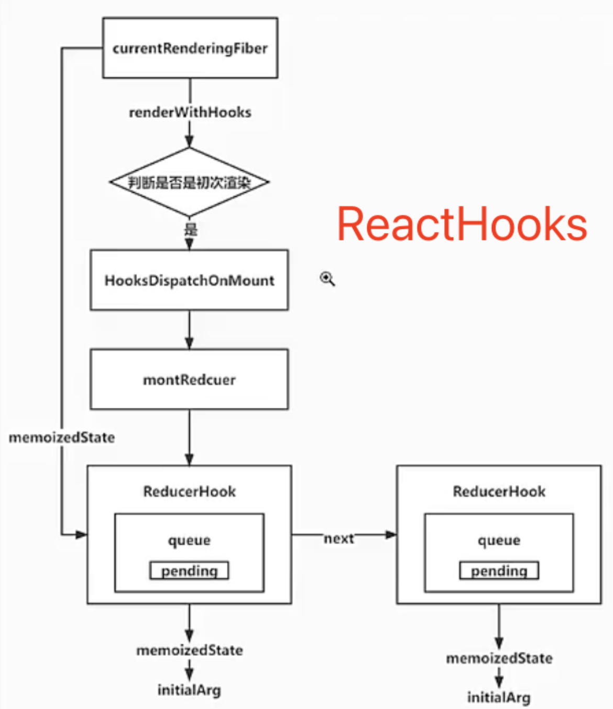

# 事件+ReactHooks

## 1 事件

### 1.1 合成事件逻辑-回调函数添加到派发队列函数-extractEvents-[src/react-dom-bindings/src/events/plugins/SimpleEventPlugin.js](../../public/react18-learn/src/react-dom-bindings/src/events/plugins/SimpleEventPlugin.js)

```js
// 合成事件实例
const event = new SyntheticEventCtor(
  reactName,
  domEventName,
  null,
  nativeEvent,
  nativeEventTarget
)
```

### 1.2 派发事件执行图示

- 

### 1.3 派发函数队列处理函数创建-processDispatchQueue-[src/react-dom-bindings/src/events/DOMPluginEventSystem.js](../../public/react18-learn/src/react-dom-bindings/src/events/DOMPluginEventSystem.js)

```js
function dispatchEventForPlugins(
  domEventName,
  eventSystemFlags,
  nativeEvent,
  targetInst,
  targetContainer
) {
  // extractEvents(...
  processDispatchQueue(dispatchQueue, eventSystemFlags)
}

function processDispatchQueue(dispatchQueue, eventSystemFlags) {
  // 判断是否在捕获阶段
  const isCapturePhase = (eventSystemFlags & IS_CAPTURE_PHASE) !== 0
  for (let i = 0; i < dispatchQueue.length; i++) {
    const { event, listeners } = dispatchQueue[i]
    processDispatchQqueueItemsInOrder(event, listeners, isCapturePhase)
  }
}
```

### 1.4 派发函数队列单向处理函数创建-processDispatchQqueueItemsInOrder-[src/react-dom-bindings/src/events/DOMPluginEventSystem.js](../../public/react18-learn/src/react-dom-bindings/src/events/DOMPluginEventSystem.js)

```js
function processDispatchQqueueItemsInOrder(
  event,
  dispathchListeners,
  isCapturePhase
) {
  if (isCapturePhase) {
    for (let i = dispathchListeners.length - 1; i >= 0; i--) {
      // 浏览器打印查看
      console.log('dispathchListeners[i]:', dispathchListeners[i])
      const { currentTarget, listener } = dispathchListeners[i]
    }
  }
}
```

### 1.5 派发函数队列单向处理函数补充-processDispatchQqueueItemsInOrder-[src/react-dom-bindings/src/events/DOMPluginEventSystem.js](../../public/react18-learn/src/react-dom-bindings/src/events/DOMPluginEventSystem.js)

```js
function processDispatchQqueueItemsInOrder(
  event,
  dispathchListeners,
  isCapturePhase
) {
  if (isCapturePhase) {
    // dispathchListeners[子, 父]
    for (let i = dispathchListeners.length - 1; i >= 0; i--) {
      const listener = dispathchListeners[i]
      if (event.isPropagationStopped()) {
        return
      }
      listener(event)
    }
  } else {
    for (let i = 0; i < dispathchListeners.length; i++) {
      const listener = dispathchListeners[i]
      if (event.isPropagationStopped()) {
        return
      }
      listener(event)
    }
  }
}
```

- 浏览器点击查看打印正确

## 2 事件

### 2.1 派发的监听器创建函数创建并调用-createDispatchListener-[src/react-dom-bindings/src/events/DOMPluginEventSystem.js](../../public/react18-learn/src/react-dom-bindings/src/events/DOMPluginEventSystem.js)

```js
export function accumulateSinglePhaseListeners(
  targetFiber,
  reactName,
  nativeEventType,
  isCapturePhase
) {
  // ...
  if (tag === HostComponent && stateNode !== null) {
    const listener = getListener(instance, reactEventName)
    if (listener) {
      listeners.push(createDispatchListener(instance, listener, stateNode)) // 创建 dispatch listener
    }
  }
  // ...
}
/**
 * description:
 * @param {*} instance
 * @param {*} listener
 * @param {*} currentTarget
 */
function createDispatchListener(instance, listener, currentTarget) {
  return { instance, listener, currentTarget }
}
```

### 2.2 派发函数队列有序执行函数 Fix-processDispatchQqueueItemsInOrder-[src/react-dom-bindings/src/events/DOMPluginEventSystem.js](../../public/react18-learn/src/react-dom-bindings/src/events/DOMPluginEventSystem.js)

```js
function processDispatchQqueueItemsInOrder(
  event,
  dispathchListeners,
  isCapturePhase
) {
  if (isCapturePhase) {
    // dispathchListeners[子, 父]
    for (let i = dispathchListeners.length - 1; i >= 0; i--) {
      const { listener, currentTarget } = dispathchListeners[i]
      if (event.isPropagationStopped()) {
        return
      }
      executeDispatch(event, listener, currentTarget)
    }
  }
  // ...
}
```

### 2.3 派发执行函数 Create-executeDispatch-[src/react-dom-bindings/src/events/DOMPluginEventSystem.js](../../public/react18-learn/src/react-dom-bindings/src/events/DOMPluginEventSystem.js)

```js
function executeDispatch(event, listener, currentTarget) {
  // 合成事件实例 currentTarget 是在不断的变化的
  // event nativeEventTarget 它的是原始的事件源，是永远不变的
  // event currentTarget 当前的事件源，它是会随着事件回调的执行不断变化的
  event.currentTarget = currentTarget
  listener(event)
}
```

### 2.4 入口文件 Fix-[src/main.jsx](../../public/react18-learn/src/main.jsx)

```jsx
<h1
  onClick={(event) => console.log('ParentBubble', event.currentTarget)}
  onClickCapture={(event) => console.log('ParentCapture', event.currentTarget)}
>
  <span
    onClick={(event) => console.log('ChildBubble', event.currentTarget)}
    onClickCapture={(event) => console.log('ChildCapture', event.currentTarget)}
  >
    world
  </span>
</h1>
```

### 2.5 派发函数队列有序执行函数 Fix-processDispatchQqueueItemsInOrder-[src/react-dom-bindings/src/events/DOMPluginEventSystem.js](../../public/react18-learn/src/react-dom-bindings/src/events/DOMPluginEventSystem.js)

```js
function processDispatchQqueueItemsInOrder(
  event,
  dispathchListeners,
  isCapturePhase
) {
  if (isCapturePhase) {
    // ...
  } else {
    for (let i = 0; i < dispathchListeners.length; i++) {
      const { listener, currentTarget } = dispathchListeners[i]
      if (event.isPropagationStopped()) {
        return
      }
      executeDispatch(event, listener, currentTarget) // Fix
    }
  }
}
```

- 浏览器查看 currentTarge 打印结果正确

## 3 事件

### 3.1 入口文件设置组织子元素冒泡默认-[src/main.jsx](../../public/react18-learn/src/main.jsx)

```js
<span
  onClick={(event) => {
    console.log('ChildBubble', event.currentTarget.tagName)
    event.stopPropagation()
  }}
  onClickCapture={(event) =>
    console.log('ChildCapture', event.currentTarget.tagName)
  }
>
  world
</span>
```

- 浏览器点击在控制台查看冒泡中止

### 3.2 dispatchQueue 为什么是数组-[doc/14.question.md](../../public/react18-learn/doc/14.question.md)

```md
### dispatchQueue 为什么是数组？

- 源码多个插件系统
- 因为在 React 中，一个组件可能有多个子组件，而子组件的更新可能是异步的，所以 React 采用了一种叫做调度队列的机制，将所有更新都收集起来，然后统一进行更新。
- 而调度队列的实现方式就是数组，因为数组的插入和删除操作都是 O(1) 的，所以可以用数组来实现调度队列。
```

## 4 ReactHooks

### 4.1 ReactHooks.图示

- 

### 4.2 钩子函数添加到入口文件-counter-[src/main.jsx](../../public/react18-learn/src/main.jsx)

```js
import * as React from './react'

function counter(state, action) {
  if (action.type === 'add') return state + action.payload
  return state
}
function FunctionComponent() {
  const [number, setNumber] = React.useReducer(counter, 0)
  return (
    <div>
      <h1>{number}</h1>
      <button onClick={() => setNumber({ type: 'add', payload: 1 })}>
        add
      </button>
    </div>
  )
}
```

### 4.3 导出状态管理器主入口-useReducer-[src/react/index.js](../../public/react18-learn/src/react/index.js)

```js
export { useReducer } from './src/React'
```

### 4.4 导出状态管理器实际入口-useReducer-[src/react/src/React.js](../../public/react18-learn/src/react/src/React.js)

```js
import { useReducer } from './ReactHooks'
export { useReducer }
```

### 4.5 状态管理器函数创建-useReducer-[src/react/src/ReactHooks.js](../../public/react18-learn/src/react/src/ReactHooks.js)

```js
/**
 * description: 状态管理器
 * @param {Function} reducer 状态管理器函数，用于根据老状态和动作计算新状态
 * @param {any} initialArg 初始状态
 */
export function useReducer(reducer, initialArg) {}
```

## 5 ReactHooks

### 5.1 React 派发者对象创建并导出-ReactCurrentDispatcher-[src/react/src/ReactCurrentDispatcher.js](../../public/react18-learn/src/react/src/ReactCurrentDispatcher.js)

```js
const ReactCurrentDispatcher = {
  current: null,
}
export default ReactCurrentDispatcher
```

### 5.2 状态管理器函数补充-useReducer-[src/react/src/ReactHooks.js](../../public/react18-learn/src/react/src/ReactHooks.js)

```js
import ReactCurrentDispatcher from './ReactCurrentDispatcher'
export function useReducer(reducer, initialArg) {
  const dispatcher = resolveDispatcher()
  return dispatcher.useReducer(reducer, initialArg)
}
```

### 5.3 派发者对象获取函数创建-resolveDispatcher-[src/react/src/ReactHooks.js](../../public/react18-learn/src/react/src/ReactHooks.js)

```js
function resolveDispatcher() {
  return ReactCurrentDispatcher.current
}
```

### 5.4 希望共享的变量-`__SECRET_INTERNALS_DO_NOT_USE_OR_YOU_WILL_BE_FIRED`-[src/react/index.js](../../public/react18-learn/src/react/index.js)

```js
export {
  // 希望在不同的内部模块之间共享的变量可以保存到这个对象中
  __SECRET_INTERNALS_DO_NOT_USE_OR_YOU_WILL_BE_FIRED,
  useReducer,
} from './src/React'
```

### 5.5 希望共享的变量-`__SECRET_INTERNALS_DO_NOT_USE_OR_YOU_WILL_BE_FIRED`-[src/react/src/React.js](../../public/react18-learn/src/react/src/React.js)

```js
// ...
import ReactSharedInternals from './ReactSharedInternals'
export {
  useReducer,
  ReactSharedInternals as __SECRET_INTERNALS_DO_NOT_USE_OR_YOU_WILL_BE_FIRED,
}
```
