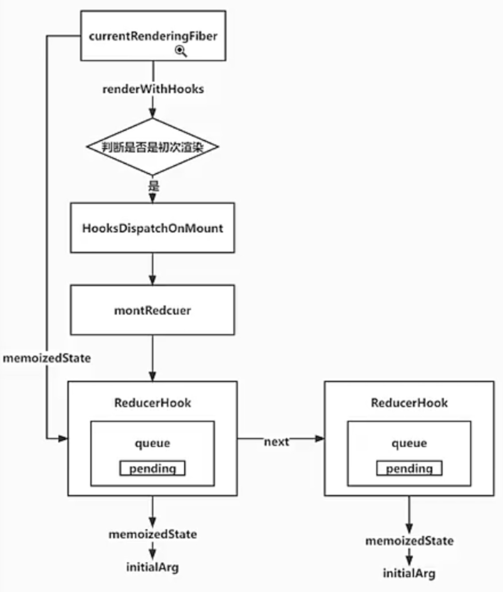

# React18.2 源码学习

## 1 ReactHooks

### 1.1 为 current 赋值-ReactSharedInternals-[src/react/src/ReactSharedInternals.js](../../public/react18-learn/src/react/src/ReactSharedInternals.js)

```js
import ReactCurrentDispatcher from './ReactCurrentDispatcher'

const ReactSharedInternals = {
  ReactCurrentDispatcher,
}
export default ReactSharedInternals
```

### 1.2 为 current 赋值-renderWithHooks-[src/react-reconciler/src/ReactFiberHooks.js](../../public/react18-learn/src/react-reconciler/src/ReactFiberHooks.js)

```js
import ReactCurrentDispatcher from 'react/src/ReactCurrentDispatcher'

export function renderWithHooks(current, workInProgress, Component, props) {
  // 需要函数组件执行前给 ReactCurrentDispatcher.current 赋值
  ReactCurrentDispatcher.current = HooksDispatcherOnMount
  const children = Component(props)
  return children
}
```

### 1.3 状态管理完成加载函数创建-mountReducer-[src/react-reconciler/src/ReactFiberHooks.js](../../public/react18-learn/src/react-reconciler/src/ReactFiberHooks.js)

```js
import ReactSharedInternals from 'shared/ReactSharedInternals'
const { ReactCurrentDispatcher } = ReactSharedInternals

const HooksDispatcherOnMount = {
  useReducer: mountReducer,
}

function mountReducer(reducer, initialArg) {
  console.log('reducer, initialArg:', reducer, initialArg)
  return [initialArg]
}
```

- 浏览器点击查看正确

### 1.4 挂载构建中的钩子函数-mountWorkInProgressHook-[src/react-reconciler/src/ReactFiberHooks.js](../../public/react18-learn/src/react-reconciler/src/ReactFiberHooks.js)

```js
let workInProgressHook = null
/**
 * description: 挂载构建中的钩子函数
 */
function mountWorkInProgressHook() {
  const hook = {
    memoizedState: null, // hook 的状态 0
    queue: null, // 存放本 hook 的更新队列，queue.pending = update 的循环列表
    next: null, // 指向下一个 hook，一个函数里会有多个 hook，他们组成一个单向链表
  }
  if (workInProgressHook === null) {
    currentlyRenderingFiber.memoizedState = workInProgressHook = hook
  } else {
    workInProgressHook = workInProgressHook.next = hook
  }
  return workInProgressHook
}
```

### 1.5 入口文件增加调用 setNumber-[src/main.jsx](../../public/react18-learn/src/main.jsx)

```js
import * as React from './react'

function FunctionComponent() {
  const [number, setNumber] = React.useReducer(counter, 0)
  const [number2, setNumber2] = React.useReducer(counter, 0)
  return (
    <div>
      <h1>{number}</h1>
      <button
        onClick={() => {
          setNumber({ type: 'add', payload: 1 }) // update1=>update2=>update3=>update1
          setNumber({ type: 'add', payload: 1 }) // update2
          setNumber({ type: 'add', payload: 1 }) // update3
        }}
      >
        add
      </button>
    </div>
  )
}
```

## 2 ReactHooks

### 2.1 初次渲染钩子流程图示



### 2.2 渲染中 fiber 变量-currentlyRenderingFiber 创建并赋值-[src/react-reconciler/src/ReactFiberHooks.js](../../public/react18-learn/src/react-reconciler/src/ReactFiberHooks.js)

```js
let currentlyRenderingFiber = null

export function renderWithHooks(current, workInProgress, Component, props) {
  currentlyRenderingFiber = workInProgress
  // ...
}
```

### 2.3 状态管理器挂载函数-mountReducer-[src/react-reconciler/src/ReactFiberHooks.js](../../public/react18-learn/src/react-reconciler/src/ReactFiberHooks.js)

```js
function mountReducer(reducer, initialArg) {
  const hook = mountWorkInProgressHook()
  hook.memoizedState = initialArg
  const queue = {
    pending: null,
  }
  hook.queue = queue
  const dispatch = dispatchReducerAction.bind(
    null,
    currentlyRenderingFiber,
    queue
  )
  return [hook.memoizedState, dispatch]
}
```

### 2.4 派发状态管理器动作函数创建-dispatchReducerAction-[src/react-reconciler/src/ReactFiberHooks.js](../../public/react18-learn/src/react-reconciler/src/ReactFiberHooks.js)

```js
/**
 * description: 派发状态管理器动作
 * @param {Object} fiber function 对应的 fiber
 * @param {Object} queue 本 hook 对应的更新队列
 * @param {Object} action 派发的动作
 */
function dispatchReducerAction(fiber, queue, action) {
  console.log(fiber, queue, action)
}
```

- 浏览器点击查看正确

### 2.5 状态管理器挂载函数补充-mountReducer-[src/react-reconciler/src/ReactFiberHooks.js](../../public/react18-learn/src/react-reconciler/src/ReactFiberHooks.js)

```js
function mountReducer(reducer, initialArg) {
  const hook = mountWorkInProgressHook()
  hook.memoizedState = initialArg
  const queue = {
    pending: null,
    dispatch: null,
  }
  hook.queue = queue
  const dispatch = (queue.dispatch = dispatchReducerAction.bind(
    null,
    currentlyRenderingFiber,
    queue
  ))
  return [hook.memoizedState, dispatch]
}
```

## 3 ReactHooks

### 3.1 派发状态管理器动作函数补充-dispatchReducerAction-[src/react-reconciler/src/ReactFiberHooks.js](../../public/react18-learn/src/react-reconciler/src/ReactFiberHooks.js)

```js
import { scheduleUpdateOnFiber } from './ReactFiberWorkLoop'
import { enqueueConcurrentHookUpdate } from './ReactFiberConcurrentUpdates'

function dispatchReducerAction(fiber, queue, action) {
  // 在每个 hook 里会存放一个更新队列，更新队列是一个更新对象的循环链表 update1.next = update2.next = update3.next
  const update = {
    action, // {type: 'add', payload: 1} 派发的动作
    next: null,
  }
  // 把当前的最新添加到更新队列中，并且返回当前的根 fiber
  const root = enqueueConcurrentHookUpdate(fiber, queue, update)
  scheduleUpdateOnFiber(root)
}
```

### 3.2 更新队列中插入更新函数创建-enqueueConcurrentHookUpdate-[src/react-reconciler/src/ReactFiberConcurrentUpdates.js](../../public/react18-learn/src/react-reconciler/src/ReactFiberConcurrentUpdates.js)

```js
import { HostRoot } from './ReactWorkTags'
const concurrentQueue = []
let concurrentQueueIndex = 0
/**
 * description: 更新队列中插入更新函数
 * @param {Object} fiber 函数组件中对应的 fiber
 * @param {Object} queue 本 hook 对应的更新队列
 * @param {Object} update 更新对象
 */
export function enqueueConcurrentHookUpdate(fiber, queue, update) {
  enqueueUpdate(fiber, queue, update)
}
function enqueueUpdate(fiber, queue, update) {}
```

### 3.3 把更新缓存到 concurrentQueue 数组中- enqueueUpdate-[src/react-reconciler/src/ReactFiberConcurrentUpdates.js](../../public/react18-learn/src/react-reconciler/src/ReactFiberConcurrentUpdates.js)

```js
/**
 * description: 把更新缓存到 concurrentQueue 数组中
 * @param {Object} fiber 函数组件中对应的 fiber
 * @param {Object} queue 本 hook 对应的更新队列
 * @param {Object} update 更新对象
 */
function enqueueUpdate(fiber, queue, update) {
  // 012 setNumber1 345 setNumber2 678 setNumber3
  concurrentQueue[concurrentQueueIndex++] = fiber // 函数组件对应的 fiber
  concurrentQueue[concurrentQueueIndex++] = queue // 要更新的 hook 对应的更新队列
  concurrentQueue[concurrentQueueIndex++] = update // 更新对象
}
```

### 3.4 根 fiber 获取函数创建并调用-getRootForUpdatedFiber-[src/react-reconciler/src/ReactFiberConcurrentUpdates.js](../../public/react18-learn/src/react-reconciler/src/ReactFiberConcurrentUpdates.js)

```js
export function enqueueConcurrentHookUpdate(fiber, queue, update) {
  enqueueUpdate(fiber, queue, update)
  return getRootForUpdatedFiber(fiber)
}

function getRootForUpdatedFiber(sourceFiber) {
  let node = sourceFiber
  let parent = node.return
  while (parent !== null) {
    node = parent
    parent = node.return
  }
  return node.tag === HostRoot ? node.stateNode : null
}
```

### 3.5 更新队列方法完成更新函数调用-finishQueueingConcurrentUpdates-[src/react-reconciler/src/ReactFiberWorkLoop.js](../../public/react18-learn/src/react-reconciler/src/ReactFiberWorkLoop.js)

```js
import { finishQueueingConcurrentUpdates } from './ReactFiberConcurrentUpdates'

function prepareFreshStack(root) {
  workInProgress = createWorkInProgress(root.current, null)
  finishQueueingConcurrentUpdates()
}
```

## 4 ReactHooks

### 4.1 更新队列方法完成更新函数调用-finishQueueingConcurrentUpdates-[src/react-reconciler/src/ReactFiberConcurrentUpdates.js](../../public/react18-learn/src/react-reconciler/src/ReactFiberConcurrentUpdates.js)

```js
export function finishQueueingConcurrentUpdates() {
  const endIndex = concurrentQueueIndex
  concurrentQueueIndex = 0
  let i = 0
  while (i < endIndex) {
    const fiber = concurrentQueue[i++]
    const queue = concurrentQueue[i++]
    const update = concurrentQueue[i++]
    if (queue !== null && update !== null) {
      const pending = queue.pending
      if (pending === null) {
        update.next = update
      } else {
        update.next = pending.next
        pending.next = update
      }
      queue.pending = update
    }
  }
}
```

### 4.2 DOM 对应 Fiber 获取函数修改-返回 null 而非 undefined-getClosestInstanceFromNode-[src/react-dom-bindings/src/client/ReactDOMComponentTree.js](../../public/react18-learn/src/react-dom-bindings/src/client/ReactDOMComponentTree.js)

```js
export function getClosestInstanceFromNode(node) {
  // ...
  if (targetInst) {
    return targetInst
  }
  return null
}
```

- 浏览器点击查看正确

### 4.3 定义工作中的根 root-workInProgressRoot-[src/react-reconciler/src/ReactFiberWorkLoop.js](../../public/react18-learn/src/react-reconciler/src/ReactFiberWorkLoop.js)

```js
let workInProgressRoot = null

function ensureRootIsScheduled(root) {
  if (workInProgressRoot) return
  workInProgressRoot = root
  //告诉 浏览器要执行 performConcurrentWorkOnRoot
  scheduleCallback(performConcurrentWorkOnRoot.bind(null, root))
}

function performConcurrentWorkOnRoot(root) {
  //...
  workInProgressRoot = null
}

function commitRoot(root) {
  const { finishedWork } = root
  printFinishedWork(finishedWork)
  console.log('commitRoot~~~~~~~~~~~~~~~~~')
  // ...
}
```

- 浏览器点击查看正确

### 4.4 pending 指向尾部原因-[doc/14.question.md](../../public/react18-learn/doc/14.question.md)

```md
### pending 指向尾部原因

- 找首尾方便
- 指向首尾导致尾部元素寻找困难
```

### 4.5 函数组件渲染函数补充-renderWithHooks-[src/react-reconciler/src/ReactFiberHooks.js](../../public/react18-learn/src/react-reconciler/src/ReactFiberHooks.js)

```js
export function renderWithHooks(current, workInProgress, Component, props) {
  currentlyRenderingFiber = workInProgress // Function 组件对应的 fiber
  // 需要函数组件执行前给 ReactCurrentDispatcher.current 赋值
  if (current !== null && current.memoizedState !== null) {
    ReactCurrentDispatcher.current = HooksDispatcherOnUpdate
  } else {
    ReactCurrentDispatcher.current = HooksDispatcherOnMount
  }
  const children = Component(props)
  currentlyRenderingFiber = null
  workInProgressHook = null
  currentHook = null
  return children
}
```

## 5 ReactHooks

### 5.1 状态管理器更新函数创建-updateReducer-[src/react-reconciler/src/ReactFiberHooks.js](../../public/react18-learn/src/react-reconciler/src/ReactFiberHooks.js)

```js
let currentHook = null

const HooksDispatcherOnUpdate = {
  useReducer: updateReducer,
}
function updateReducer(reducer, initialArg) {
  const hook = updateWorkInProgressHook()
}
```

### 5.2 钩子更新函数创建-updateWorkInProgressHook-[src/react-reconciler/src/ReactFiberHooks.js](../../public/react18-learn/src/react-reconciler/src/ReactFiberHooks.js)

```js
function updateWorkInProgressHook() {
  // 获取将要构建的新的 hook 的老 hook
  if (currentHook === null) {
    const current = currentlyRenderingFiber.alternate
    currentHook = current.memoizedState
  } else {
    currentHook = currentHook.next
  }
  const newHook = {
    memoizedState: currentHook.memoizedState,
    queue: currentHook.queue,
    next: null,
  }
  if (workInProgressHook === null) {
    currentlyRenderingFiber.memoizedState = workInProgressHook = newHook
  } else {
    workInProgressHook = workInProgressHook.next = newHook
  }
  return workInProgressHook
}
```

### 5.3 状态管理器更新函数补充-updateReducer-[src/react-reconciler/src/ReactFiberHooks.js](../../public/react18-learn/src/react-reconciler/src/ReactFiberHooks.js)

```js
function updateReducer(reducer) {
  // 获取将要构建的新的 hook
  const hook = updateWorkInProgressHook()
  // 获取新的 hook 的更新队列
  const queue = hook.queue
  // 获取老 hook
  const current = currentHook
  // 获取将要生效的更新队列
  const pendingQueue = queue.pending
  // 初始化一个新的状态，取值为当前的状态
  const nextState = current.memoizedState
  if (pendingQueue !== null) {
    queue.pending = null
    const firstUpdate = pendingQueue.next
    let update = firstUpdate
    do {
      const action = update.action
      nextState = reducer(nextState, action)
      update = update.next
    } while (update !== null && update !== firstUpdate)
  }
  hook.memoizedState = nextState
  return [hook.memoizedState, queue.dispatch]
}
```
