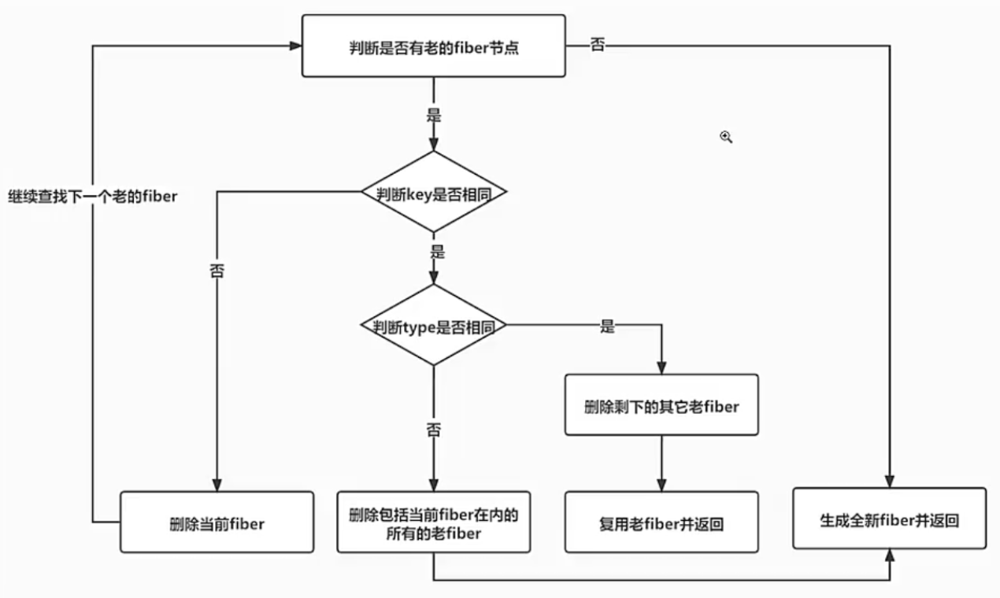
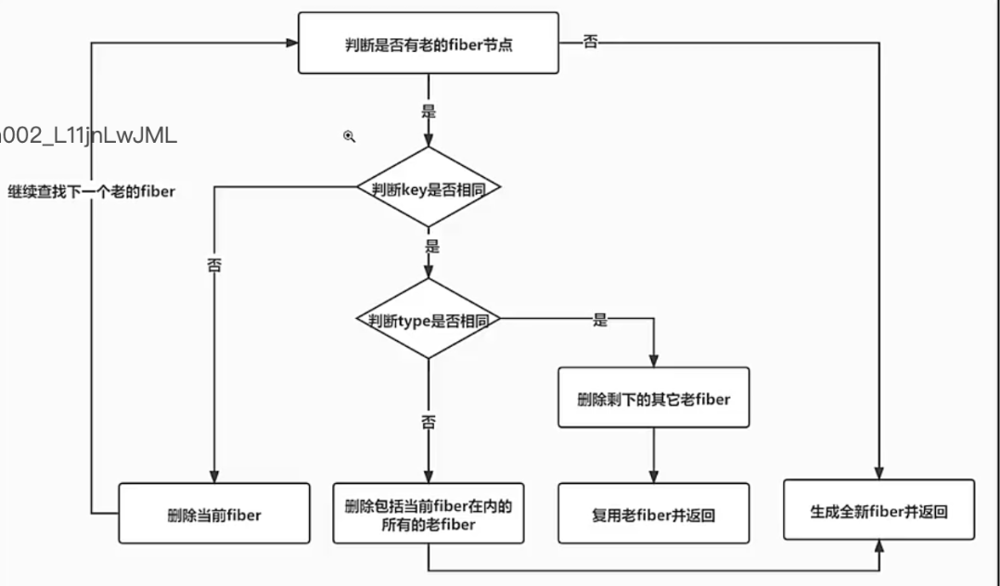

# React18.2 源码学习

## 1 ReactHooks-DOMDiff

### 1.1 DOMDiff.图示

- 
- 判断有没有老 fiber
- child 不为 null，表明有老 fiber
- 判断 key 和 type 是否一样
- 都一样表示此节点可以复用

### 1.2 第一个子 fiber 获取函数改-reconcileSingleElement-[src/react-reconciler/src/ReactChildFiber.js](../../public/react18-learn/src/react-reconciler/src/ReactChildFiber.js)

```js
/**
 * description: 第一个子 fiber 获取
 * @param {*} returnFiber
 * @param {*} currentFirstFiber
 * @param {*} element
 */
function reconcileSingleElement(returnFiber, currentFirstFiber, element) {
  // 新的虚拟 DOM 的 key，也就是唯一标准
  const key = element.key // null
  let child = currentFirstFiber // 老 FunctionComponent 节点对应的 fiber
  while (child !== null) {
    // 老 fiber 的 key 和新的 key 一样，表示可以复用
    if (child.key === key) {
      // 老 fiber 的 type 和新的 type 一样，表示可以复用
      if (child.type === element.type) {
        // 老 fiber 的 key&type 和新的一样，表示可以复用
        const existing = useFiber(child, element.props)
        existing.return = returnFiber
        return existing
      }
    }
    child = child.sibling
  }
  // 初次挂载，老节点 currentFirstFiber 是没有的，可以直接根据虚拟 DOM 创建新的 Fiber 节点
  const created = createFiberFromElement(element)
  created.return = returnFiber
  return created
}
```

### 1.3 基于老 fiber 创建新 fiber-useFiber-[src/react-reconciler/src/ReactChildFiber.js](../../public/react18-learn/src/react-reconciler/src/ReactChildFiber.js)

```js
function createChildReconciler(shouldTrackSideEffects) {
  /**
   * description: 基于老 fiber 创建新 fiber
   * @param {*} fiber - 老 fiber
   * @param {*} pendingProps - 新属性 props
   */
  function useFiber(fiber, pendingProps) {
    const clone = createWorkInProgress(fiber, pendingProps)
    clone.index = 0
    clone.sibling = null
    return clone
  }
  // ...
}
```

### 1.4 副作用设置函数改-placeSingleChild-[src/react-reconciler/src/ReactChildFiber.js](../../public/react18-learn/src/react-reconciler/src/ReactChildFiber.js)

```js
function placeSingleChild(newFiber) {
  // ...
  if (shouldTrackSideEffects && newFiber.alternate === null) {
    // ...
  }
  // ...
}
```

### 1.5 节点更新函数调用-updateHostComponent-[src/react-reconciler/src/ReactFiberCompleteWork.js](../../public/react18-learn/src/react-reconciler/src/ReactFiberCompleteWork.js)

- beginWork 后，进行 completeWork 逻辑
- 老 fiber + 真实 DOM => 节点更新逻辑 updateHostComponent

```js
export function completeWork(current, workInProgress) {
  // ...const { type } = workInProgress...
  if (current !== null && workInProgress.stateNode !== null) {
    updateHostComponent(current, workInProgress, type, newProps)
  } else {
    const instance = createInstance(type, newProps, workInProgress)
    // 把自己所有的儿子都添加到自己的身上
    appendAllChildren(instance, workInProgress)
    workInProgress.stateNode = instance
    finalizeInitialChildren(instance, type, newProps)
  }
  // bubbleProperties(workInProgress)...
}
```

## 2 ReactHooks-DOMDiff

### 2.1 节点更新函数增-updateHostComponent-[src/react-reconciler/src/ReactFiberCompleteWork.js](../../public/react18-learn/src/react-reconciler/src/ReactFiberCompleteWork.js)

```js
/**
 * description: 节点更新函数
 * @param {*} current - 老 fiber
 * @param {*} workInProgress - 新 fiber
 * @param {*} type - 类型
 * @param {*} newProps - 新属性 props
 */
function updateHostComponent(current, workInProgress, type, newProps) {
  const oldProps = current.memoizedProps // 老的属性
  const instance = workInProgress.stateNode // 老的 DOM 节点
  debugger
  // 比较新老属性，收集属性的差异
  // const updatePayload = prepareUpdate(instance, type, oldProps, newProps)
  const updatePayload = ['children', 6] // TODO 待dele 假数据
  // 让原生组件的新 fiber 更新队列等于 []
  workInProgress.updateQueue = updatePayload
  if (updatePayload) {
    markUpdate(workInProgress)
  }
}
```

### 2.2 更新阶段标记函数-markUpdate-[src/react-reconciler/src/ReactFiberCompleteWork.js](../../public/react18-learn/src/react-reconciler/src/ReactFiberCompleteWork.js)

```js
import { NoFlags, Update } from './ReactFiberFlags'

/**
 * description: 更新阶段标记函数
 * @param {*} workInProgress - 新 fiber
 */
function markUpdate(workInProgress) {
  workInProgress.flags |= Update
}
```

- 浏览器查看: 根 Fiber.child -> FunctionComponent -> FunctionComponent.memoizedState -> useReducer -> memoizedState = 0

### 2.3 补充函数逻辑-构建子 fiber 函数改-beginWork-[src/react-reconciler/src/ReactFiberBeginWork.js](../../public/react18-learn/src/react-reconciler/src/ReactFiberBeginWork.js)

```js
export function beginWork(current, workInProgress) {
  // ...
  switch (workInProgress.tag) {
    // 因为在 React 里组件其实有两种，一种是函数组件，一种是类组件，但是它们都是都是函数
    // case IndeterminateComponent:...
    case FunctionComponent: {
      const Component = workInProgress.type
      const nextProps = workInProgress.pendingProps
      return updateFunctionComponent(
        current,
        workInProgress,
        Component,
        nextProps
      )
    }
    // case HostRoot:...
  }
}
```

### 2.4 准备函数组件更新函数-updateFunctionComponent-[src/react-reconciler/src/ReactFiberBeginWork.js](../../public/react18-learn/src/react-reconciler/src/ReactFiberBeginWork.js)

```js
export function updateFunctionComponent(
  current,
  workInProgress,
  Component,
  props
) {
  const nextChildren = renderWithHooks(
    current,
    workInProgress,
    Component,
    props
  )
  reconcileChildren(current, workInProgress, nextChildren)
  return workInProgress.child
}
```

### 2.5 更新准备函数引用-prepareUpdate-[src/react-reconciler/src/ReactFiberCompleteWork.js](../../public/react18-learn/src/react-reconciler/src/ReactFiberCompleteWork.js)

```js
import {
  appendInitialChild,
  createInstance,
  createTextInstance,
  finalizeInitialChildren,
  prepareUpdate,
} from 'react-dom-bindings/src/client/ReactDOMHostConfig'
```

## 3 ReactHooks-DOMDiff

### 3.1 在 fiber(button)的完成阶段准备更新 DOM 函数增-prepareUpdate-[src/react-dom-bindings/src/client/ReactDOMHostConfig.js](../../public/react18-learn/src/react-dom-bindings/src/client/ReactDOMHostConfig.js)

```js
export function prepareUpdate(domElement, type, oldProps, newProps) {
  return diffProperties(domElement, type, oldProps, newProps)
}
```

### 3.2 属性差距比较函数增-diffProperties-[src/react-dom-bindings/src/client/ReactDOMComponent.js](../../public/react18-learn/src/react-dom-bindings/src/client/ReactDOMComponent.js)

- 差异比较.1-老对象有，新对象无，删除属性

```js
export function diffProperties(domElement, tag, lastProps, nextProps) {
  let updatePayload = null
  let propKey
  let styleName
  let styleUpdates = null
  //处理属性的删除 如果说一个属性在老对象里有，新对象没有的话，那就意味着删除
  for (propKey in lastProps) {
    //如果新属性对象里有此属性，或者老的没有此属性，或者老的是个null
    if (
      nextProps.hasOwnProperty(propKey) ||
      !lastProps.hasOwnProperty(propKey) ||
      lastProps[propKey] === null
    ) {
      continue
    }
    if (propKey === STYLE) {
      const lastStyle = lastProps[propKey]
      for (styleName in lastStyle) {
        if (lastStyle.hasOwnProperty(styleName)) {
          if (!styleUpdates) {
            styleUpdates = {}
          }
          styleUpdates[styleName] = ''
        }
      }
    } else {
      ;(updatePayload = updatePayload || []).push(propKey, null)
    }
  }
  //遍历新的属性对象
  for (propKey in nextProps) {
    const nextProp = nextProps[propKey] //新属性中的值
    const lastProp = lastProps !== null ? lastProps[propKey] : undefined //老属性中的值
    if (
      !nextProps.hasOwnProperty(propKey) ||
      nextProp === lastProp ||
      (nextProp === null && lastProp === null)
    ) {
      continue
    }
    if (propKey === STYLE) {
      if (lastProp) {
        //计算要删除的行内样式
        for (styleName in lastProp) {
          //如果此样式对象里在的某个属性老的style里有，新的style里没有
          if (
            lastProp.hasOwnProperty(styleName) &&
            (!nextProp || !nextProp.hasOwnProperty(styleName))
          ) {
            if (!styleUpdates) styleUpdates = {}
            styleUpdates[styleName] = ''
          }
        }
        //遍历新的样式对象
        for (styleName in nextProp) {
          //如果说新的属性有，并且新属性的值和老属性不一样
          if (
            nextProp.hasOwnProperty(styleName) &&
            lastProp[styleName] !== nextProp[styleName]
          ) {
            if (!styleUpdates) styleUpdates = {}
            styleUpdates[styleName] = nextProp[styleName]
          }
        }
      } else {
        styleUpdates = nextProp
      }
    } else if (propKey === CHILDREN) {
      if (typeof nextProp === 'string' || typeof nextProp === 'number') {
        ;(updatePayload = updatePayload || []).push(propKey, nextProp)
      }
    } else {
      ;(updatePayload = updatePayload || []).push(propKey, nextProp)
    }
  }
  if (styleUpdates) {
    ;(updatePayload = updatePayload || []).push(STYLE, styleUpdates)
  }
  return updatePayload //[key1,value1,key2,value2]
}
```

### 3.3 prepareUpdate 调用-节点更新函数改-updateHostComponent-[src/react-reconciler/src/ReactFiberCompleteWork.js](../../public/react18-learn/src/react-reconciler/src/ReactFiberCompleteWork.js)

```js
function updateHostComponent(current, workInProgress, type, newProps) {
  const oldProps = current.memoizedProps // 老的属性
  const instance = workInProgress.stateNode // 老的 DOM 节点
  // 比较新老属性，收集属性的差异
  const updatePayload = prepareUpdate(instance, type, oldProps, newProps)
  // 让原生组件的新 fiber 更新队列等于 []
  console.log('updatePayload:', updatePayload)
  workInProgress.updateQueue = updatePayload
  if (updatePayload) {
    markUpdate(workInProgress)
  }
}
```

### 3.4 入口文件定义 button 的 ID-[src/main.jsx](../../public/react18-learn/src/main.jsx)

```jsx
function FunctionComponent() {
  debugger
  const [number, setNumber] = React.useReducer(counter, 0)
  return (
    <div>
      <button
        id={Date.now()}
        onClick={() => {
          setNumber({ type: 'add', payload: 1 }) // update1=>update2=>update3=>update1
          setNumber({ type: 'add', payload: 2 }) // update2
          setNumber({ type: 'add', payload: 3 }) // update3
        }}
      >
        {number}
      </button>
    </div>
  )
}
```

- 浏览器点击查看 updatePayload ['id', 000, 'onClick',...]

### 3.5 入口文件设置可变属性 attrs-[src/main.jsx](../../public/react18-learn/src/main.jsx)

```jsx
function FunctionComponent() {
  const [number, setNumber] = React.useReducer(counter, 0)
  let attrs = { id: 'btn1' }
  if (number === 6) {
    delete attrs.id
    attrs.style = { color: 'red' }
  }
  return (
    <div>
      <button
        {...attrs}
        onClick={() => {
          setNumber({ type: 'add', payload: 1 }) // update1=>update2=>update3=>update1
          setNumber({ type: 'add', payload: 2 }) // update2
          setNumber({ type: 'add', payload: 3 }) // update3
        }}
      >
        {number}
      </button>
    </div>
  )
}
```

- 浏览器点击查看 updatePayload ['id', null, 'onClick',...]

## 4 ReactHooks-DOMDiff

### 4.1 一个 fiber 节点完成函数增加函数组件逻辑-completeWork-[src/react-reconciler/src/ReactFiberCompleteWork.js](../../public/react18-learn/src/react-reconciler/src/ReactFiberCompleteWork.js)

```js
import {
  FunctionComponent,
  HostComponent,
  HostRoot,
  HostText,
} from './ReactWorkTags'

export function completeWork(current, workInProgress) {
  // ...
  switch (workInProgress.tag) {
    // case HostComponent:...
    case FunctionComponent:
      bubbleProperties(workInProgress)
      break
    // case HostText:...
  }
}
```

### 4.2 fiber 副作用执行函数增加 DOM 更新逻辑-commitMutationEffectsOnFiber-[src/react-reconciler/src/ReactFiberCommitWork.js](../../public/react18-learn/src/react-reconciler/src/ReactFiberCommitWork.js)

```js
import { MutationMask, Placement, Update } from './ReactFiberFlags'

import {
  appendChild,
  insertBefore,
  commitUpdate,
} from 'react-dom-bindings/src/client/ReactDOMHostConfig'

export function commitMutationEffectsOnFiber(finishedWork, root) {
  const current = finishedWork.alternate
  const flags = finishedWork.flags
  switch (finishedWork.tag) {
    case FunctionComponent:
    case HostRoot:
    case HostText: {
      // 先遍历它们的子节点，处理它们的子节点上的副作用
      recursivelyTraverseMutationEffects(root, finishedWork)
      // 再处理自己身上的副作用
      commitReconciliationEffects(finishedWork)
      break
    }
    case HostComponent:
      // 先遍历它们的子节点，处理它们的子节点上的副作用
      recursivelyTraverseMutationEffects(root, finishedWork)
      // 再处理自己身上的副作用
      commitReconciliationEffects(finishedWork)
      // 处理 DOM 更新
      if (flags & Update) {
        // 获取真实 DOM
        const instance = finishedWork.stateNode
        // 更新真实 DOM
        if (instance !== null) {
          const newProps = finishedWork.memoizedProps
          const oldProps = current !== null ? current.memoizedProps : newProps
          const type = finishedWork.type
          const updatePayload = finishedWork.updateQueue
          finishedWork.updateQueue = null
          if (updatePayload) {
            commitUpdate(
              instance,
              updatePayload,
              type,
              oldProps,
              newProps,
              finishedWork
            )
          }
        }
      }
      break
    default:
      break
  }
}
```

### 4.3 更新提交函数增-commitUpdate-[src/react-dom-bindings/src/client/ReactDOMHostConfig.js](../../public/react18-learn/src/react-dom-bindings/src/client/ReactDOMHostConfig.js)

```js
import {
  diffProperties,
  setInitialProperties,
  updateProperties,
} from './ReactDOMComponent'

export function commitUpdate(
  domElement,
  updatePayload,
  type,
  oldProps,
  newProps
) {
  updateProperties(domElement, updatePayload, type, oldProps, newProps)
  updateFiberProps(domElement, newProps)
}
```

### 4.4 属性更新函数增-updateProperties-[src/react-dom-bindings/src/client/ReactDOMComponent.js](../../public/react18-learn/src/react-dom-bindings/src/client/ReactDOMComponent.js)

```js
export function updateProperties(domElement, updatePayload) {
  updateDOMProperties(domElement, updatePayload)
}
```

### 4.5 真实 DOM 属性更新函数增-updateDOMProperties-[src/react-dom-bindings/src/client/ReactDOMComponent.js](../../public/react18-learn/src/react-dom-bindings/src/client/ReactDOMComponent.js)

```js
function updateDOMProperties(domElement, updatePayload) {
  for (let i = 0; i < updatePayload.length; i += 2) {
    const propKey = updatePayload[i]
    const propValue = updatePayload[i + 1]
    if (propKey === STYLE) {
      setValueForStyles(domElement, propValue)
    } else if (propKey === CHILDREN) {
      setTextContent(domElement, propValue)
    } else {
      setValueForProperty(domElement, propKey, propValue)
    }
  }
}
```

- 浏览器点击查看函数组件执行正确

## 5 ReactHooks-DOMDiff

### 5.1 fiber.节点更新图示

- 

### 5.2 入口文件增加 counter-[src/main.jsx](../../public/react18-learn/src/main.jsx)

```js
function counter(state, action) {
  if (action.type === 'add') return state + 1
  return state
}
function FunctionComponent() {
  const [number, setNumber] = React.useReducer(counter, 0)
  return (
    <div>
      <button
        onClick={() => {
          setNumber({ type: 'add' })
        }}
      >
        {number}
      </button>
    </div>
  )
}
```

- 浏览器查看正确
