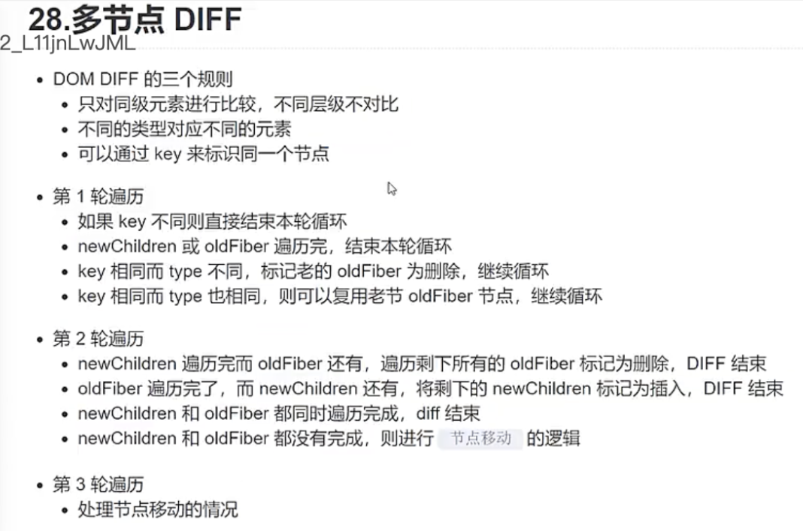
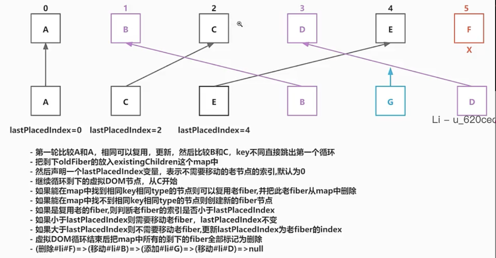
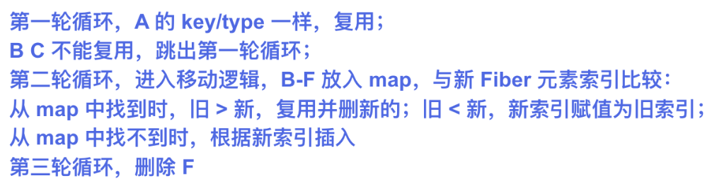
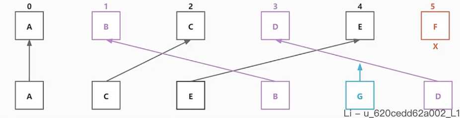

# React18.2 源码学习

## 1 hooks-useState

### 1.1 removeChild-子节点删除函数-[src/react-dom-bindings/src/client/ReactDOMHostConfig.js](../../public/react18-learn/src/react-dom-bindings/src/client/ReactDOMHostConfig.js)

```js
export function removeChild(parentInstance, child) {
  parentInstance.removeChild(child)
}
```

### 1.2 getFlags-改：操作标记获取函数-[src/react-reconciler/src/ReactFiberWorkLoop.js](../../public/react18-learn/src/react-reconciler/src/ReactFiberWorkLoop.js)

```js
import { ChildDeletion } from './ReactFiberFlags'
function getFlags(fiber) {
  const { flags, deletions } = fiber
  switch (flags) {
    //   return '更新'...
    case ChildDeletion:
      return (
        '子节点有删除' +
        deletions
          .map((fiber) => `${fiber.key}#${fiber.memoizedProps.id}`)
          .join(',')
      )
    // default:...
  }
}
```

### 1.3 getTag-改：标签获取函数-[src/react-reconciler/src/ReactFiberWorkLoop.js](../../public/react18-learn/src/react-reconciler/src/ReactFiberWorkLoop.js)

```js
function getTag(tag) {
  switch (tag) {
    case FunctionComponent:
      return 'FunctionComponent'
    // case HostComponent:...
  }
}
```

- 浏览器查看正确

### 1.4 printFinishedWork-改：打印完成的工作-[src/react-reconciler/src/ReactFiberWorkLoop.js](../../public/react18-learn/src/react-reconciler/src/ReactFiberWorkLoop.js)

```js
function printFinishedWork(fiber) {
  const { flags, deletions } = fiber
  if (flags === ChildDeletion) {
    fiber.flags &= ~ChildDeletion
    console.log(
      '子节点有删除-------' +
        deletions.map((fiber) => `${fiber.type}#${fiber.memoizedProps.id}`)
    )
  }
  // let child = fiber.child...
}
```

### 1.5 reconcileSingleChild-改:deleteRemainingChildren 调用-[src/react-reconciler/src/ReactChildFiber.js](../../public/react18-learn/src/react-reconciler/src/ReactChildFiber.js)

```js
function reconcileSingleElement(returnFiber, currentFirstChild, element) {
  // let child = currentFirstChild...
  while (child !== null) {
    // 老 fiber 的 key 和新的 key 一样，表示可以复用
    if (child.key === key) {
      // 老 fiber 的 type 和新的 type 一样，表示可以复用
      if (child.type === element.type) {
        deleteRemainingChildren(returnFiber, child.sibling)
        // 老 fiber 的 key&type 和新的一样，表示可以复用
        const existing = useFiber(child, element.props)
        existing.return = returnFiber
        return existing
      } else {
        // 如果找到一key一样老fiber,但是类型不一样，不能此老fiber,把剩下的全部删除
        deleteRemainingChildren(returnFiber, child)
      }
    } else {
      deleteChild(returnFiber, child)
    }
    child = child.sibling
  }
  // ...
}
```

## 2 hooks-useState

### 2.1 deleteRemainingChildren-对从 currentFirstChild 之后的所有 fiber 节点删除函数-[src/react-reconciler/src/ReactChildFiber.js](../../public/react18-learn/src/react-reconciler/src/ReactChildFiber.js)

```js
function deleteRemainingChildren(returnFiber, currentFirstChild) {
  if (!shouldTrackSideEffects) return
  let childToDelete = currentFirstChild
  while (childToDelete !== null) {
    deleteChild(returnFiber, childToDelete)
    childToDelete = childToDelete.sibling
  }
  return null
}
```

### 2.2 FunctionComponent-改:函数组件-[src/main.jsx](../../public/react18-learn/src/main.jsx)

```js
function FunctionComponent() {
  const [number, setNumber] = React.useState(0)
  return number === 0 ? (
    <div onClick={() => setNumber(number + 1)} key="title1" id="title1">
      title1
    </div>
  ) : (
    <div onClick={() => setNumber(number + 1)} key="title1" id="title1">
      title1
    </div>
  )
}
```

### 2.3 FunctionComponent-改:函数组件-[src/main.jsx](../../public/react18-learn/src/main.jsx)

```js
// 多节点 => 单节点
function FunctionComponent() {
  const [number, setNumber] = React.useState(0)
  return number === 0 ? (
    <ul onClick={() => setNumber(number + 1)} key="container" id="title1">
      <li key="A" id="A">
        A
      </li>
      <li key="B" id="B">
        B
      </li>
      <li key="C" id="C">
        C
      </li>
    </ul>
  ) : (
    <ul onClick={() => setNumber(number + 1)} key="container" id="title1">
      <li key="B" id="B2">
        B2
      </li>
    </ul>
  )
}
```

- 浏览器查看正确
- 更新 4+删除 8=12

### 2.4 多节点.diff.图示

- 

### 2.5 FunctionComponent-改:函数组件-[src/main.jsx](../../public/react18-learn/src/main.jsx)

```js
// 多节点 => 单节点
function FunctionComponent() {
  const [number, setNumber] = React.useState(0)
  return number === 0 ? (
    <ul onClick={() => setNumber(number + 1)} key="container" id="title1">
      <li key="A" id="A">
        A
      </li>
      <li key="B" id="B">
        B
      </li>
      <li key="C" id="C">
        C
      </li>
    </ul>
  ) : (
    <ul onClick={() => setNumber(number + 1)} key="container" id="title1">
      <li key="A" id="A2">
        A2
      </li>
      <p key="B" id="B">
        B
      </p>
      <li key="C" id="C2">
        C2
      </li>
    </ul>
  )
}
```

- 浏览器查看状态：功能未实现

## 3 hooks-DOMDiff

### 3.1 reconcileChildrenArray-改：子节点数组处理函数-[src/react-reconciler/src/ReactChildFiber.js](../../public/react18-learn/src/react-reconciler/src/ReactChildFiber.js)

```js
function reconcileChildrenArray(returnFiber, currentFirstChild, newChildren) {
  // ...let newIdx = 0
  let oldFiber = currentFirstChild // 第一个老fiber
  let nextOldFiber = null // 下一个老fiber
  // 开始第一轮循环 如果老fiber有值，新的虚拟DOM也有值
  for (; oldFiber !== null && newIdx < newChildren.length; newIdx++) {
    //先暂下一个老fiber
    nextOldFiber = oldFiber.sibling
    //试图更新或者试图复用老的
    const newFiber = updateSlot(returnFiber, oldFiber, newChildren[newIdx])
  }
  // for (; newIdx < newChildren.length; newIdx++) {...
}
```

### 3.2 updateSlot-插槽更新函数-[src/react-reconciler/src/ReactChildFiber.js](../../public/react18-learn/src/react-reconciler/src/ReactChildFiber.js)

```js
function updateSlot(returnFiber, oldFiber, newChild) {
  const key = oldFiber !== null ? oldFiber.key : null
  if (newChild !== null && typeof newChild === 'object') {
    switch (newChild.$$typeof) {
      case REACT_ELEMENT_TYPE: {
        if (newChild.key == key) {
          return updateElement(returnFiber, oldFiber, newChild)
        }
      }
      default:
        return null
    }
  }
  return null
}
```

### 3.3 updateElement-元素更新函数-[src/react-reconciler/src/ReactChildFiber.js](../../public/react18-learn/src/react-reconciler/src/ReactChildFiber.js)

```js
function updateElement(returnFiber, current, element) {
  const elementType = element.type
  if (current !== null) {
    // 判断是否类型一样，则表示key和type都一样，可以复用老的fiber和真实DOM
    if ((current.type = elementType)) {
      const existing = useFiber(current, element.props)
      existing.return = returnFiber
      return existing
    }
  }
  const created = createFiberFromElement(element)
  created.return = returnFiber
  return created
}
```

### 3.4 reconcileChildrenArray-改：子节点数组处理函数-初次挂载时无替身.alternate-[src/react-reconciler/src/ReactChildFiber.js](../../public/react18-learn/src/react-reconciler/src/ReactChildFiber.js)

```js
function reconcileChildrenArray(returnFiber, currentFirstChild, newChildren) {
  // ...let nextOldFiber = null // 下一个老fiber
  // 开始第一轮循环 如果老fiber有值，新的虚拟DOM也有值
  for (; oldFiber !== null && newIdx < newChildren.length; newIdx++) {
    // ...const newFiber = updateSlot(returnFiber, oldFiber, newChildren[newIdx])
    if (newFiber === null) {
      break
    }
    // Q: 判断是否需要追踪副作用原因？提升性能，避免添加不必要的副作用
    if (shouldTrackSideEffects) {
      // 如果有老fiber,但是新的fiber并没有成功复用老fiber和老的真实DOM，那就删除老fiber,在提交阶段会删除真实DOM
      if (oldFiber && newFiber.alternate === null) {
        deleteChild(returnFiber, oldFiber)
      }
    }
    // 指定新的 fiber 位置
    placeChild(newFiber, newIdx)
    if (previousNewFiber === null) {
      resultingFirstChild = newFiber // li(A).sibling = p(B).sibling = li(C)
    } else {
      previousNewFiber.sibling = newFiber
    }
    previousNewFiber = newFiber
    // Q: oldFiber = oldFiber.sibling 不这样写的原因？为了安全，sibling 使用较多，防止开发者修改老 fiber 的 sibling
    oldFiber = nextOldFiber
  }
}
```

### 3.5 placeChild-子节点放置函数-[src/react-reconciler/src/ReactChildFiber.js](../../public/react18-learn/src/react-reconciler/src/ReactChildFiber.js)

```js
function placeChild(newFiber, newIdx) {
  // 指定新的fiber在新的挂载索引
  newFiber.index = newIdx
  // 如果不需要跟踪副作用
  if (!shouldTrackSideEffects) {
    return
  }
  // 获取它的老fiber
  const current = newFiber.alternate
  // 如果有，说明这是一个更新的节点，有老的真实DOM
  if (current !== null) {
    // A 与 C 都会进入这里
    debugger
    return
  } else {
    // 如果没有，说明这是一个新的节点，需要插入
    newFiber.flags |= Placement
  }
}
```

- 浏览器查看插入正确

## 4 hooks-DOMDiff

### 4.1 FunctionComponent-改:函数组件-增加节点.D-[src/main.jsx](../../public/react18-learn/src/main.jsx)

```js
function FunctionComponent() {
  const [number, setNumber] = React.useState(0)
  return number === 0 ? (
    <ul onClick={() => setNumber(number + 1)} key="container" id="title1">
      <li key="A" id="A">
        A
      </li>
      <li key="B" id="B">
        B
      </li>
      <li key="C" id="C">
        C
      </li>
    </ul>
  ) : (
    <ul onClick={() => setNumber(number + 1)} key="container" id="title1">
      <li key="A" id="A2">
        A2
      </li>
      <li key="B" id="B">
        B
      </li>
      <li key="C" id="C2">
        C2
      </li>
      <li key="D" id="D">
        D
      </li>
    </ul>
  )
}
```

### 4.2 reconcileChildrenArray-改：子节点数组处理函数-初次挂载时无替身.alternate-[src/react-reconciler/src/ReactChildFiber.js](../../public/react18-learn/src/react-reconciler/src/ReactChildFiber.js)

```js
function reconcileChildrenArray(returnFiber, currentFirstChild, newChildren) {
  // for (; oldFiber !== null && newIdx < newChildren.length; newIdx++) {}...
  // 如果老的 fiber 已经没有了，新的虚拟 DOM 还有，插入新节点的逻辑
  for (; newIdx < newChildren.length; newIdx++) {
    const newFiber = createChild(returnFiber, newChildren[newIdx])
    if (newFiber === null) continue
    placeChild(newFiber, newIdx)
    //  如果 previousNewFiber 为 null，说明这是第一个 fiber
    if (previousNewFiber === null) {
      resultingFirstChild = newFiber // 这个 newFiber 就是大儿子
    } else {
      // 否则说明不是大儿子，就把这个 newFiber 添加上一个子节点后面
      previousNewFiber.sibling = newFiber
    }
    // 让 newFiber 成为最后一个或者说上一个子 fiber
    previousNewFiber = newFiber
  }
  return resultingFirstChild
}
```

### 4.3 FunctionComponent-改:函数组件-删除节点实现-[src/main.jsx](../../public/react18-learn/src/main.jsx)

```js
function FunctionComponent() {
  const [number, setNumber] = React.useState(0)
  return number === 0 ? (
    <ul onClick={() => setNumber(number + 1)} key="container" id="title1">
      <li key="A" id="A">
        A
      </li>
      <li key="B" id="B">
        B
      </li>
      <li key="C" id="C">
        C
      </li>
    </ul>
  ) : (
    <ul onClick={() => setNumber(number + 1)} key="container" id="title1">
      <li key="A" id="A2">
        A2
      </li>
      <li key="B" id="B">
        B
      </li>
    </ul>
  )
}
```

### 4.4 reconcileChildrenArray-改：子节点数组处理函数-初次挂载时无替身.alternate-[src/react-reconciler/src/ReactChildFiber.js](../../public/react18-learn/src/react-reconciler/src/ReactChildFiber.js)

```js
function reconcileChildrenArray(returnFiber, currentFirstChild, newChildren) {
  // for (; oldFiber !== null && newIdx < newChildren.length; newIdx++) {}...
  // 新的虚拟 DOM 已经循环完毕，3个节点变为 2 个节点
  if (newIdx === newChildren.length) {
    // 删除剩下的老 fiber
    deleteRemainingChildren(returnFiber, oldFiber)
    return resultingFirstChild
  }
}
```

- 浏览器查看节点删除正确

### 4.5 dom.diff.节点移动图示

- 
- 

## 5 hooks-DOMDiff

### 5.1 dom.diff.原理-[doc/15.diff.js](../../public/react18-learn/doc/15.diff.js)

- 

```js
let existingChildren = new Map()
existingChildren.set('B', 'B_Fiber')
existingChildren.set('C', 'C_Fiber')
existingChildren.set('B', 'B_Fiber')
existingChildren.set('E', 'E_Fiber')
existingChildren.set('F', 'F_Fiber')
let lastPlaceIndex = 0
let newChildren = ['C', 'E', 'B', 'G', 'D']
for (let i = 0; i < newChildren.length; i++) {
  let newChild = newChildren[i]
  let exist = existingChildren.get(newChild)
  if (exist) {
    // 复用 'C'
    existingChildren.delete(newChild)
  } else {
    // 不存在
    lastPlaceIndex = i
  }
}
```

### 5.2 reconcileChildrenArray-改：子节点数组处理函数-开始处理移动情况-[src/react-reconciler/src/ReactChildFiber.js](../../public/react18-learn/src/react-reconciler/src/ReactChildFiber.js)

```js
function reconcileChildrenArray(returnFiber, currentFirstChild, newChildren) {
  // for (; newIdx < newChildren.length; newIdx++) {}...
  const existingChildren = mapRemainingChildren(returnFiber, oldFiber)
  return resultingFirstChild
}
```

### 5.3 mapRemainingChildren-剩余老节点放置处理函数-[src/react-reconciler/src/ReactChildFiber.js](../../public/react18-learn/src/react-reconciler/src/ReactChildFiber.js)

```js
function mapRemainingChildren(returnFiber, currentFirstChild) {
  const existingChildren = new Map()
  let existingChild = currentFirstChild
  while (existingChild != null) {
    // 如果有key用key,如果没有key使用索引
    if (existingChild.key !== null) {
      existingChildren.set(existingChild.key, existingChild)
    } else {
      existingChildren.set(existingChild.index, existingChild)
    }
    existingChild = existingChild.sibling
  }
  return existingChildren
}
```

### 5.4 reconcileChildrenArray-改：子节点数组处理函数-遍历剩余的虚拟 DOM 子节点, 找复用的节点-[src/react-reconciler/src/ReactChildFiber.js](../../public/react18-learn/src/react-reconciler/src/ReactChildFiber.js)

```js
function reconcileChildrenArray(returnFiber, currentFirstChild, newChildren) {
  // const existingChildren = mapRemainingChildren(returnFiber, oldFiber)...
  for (; newIdx < newChildren.length; newIdx++) {
    const newFiber = updateFromMap(
      existingChildren,
      returnFiber,
      newIdx,
      newChildren[newIdx]
    )
  }
  return resultingFirstChild
}
```

### 5.5 updateFromMap-从 map 中更新函数-[src/react-reconciler/src/ReactChildFiber.js](../../public/react18-learn/src/react-reconciler/src/ReactChildFiber.js)

```js
function updateFromMap(existingChildren, returnFiber, newIdx, newChild) {
  if (
    (typeof newChild === 'string' && newChild !== '') ||
    typeof newChild === 'number'
  ) {
    const matchedFiber = existingChildren.get(newIdx) || null
    return updateTextNode(returnFiber, matchedFiber, '' + newChild)
  }
}
```
