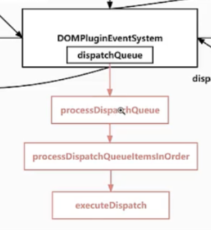

# React18.2 源码学习

## 1

### 1.1 合成事件逻辑-回调函数添加到派发队列函数-extractEvents-[src/react-dom-bindings/src/events/plugins/SimpleEventPlugin.js](../../public/react18-learn/src/react-dom-bindings/src/events/plugins/SimpleEventPlugin.js)

```js
// 合成事件实例
const event = new SyntheticEventCtor(
  reactName,
  reactEventType,
  null,
  nativeEvent,
  nativeEventTarget
)
```

### 1.2 派发事件执行图示

- 

### 1.3 -[xxx](../../public/react18-learn/xxx)

```js

```

### 1.4 -[xxx](../../public/react18-learn/xxx)

```js

```

### 1.5 -[xxx](../../public/react18-learn/xxx)

```js

```

## 2

### 2.1 -[xxx](../../public/react18-learn/xxx)

```js

```

### 2.2 -[xxx](../../public/react18-learn/xxx)

```js

```

### 2.3 -[xxx](../../public/react18-learn/xxx)

```js

```

### 2.4 -[xxx](../../public/react18-learn/xxx)

```js

```

### 2.5 -[xxx](../../public/react18-learn/xxx)

```js

```

## 3

### 3.1 -[xxx](../../public/react18-learn/xxx)

```js

```

### 3.2 -[xxx](../../public/react18-learn/xxx)

```js

```

### 3.3 -[xxx](../../public/react18-learn/xxx)

```js

```

### 3.4 -[xxx](../../public/react18-learn/xxx)

```js

```

### 3.5 -[xxx](../../public/react18-learn/xxx)

```js

```

## 4

### 4.1 -[xxx](../../public/react18-learn/xxx)

```js

```

### 4.2 -[xxx](../../public/react18-learn/xxx)

```js

```

### 4.3 -[xxx](../../public/react18-learn/xxx)

```js

```

### 4.4 -[xxx](../../public/react18-learn/xxx)

```js

```

### 4.5 -[xxx](../../public/react18-learn/xxx)

```js

```

## 5

### 5.1 -[xxx](../../public/react18-learn/xxx)

```js

```

### 5.2 -[xxx](../../public/react18-learn/xxx)

```js

```

### 5.3 -[xxx](../../public/react18-learn/xxx)

```js

```

### 5.4 -[xxx](../../public/react18-learn/xxx)

```js

```

### 5.5 -[xxx](../../public/react18-learn/xxx)

```js

```
