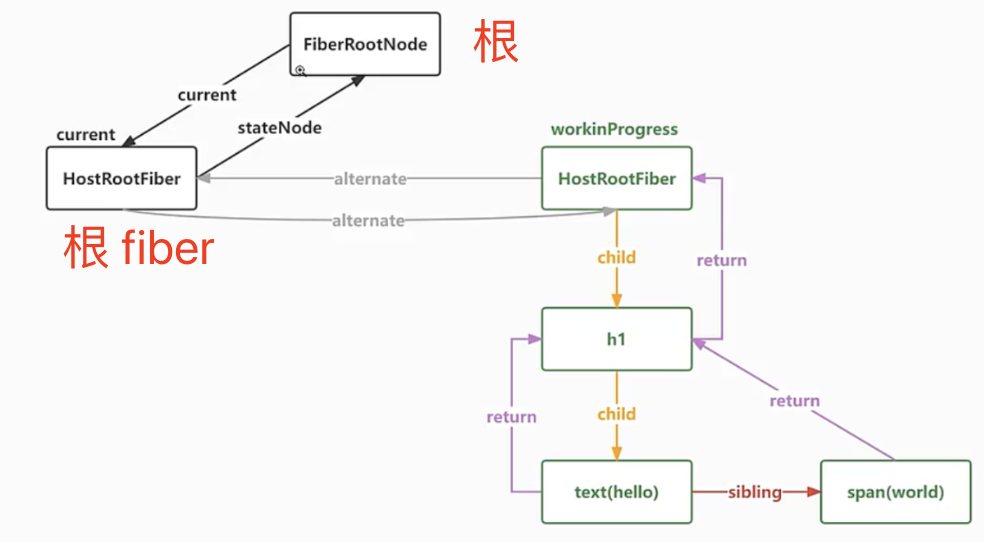
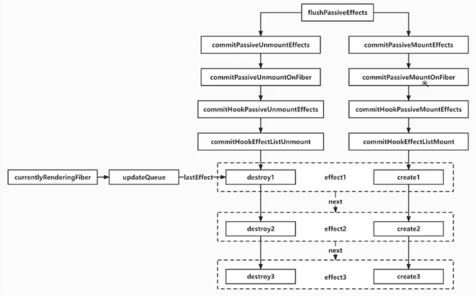

# React18.2 源码学习

## 1 useEffect

### 1.1 commitRoot-改:提交函数-渲染完成，进入执行逻辑-[src/react-reconciler/src/ReactFiberWorkLoop.js](../../public/react18-learn/src/react-reconciler/src/ReactFiberWorkLoop.js)

```js
// ...let workInProgressRoot = null
let rootDoesHavePassiveEffect = false // 此根节点上有没有useEffect类似的副作用
let rootWithPendingPassiveEffects = null // 具有useEffect副作用的根节点 FiberRootNode,根fiber.stateNode

function commitRoot(root) {
  const { finishedWork } = root
  printFinishedWork(finishedWork)
  if (
    (finishedWork.subtreeFlags & Passive) !== NoFlags ||
    (finishedWork.flags & Passive) !== NoFlags
  ) {
    rootDoesHavePassiveEffect = true
    scheduleCallback(flushPassiveEffect)
  }
  console.log('~~~~~~~~~~~~~~~~~~~~~')
  // ...
}
```

### 1.2 渲染.fiber.图示



### 1.3 flushPassiveEffect-有要执行副作用的根-[src/react-reconciler/src/ReactFiberWorkLoop.js](../../public/react18-learn/src/react-reconciler/src/ReactFiberWorkLoop.js)

```js
function flushPassiveEffect() {
  if (rootWithPendingPassiveEffects !== null) {
    const root = rootWithPendingPassiveEffects
    // 执行卸载副作用，destroy
    commitPassiveUnmountEffects(root.current)
    // 执行挂载副作用 create
    commitPassiveMountEffects(root, root.current)
  }
}
```

### 1.4 commitRoot-改:提交函数-提交完成后-[src/react-reconciler/src/ReactFiberWorkLoop.js](../../public/react18-learn/src/react-reconciler/src/ReactFiberWorkLoop.js)

```js
function commitRoot(root) {
  // ...
  if (subtreeHasEffects || rootHasEffect) {
    commitMutationEffectsOnFiber(finishedWork, root)
    if (rootDoesHavePassiveEffect) {
      rootDoesHavePassiveEffect = false
      rootWithPendingPassiveEffects = root
    }
  }
  // 等 DOM 变更后, 就可以把让 root 的 current 指向新的 fiber 树
  root.current = finishedWork
}
```

### 1.5 从 ReactFiberCommitWork.js 文件中引入方法-[src/react-reconciler/src/ReactFiberWorkLoop.js](../../public/react18-learn/src/react-reconciler/src/ReactFiberWorkLoop.js)

```js
import {
  commitMutationEffectsOnFiber, // 执行 DOM 操作
  commitPassiveUnmountEffects, // 执行 destroy
  commitPassiveMountEffects, // 执行 create
} from './ReactFiberCommitWork'
```

## 2 useEffect

### 2.1 flushPassiveEffects.effect.调用栈图示



### 2.2 commitPassiveUnmountEffects&commitPassiveMountEffects-[src/react-reconciler/src/ReactFiberCommitWork.js](../../public/react18-learn/src/react-reconciler/src/ReactFiberCommitWork.js)

```js
export function commitPassiveUnmountEffects() {}
export function commitPassiveMountEffects(root, finishedWork) {
  // commitPassiveMountEffects ->
  // commitPassiveMountOnFiber ->
  // commitHookPassiveMountEffects ->
  // commitHookEffectListMount ->
  commitPassiveMountOnFiber(root, finishedWork)
}
```

### 2.3 commitPassiveMountOnFiber-挂载在 fiber 上的副作用提交函数-[src/react-reconciler/src/ReactFiberCommitWork.js](../../public/react18-learn/src/react-reconciler/src/ReactFiberCommitWork.js)

```js
import {
  HasEffect as HookHasEffect,
  Passive as HookPassive,
} from './ReactHookEffectTags'

function commitPassiveMountOnFiber(finishedRoot, finishedWork) {
  const flags = finishedWork.flags
  switch (finishedWork.tag) {
    case HostRoot: {
      recursivelyTraversePassiveMountEffects(finishedRoot, finishedWork)
      break
    }
    case FunctionComponent: {
      recursivelyTraversePassiveMountEffects(finishedRoot, finishedWork)
      if (flags & Passive) {
        commitHookPassiveMountEffects(finishedWork, HookHasEffect | HookPassive)
      }
      break
    }
  }
}
```

### 2.4 commitHookPassiveMountEffects-挂载在钩子上的副作用提交-[src/react-reconciler/src/ReactFiberCommitWork.js](../../public/react18-learn/src/react-reconciler/src/ReactFiberCommitWork.js)

```js
function commitHookPassiveMountEffects(finishedWork, hookFlags) {
  commitHookEffectListMount(hookFlags, finishedWork)
}
```

### 2.5 commitHookEffectListMount-挂载在钩子上的副作用列表提交-[src/react-reconciler/src/ReactFiberCommitWork.js](../../public/react18-learn/src/react-reconciler/src/ReactFiberCommitWork.js)

```js
function commitHookEffectListMount(flags, finishedWork) {
  const updateQueue = finishedWork.updateQueue
  const lastEffect = updateQueue !== null ? updateQueue.lastEffect : null
  if (lastEffect !== null) {
    // 获取第一个 effect
    const firstEffect = lastEffect.next
    let effect = firstEffect
    do {
      // 如果次 effect 类型和传入的相同，都是 9 HookHasEffect | PassiveEffect
      if ((effect.tag & flags) === flags) {
        const create = effect.create
        effect.destroy = create()
      }
      effect = effect.next
    } while (effect !== firstEffect)
  }
}
```

## 3 useEffect

### 3.1 recursivelyTraversePassiveMountEffects-挂载的消极副作用递归执行函数-[src/react-reconciler/src/ReactFiberCommitWork.js](../../public/react18-learn/src/react-reconciler/src/ReactFiberCommitWork.js)

```js
function recursivelyTraversePassiveMountEffects(root, parentFiber) {
  if (parentFiber.subtreeFlags & Passive) {
    let child = parentFiber.child
    while (child !== null) {
      commitPassiveMountOnFiber(root, child)
      child = child.sibling
    }
  }
}
```

### 3.2 updateEffect-副作用更新函数-[src/react-reconciler/src/ReactFiberHooks.js](../../public/react18-learn/src/react-reconciler/src/ReactFiberHooks.js)

```js
const HooksDispatcherOnUpdate = {
  useReducer: updateReducer,
  useState: updateState,
  useEffect: updateEffect,
}
function updateEffect(create, deps) {
  return updateEffectImpl(PassiveEffect, HookPassive, create, deps)
}
```

### 3.3 updateEffectImpl-副作用更新实现函数-[src/react-reconciler/src/ReactFiberHooks.js](../../public/react18-learn/src/react-reconciler/src/ReactFiberHooks.js)

```js
function updateEffectImpl(fiberFlags, hookFlags, create, deps) {
  const hook = updateWorkInProgressHook()
  const nextDeps = deps == undefined ? null : deps
  let destroy //上一个老hook
  if (currentHook !== null) {
    // 获取此useEffect这个Hook上老的effect对象 create deps destroy
    const prevEffect = currentHook.memoizedState
    destroy = prevEffect.destroy
    if (nextDeps !== null) {
      const prevDeps = prevEffect.deps
      if (areHookInputsEqual(nextDeps, prevDeps)) {
        hook.memoizedState = pushEffect(hookFlags, create, destroy, nextDeps)
      }
    }
  }
}
```

### 3.4 areHookInputsEqual-数组比较是否相等函数-[src/react-reconciler/src/ReactFiberHooks.js](../../public/react18-learn/src/react-reconciler/src/ReactFiberHooks.js)

```js
function areHookInputsEqual(nextDeps, prevDeps) {
  if (prevDeps === null) return null
  for (let i = 0; i < prevDeps.length && i < nextDeps.length; i++) {
    if (Object.is(nextDeps[i], prevDeps[i])) {
      continue
    }
    return false
  }

  return true
}
```

### 3.5 updateEffectImpl-改：副作用更新实现函数-[src/react-reconciler/src/ReactFiberHooks.js](../../public/react18-learn/src/react-reconciler/src/ReactFiberHooks.js)

```js
function updateEffectImpl(fiberFlags, hookFlags, create, deps) {
  // ...
  if (currentHook !== null) {
    // 获取此useEffect这个Hook上老的effect对象 create deps destroy
    const prevEffect = currentHook.memoizedState
    destroy = prevEffect.destroy
    if (nextDeps !== null) {
      const prevDeps = prevEffet.deps
      // 用新数组和老数组进行对比，如果一样的话
      if (areHookInputsEqual(nextDeps, prevDeps)) {
        // 不管要不要更新，都需要把 effect 组成完整的循环链表放到 fiber.updateQueue 中
        hook.memoizedState = pushEffect(hookFlags, create, destroy, nextDeps)
        return
      }
    }
  }
  // 如果要执行的话需要修改 fiber 的 flags
  currentlyRenderingFiber.flags |= fiberFlags
  // 如果要执行的话，添加 HookHasEffect flag
  // Q: 需要 HookHasEffect 原因？不是每个 Passive 都会执行的
  hook.memoizedState = pushEffect(
    HookHasEffect | hookFlags,
    create,
    destroy,
    nextDeps
  )
}
```

## 4 useEffect

### 4.1 commitPassiveUnmountEffects-取消挂载的副作用提交函数-[src/react-reconciler/src/ReactFiberCommitWork.js](../../public/react18-learn/src/react-reconciler/src/ReactFiberCommitWork.js)

```js
function commitPassiveUnmountEffects(finishedWork) {
  // commitPassiveUnmountEffects ->
  // commitPassiveUnmountOnFiber ->
  // commitHookPassiveUnmountEffects ->
  // commitHookEffectListUnmount ->
  commitPassiveUnmountOnFiber(finishedWork)
}
```

### 4.2 commitPassiveUnmountOnFiber-取消挂载在 fiber 的副作用提交函数-[src/react-reconciler/src/ReactFiberCommitWork.js](../../public/react18-learn/src/react-reconciler/src/ReactFiberCommitWork.js)

```js
function commitPassiveUnmountOnFiber(finishedWork) {
  const flags = finishedWork.flags
  switch (finishedWork.tag) {
    case HostRoot: {
      recursivelyTraversePassiveUnmountEffects(finishedWork)
      break
    }
    case FunctionComponent: {
      recursivelyTraversePassiveUnmountEffects(finishedWork)
      if (flags & Passive) {
        //1024
        commitHookPassiveUnmountEffects(
          finishedWork,
          HookHasEffect | HookPassive
        )
      }
      break
    }
  }
}
```

### 4.3 commitHookPassiveUnmountEffects-取消挂载在钩子的副作用提交函数-[src/react-reconciler/src/ReactFiberCommitWork.js](../../public/react18-learn/src/react-reconciler/src/ReactFiberCommitWork.js)

```js
function commitHookPassiveUnmountEffects(finishedWork, hookFlags) {
  commitHookEffectListUnmount(hookFlags, finishedWork)
}
```

### 4.4 commitHookEffectListUnmount-取消挂载在钩子的副作用列表提交函数-[src/react-reconciler/src/ReactFiberCommitWork.js](../../public/react18-learn/src/react-reconciler/src/ReactFiberCommitWork.js)

```js
function commitHookEffectListUnmount(flags, finishedWork) {
  const updateQueue = finishedWork.updateQueue
  const lastEffect = updateQueue !== null ? updateQueue.lastEffect : null
  if (lastEffect !== null) {
    // 获取第一个 effect
    const firstEffect = lastEffect.next
    let effect = firstEffect
    do {
      // 如果次 effect 类型和传入的相同，都是 9 HookHasEffect | PassiveEffect
      if ((effect.tag & flags) === flags) {
        const destroy = effect.destroy
        if (destroy !== undefined) {
          destroy()
        }
      }
      effect = effect.next
    } while (effect !== firstEffect)
  }
}
```

### 4.5 recursivelyTraversePassiveUnmountEffects-递归取消挂载的副作用处理函数-[src/react-reconciler/src/ReactFiberCommitWork.js](../../public/react18-learn/src/react-reconciler/src/ReactFiberCommitWork.js)

```js
function recursivelyTraversePassiveUnmountEffects(parentFiber) {
  if (parentFiber.subtreeFlags & Passive) {
    let child = parentFiber.child
    while (child !== null) {
      commitPassiveUnmountOnFiber(child)
      child = child.sibling
    }
  }
}
```

- 浏览器验证：更新队列未清空

## 5 useEffect

### 5.1 renderWithHooks-改：渲染函数-更新队列未清空问题解决-[src/react-reconciler/src/ReactFiberHooks.js](../../public/react18-learn/src/react-reconciler/src/ReactFiberHooks.js)

```js
export function renderWithHooks(current, workInProgress, Component, props) {
  currentlyRenderingFiber = workInProgress
  workInProgress.updateQueue = null
  // ...
}
```
