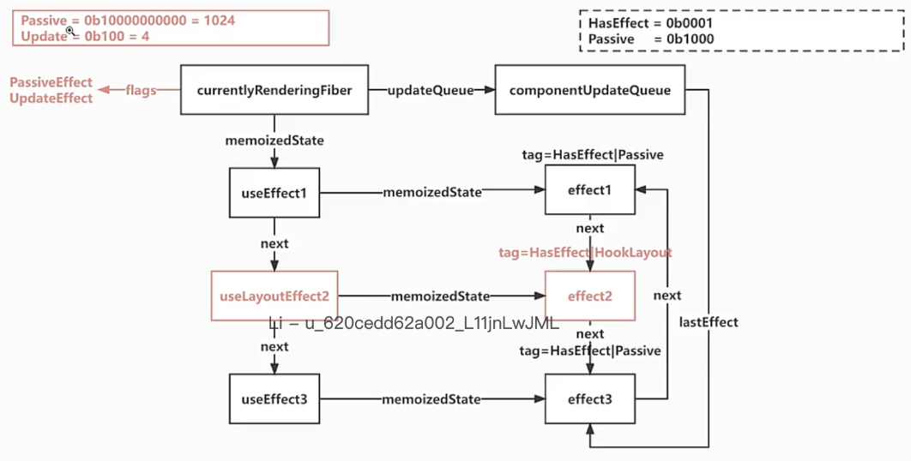

# React18.2 源码学习

## 1 useLayoutEffect

### 1.1 useLayoutEffect.图示



### 1.2 useLayoutEffect-导出-[src/react/index.js](../../public/react18-learn/src/react/index.js)

```js
export {
  // ...
  useLayoutEffect,
} from './src/React'
```

### 1.3 useLayoutEffect-引入并导出-[src/react/src/React.js](../../public/react18-learn/src/react/src/React.js)

```js
import {
  // ...
  useLayoutEffect,
} from './ReactHooks'
// ...
export {
  //...
  useLayoutEffect,
}
```

### 1.4 useLayoutEffect-浏览器绘制前副作用执行函数-[src/react/src/ReactHooks.js](../../public/react18-learn/src/react/src/ReactHooks.js)

```js
export function useLayoutEffect(create, deps) {
  const dispatcher = resolveDispatcher()
  return dispatcher.useLayoutEffect(create, deps)
}
```

### 1.5 LayoutMask-绘制前标记-[src/react-reconciler/src/ReactFiberFlags.js](../../public/react18-learn/src/react-reconciler/src/ReactFiberFlags.js)

```js
export const LayoutMask = Update
```

## 2 useLayoutEffect

### 2.1 HooksDispatcherOnMount & HooksDispatcherOnUpdate-设置挂载和更新对象-[src/react-reconciler/src/ReactFiberHooks.js](../../public/react18-learn/src/react-reconciler/src/ReactFiberHooks.js)

```js
const HooksDispatcherOnMount = {
  // ...
  useLayoutEffect: mountLayoutEffect,
}
const HooksDispatcherOnUpdate = {
  // ...
  // useLayoutEffect: updateLayoutEffect,
}
```

### 2.2 mountLayoutEffect-布局副作用挂载函数-[src/react-reconciler/src/ReactFiberHooks.js](../../public/react18-learn/src/react-reconciler/src/ReactFiberHooks.js)

```js
import {
  // ...
  Update as UpdateEffect,
} from './ReactFiberFlags'
import {
  // ...
  Layout as HookLayout,
} from './ReactHookEffectTags'

function mountLayoutEffect(create, deps) {
  return mountEffectImpl(UpdateEffect, HookLayout, create, deps)
}
```

### 2.3 updateLayoutEffect-布局副作用更新函数-[src/react-reconciler/src/ReactFiberHooks.js](../../public/react18-learn/src/react-reconciler/src/ReactFiberHooks.js)

```js
function updateLayoutEffect(create, deps) {
  return updateEffectImpl(UpdateEffect, HookLayout, create, deps)
}
```

### 2.4 commitLayoutEffects-调用：布局副作用提交函数-[src/react-reconciler/src/ReactFiberWorkLoop.js](../../public/react18-learn/src/react-reconciler/src/ReactFiberWorkLoop.js)

```js
function commitRoot(root) {
  // ...
  if (subtreeHasEffects || rootHasEffect) {
    // 当 DOM 执行变更之后
    commitMutationEffectsOnFiber(finishedWork, root)
    // 执行 layout effect
    commitLayoutEffects(finishedWork, root)
    // ...
  }
  // ...
}
```

### 2.5 commitLayoutEffects-布局副作用提交函数-[src/react-reconciler/src/ReactFiberCommitWork.js](../../public/react18-learn/src/react-reconciler/src/ReactFiberCommitWork.js)

```js
export function commitLayoutEffects(finishedWork, root) {
  //老的根fiber
  const current = finishedWork.alternate
  commitLayoutEffectOnFiber(root, current, finishedWork)
}
```

## 3 useLayoutEffect

### 3.1 commitLayoutEffectOnFiber-在 fiber 上的布局副作用提交函数-[src/react-reconciler/src/ReactFiberCommitWork.js](../../public/react18-learn/src/react-reconciler/src/ReactFiberCommitWork.js)

```js
function commitLayoutEffectOnFiber(finishedRoot, current, finishedWork) {
  const flags = finishedWork.flags
  switch (finishedWork.tag) {
    case HostRoot:
      recursivelyTraverseLayoutEffects(finishedRoot, finishedWork)
      break
    case FunctionComponent:
      recursivelyTraverseLayoutEffects(finishedRoot, finishedWork)
      if (flags & LayoutMask) {
        // Layout=Update=4
        commitHookLayoutEffects(finishedWork, HookHasEffect | HookLayout)
      }
      break
  }
}
```

### 3.2 commitHookLayoutEffects-布局副作用钩子提交函数-[src/react-reconciler/src/ReactFiberCommitWork.js](../../public/react18-learn/src/react-reconciler/src/ReactFiberCommitWork.js)

```js
function commitHookLayoutEffects(finishedWork, hookFlags) {
  commitHookEffectListMount(hookFlags, finishedWork)
}
```

### 3.3 recursivelyTraverseLayoutEffects-递归遍历布局副作用函数-[src/react-reconciler/src/ReactFiberCommitWork.js](../../public/react18-learn/src/react-reconciler/src/ReactFiberCommitWork.js)

```js
import {
  // ...
  LayoutMask,
} from './ReactFiberFlags'

function recursivelyTraverseLayoutEffects(root, parentFiber) {
  if (parentFiber.subtreeFlags & LayoutMask) {
    let child = parentFiber.child
    while (child !== null) {
      const current = child.alternate
      commitLayoutEffectOnFiber(root, current, child)
      child = child.sibling
    }
  }
}
```

### 3.4 commitLayoutEffects-引入-[src/react-reconciler/src/ReactFiberWorkLoop.js](../../public/react18-learn/src/react-reconciler/src/ReactFiberWorkLoop.js)

```js
import {
  // ...
  commitLayoutEffects,
} from './ReactFiberCommitWork'
```

### 3.5 FunctionComponent-[src/main.jsx](../../public/react18-learn/src/main.jsx)

```js
function FunctionComponent() {
  const [number, setNumber] = React.useState(0)
  React.useEffect(() => {
    console.log('useEffect1')
    return () => {
      console.log('destroy useEffect1')
    }
  })
  React.useLayoutEffect(() => {
    console.log('useLayoutEffect2')
    return () => {
      console.log('destroy useLayoutEffect2')
    }
  })
  React.useEffect(() => {
    console.log('useEffect3')
    return () => {
      console.log('destroy useEffect3')
    }
  })
  return <button onClick={() => setNumber(number + 1)}>{number}</button>
}
```

- 浏览器输出-未走 2 的销毁

## 4 useLayoutEffect

### 4.1 commitMutationEffectsOnFiber-[src/react-reconciler/src/ReactFiberCommitWork.js](../../public/react18-learn/src/react-reconciler/src/ReactFiberCommitWork.js)

```js
import {
  // ...
  Layout as HookLayout,
} from './ReactHookEffectTags'

export function commitMutationEffectsOnFiber(finishedWork, root) {
  // ...
  switch (finishedWork.tag) {
    case FunctionComponent: {
      // 先遍历它们的子节点，处理它们的子节点上的副作用
      recursivelyTraverseMutationEffects(root, finishedWork)
      // 再处理自己身上的副作用
      commitReconciliationEffects(finishedWork)
      if (flags & Update) {
        commitHookEffectListUnmount(HookHasEffect | HookLayout, finishedWork)
      }
      break
    }
  }
}
```

- 浏览器查看销毁

### 4.2 effects 渲染例子-[doc/17.useLayoutEffect.js](../../public/react18-learn/doc/17.useLayoutEffect.js)

```js
// 在渲染阶段这些effect已经准备好了
let effects = [
  {
    type: 'useEffect',
    create: 'useEffect1Create',
    destroy: 'useEffect1Destroy',
  },
  {
    type: 'useLayoutEffect',
    create: 'useLayoutEffect2Create',
    destroy: 'useLayoutEffect2Destroy',
  },
  {
    type: 'useEffect',
    create: 'useEffect3Create',
    destroy: 'useEffect3Destroy',
  },
  {
    type: 'useLayoutEffect',
    create: 'useLayoutEffect4Create',
    destroy: 'useLayoutEffect4Destroy',
  },
]
// 在渲染之后会进入 提交Commit阶段
// commit 提供阶段分成二个步骤
//    commitBeforeMutationEffects DOM变更前
//    commitMutationEffects DOM变更
//    commitHookLayoutEffects DOM变更后
// Commit完成后

// 初次挂载的时候
// commitHookLayoutEffects同步执行的 useLayoutEffect2Create 和 useLayoutEffect4Create
// 会在下一个宏任务中，异步执行的 useEffect1Create和useEffect3Create

// 更新的时候
// 先在commitMutationEffects中同步执行 useLayoutEffect2Destroy和useLayoutEffect4Destroy
// 紧接着会在commitHookLayoutEffects同步执行useLayoutEffect2Create和useLayoutEffect4Create

// 会在下一个宏任务中，异步执行
// useEffect1Destroy和useEffect3Destroy
// useEffect1Create和useEffect3Create
```

### 4.3 验证 layoutEffect-[src/react-reconciler/src/ReactFiberWorkLoop.js](../../public/react18-learn/src/react-reconciler/src/ReactFiberWorkLoop.js)

```js
function commitRoot(root) {
  // ...
  console.log('开始commit~~~~~~~~~~~~~~~~~~~~~')
  // 判断子树有没有副作用
  const subtreeHasEffects =
    (finishedWork.subtreeFlags & MutationMask) !== NoFlags
  const rootHasEffect = (finishedWork.flags & MutationMask) !== NoFlags
  // 如果自己的副作用或者子节点有副作用就进行提交 DOM 操作
  if (subtreeHasEffects || rootHasEffect) {
    console.log('DOM执行变更commitMutationEffectsOnFiber~~~~~~~~~~~~~~~~~~~~~')
    // 当 DOM 执行变更之后
    commitMutationEffectsOnFiber(finishedWork, root)
    console.log('DOM执行变更commitLayoutEffects~~~~~~~~~~~~~~~~~~~~~')
    commitLayoutEffects(finishedWork, root)
    // ...
  }
  // ...
}

function flushPassiveEffect() {
  console.log('下一个宏任务中 flushPassiveEffect~~~~~~~~~~~~~~~~~~~~~')
  // ...
}
```

- 浏览器查看
