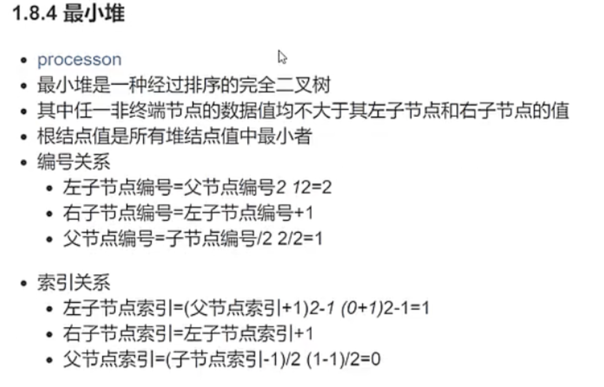
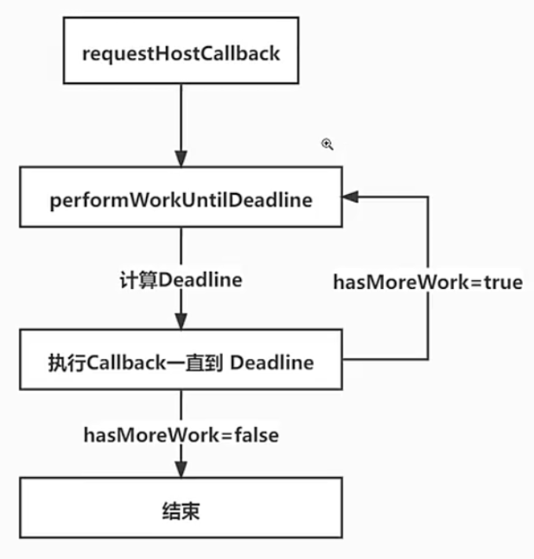
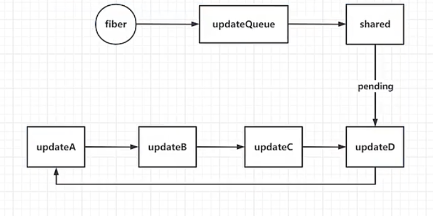

# React18.2 源码学习

## 1 Heap.堆

### 1.1 SchedulerMinHeap.例子-push.peek.pop.siftUp.siftDown.创建-[doc/19.SchedulerMinHeap.js](../../public/react18-learn/doc/19.SchedulerMinHeap.js)

- 

```js
/**
 * 调度器节点
 * @typedef {Object} SchedulerNode
 * @property {number} sortIndex 排序索引
 * @property {[id]} id 节点id
 */
/**
 * 最小堆
 * @typedef {Array<SchedulerNode>} SchedulerMinHeap
 */
/**
 * 向最小堆里添加一个节点
 * @param {SchedulerMinHeap} heap 最小堆
 * @param {SchedulerNode} node 节点
 */
function push(heap, node) {}
/**
 * 查看最小堆顶节点
 * @param {SchedulerMinHeap} heap 最小堆
 * @return {SchedulerNode} 节点
 */
function peek(heap) {}
/**
 * 弹出最小堆的堆顶元素
 * @param {SchedulerMinHeap} heap 最小堆
 * @return {SchedulerNode} 节点
 */
function pop(heap) {}
/**
 * 向上调整某个节点，使其位于正确的位置
 * @param {SchedulerMinHeap} heap 最小堆
 * @param {SchedulerNode} node 节点
 * @param {number} i 节点在堆中的索引
 */
function siftUp(heap, node, i) {}
/**
 * 向下调整某个节点，使其位于正确的位置
 * @param {SchedulerMinHeap} heap 最小堆
 * @param {SchedulerNode} node 节点
 * @param {number} i 节点在堆中的索引
 */
function siftDown(heap, node, i) {}
let heap = []
push(heap, { sortIndex: 1 })
push(heap, { sortIndex: 2 })
push(heap, { sortIndex: 3 })
```

### 1.2 push-向最小堆里添加一个节点函数-SchedulerMinHeap.例子-[doc/19.SchedulerMinHeap.js](../../public/react18-learn/doc/19.SchedulerMinHeap.js)

```js
function push(heap, node) {
  // 获取元素的数量
  const index = heap.length
  // 先把添加的元素放在数组的尾部
  heap.push(node)
  siftUp(heap, node, index)
}
```

### 1.3 siftUp-SchedulerMinHeap.例子-[doc/19.SchedulerMinHeap.js](../../public/react18-learn/doc/19.SchedulerMinHeap.js)

```js
function siftUp(heap, node, i) {
  let index = i
  while (true) {
    // 获取父节点的索引
    const parentIndex = (index - 1) >>> 1 // (子节点索引-1)/2
    // 获取父节点的值
    const parent = node[parentIndex]
    // 如果父节点存在，并且父节点的值大于当前节点的值
    if (parent !== undefined && compare(parent, node) > 0) {
      // 把儿子的值给父索引
      heap[parentIndex] = node
      // 把父亲的值给子索引
      heap[index] = parent
      // 让 index 指向父节点
      index = parentIndex
    } else {
      // 如果子节点比父节点要大，不需要交换位置，结束循环
      return
    }
  }
}

function compare(a, b) {
  const diff = a.sortIndex - b.sortIndex
  return diff !== 0 ? diff : a.id - b.id
}

let heap = []
let id = 1
push(heap, { id: id++, sortIndex: 1 })
push(heap, { id: id++, sortIndex: 2 })
push(heap, { id: id++, sortIndex: 3 })
console.log(heap)
```

### 1.4 peek-弹出最小堆的堆顶元素-SchedulerMinHeap.例子-[doc/19.SchedulerMinHeap.js](../../public/react18-learn/doc/19.SchedulerMinHeap.js)

```js
function peek(heap) {
  return heap.length === 0 ? null : heap[0]
}
```

- RunCode -> { sortIndex: 1, id: 1 }

### 1.5 push-向最小堆里添加一个节点-SchedulerMinHeap.例子-[doc/19.SchedulerMinHeap.js](../../public/react18-learn/doc/19.SchedulerMinHeap.js)

```js
function push(heap, node) {
  // 获取元素的数量
  const index = heap.length
  // 先把添加的元素放在数组的尾部
  heap.push(node)
  // 把尾部这个元素向上调整到合适的位置
  siftUp(heap, node, index)
}
```

## 2 Heap.堆

### 2.1 pop-弹出最小堆的堆顶元素-SchedulerMinHeap.例子-[doc/19.SchedulerMinHeap.js](../../public/react18-learn/doc/19.SchedulerMinHeap.js)

```js
function pop(heap) {
  if (heap.length === 0) {
    return null
  }
  // 取出数组中第一个也就是堆顶的元素
  const first = heap[0]
  // 弹出数组中的最后一个元素
  const last = heap.pop()
  if (last !== first) {
    if (last !== first) {
      heap[0] = last
      siftDown(heap, last, 0)
    }
  }
  return first
}
```

### 2.2 siftDown-向下调整某个节点，使其位于正确的位置-SchedulerMinHeap.例子-[doc/19.SchedulerMinHeap.js](../../public/react18-learn/doc/19.SchedulerMinHeap.js)

```js
function siftDown(heap, node, i) {
  let index = i
  const length = heap.length
  while (index < length) {
    //左子节点的索引
    const leftIndex = (index + 1) * 2 - 1
    const left = heap[leftIndex]
    const rightIndex = leftIndex + 1
    const right = heap[rightIndex]
    //如果左子节点存在，并且左子节点比父节点要小
    if (left !== undefined && compare(left, node) < 0) {
      //如果右节点存在，并且右节点比左节点还要小
      if (right !== undefined && compare(right, left) < 0) {
        heap[index] = right
        heap[rightIndex] = node
        index = rightIndex
      } else {
        heap[index] = left
        heap[leftIndex] = node
        index = leftIndex
      }
    } else if (right !== undefined && compare(right, node) < 0) {
      heap[index] = right
      heap[rightIndex] = node
      index = rightIndex
    } else {
      return
    }
  }
}
```

### 2.3 pop.验证方法-SchedulerMinHeap.例子-[doc/19.SchedulerMinHeap.js](../../public/react18-learn/doc/19.SchedulerMinHeap.js)

```js
let heap = []
let id = 1
push(heap, { id: id++, sortIndex: 1 })
push(heap, { id: id++, sortIndex: 2 })
push(heap, { id: id++, sortIndex: 3 })
console.log(peek(heap))
push(heap, { id: id++, sortIndex: 4 })
push(heap, { id: id++, sortIndex: 5 })
push(heap, { id: id++, sortIndex: 6 })
push(heap, { id: id++, sortIndex: 7 })
console.log(peek(heap))
pop(heap)
console.log(peek(heap))
```

- Run Code ->
  - { sortIndex: 1, id: 1 }
  - { sortIndex: 1, id: 1 }
  - { sortIndex: 2, id: 2 }

## 3 scheduler.调度器

### 3.1 SchedulerMinHeap-[src/scheduler/src/forks/SchedulerMinHeap.js](../../public/react18-learn/src/scheduler/src/forks/SchedulerMinHeap.js)

```js
export function push(heap, node) {
  // 获取元素的数量
  const index = heap.length
  // 先把添加的元素放在数组的尾部
  heap.push(node)
  siftUp(heap, node, index)
}
export function peek(heap) {
  return heap.length === 0 ? null : heap[0]
}
export function pop(heap) {
  if (heap.length === 0) {
    return null
  }
  // 取出数组中第一个也就是堆顶的元素
  const first = heap[0]
  // 弹出数组中的最后一个元素
  const last = heap.pop()
  if (last !== first) {
    if (last !== first) {
      heap[0] = last
      siftDown(heap, last, 0)
    }
  }
  return first
}
// ...
```

### 3.2 MessageChannel-[src/20.MessageChannel.html](../../public/react18-learn/src/20.MessageChannel.html)

```html
<script>
  const messageChannel = new MessageChannel()
  const channel = {
    port1: messageChannel.port1,
    port2: messageChannel.port2,
  }
  const { port1, port2 } = channel
  // 在 port1 上监听 port2 发过来的消息
  port1.onmessage = function (e) {
    console.log(`port1 接收到了来自 port2 的数据 ${e.data}`)
  }
  // 通过 port2 向 port1 发送消息
  port2.postMessage('发送给 port1 的数据')
</script>
```

- 浏览器查看正确

### 3.3 导出调度器模块-[src/scheduler/index.js](../../public/react18-learn/src/scheduler/index.js)

```js
export * from './src/forks/Scheduler'
```

### 3.4 切片调度器流程图示



### 3.5 scheduleCallback-按优先级执行任务函数-[src/scheduler/src/forks/Scheduler.js](../../public/react18-learn/src/scheduler/src/forks/Scheduler.js)

```js
function getCurrentTime() {
  return performance.now()
}
/**
 * description: 调度器
 * @param {number} priorityLevel 优先级
 * @param {function} callback 任务函数
 */
export function scheduleCallback(priorityLevel, callback) {
  const currentTime = getCurrentTime()
}
```

## 4 scheduler.调度器

### 4.1 调度器逻辑

- 科员、局长 =>先接局长；
- 本该科员，又来了副局长 =>先接副局长；
- 一直有副局长来，导致科员一直没走，不人性化；
- 定制: 科员有一个 5 秒定时器，5 秒内按优先级高的人接走，5 秒后必须科员走，超时执行，不同级别超时时间不同；

### 4.2 范围变量设置-[src/scheduler/src/forks/Scheduler.js](../../public/react18-learn/src/scheduler/src/forks/Scheduler.js)

```js
var maxSigned31BitInt = 1073741823
// Times out immediatelyvar
var IMMEDIATE_PRIORITY_TIMEOUT = -1
// Eventually times out
var USER_BLOCKING_PRIORITY_TIMEOUT = 250 // 正常优先级的过期时间
var NORMAL_PRIORITY_TIMEOUT = 5000
// 低优先级过期时间
var LOW_PRIORITY_TIMEOUT = 10000
// Never times out 永远不过期
var IDLE_PRIORITY_TIMEOUT = maxSigned31BitInt
```

### 4.3 优先级变量设置-[src/scheduler/src/forks/SchedulerPriorities.js](../../public/react18-learn/src/scheduler/src/forks/SchedulerPriorities.js)

```js
// 无优先级
export const NoPriority = 0
// 立刻执行优先级-局长
export const ImmediatePriority = 1
//用户阻塞操作优先级 用户点击 ，用户输入-副局长
export const UserBlockingPriority = 2
// 正常优先级-科长
export const NormalPriority = 3
// 低优先级-科员
export const LowPriority = 4
// 空闲优先级-临时工
export const IdlePriority = 5
```

### 4.4 scheduleCallback-改：按优先级执行任务函数-[src/scheduler/src/forks/Scheduler.js](../../public/react18-learn/src/scheduler/src/forks/Scheduler.js)

```js
import { push } from './SchedulerMinHeap'

// ...var IDLE_PRIORITY_TIMEOUT = maxSigned31BitInt
// 任务 ID 计数器
var taskCounter = 1
// 任务的最小堆
var taskQueue = []

export function scheduleCallback(priorityLevel, callback) {
  // 获取当前的时候
  const currentTime = getCurrentTime()
  // 此任务的开始时间
  const startTime = currentTime
  //超时时间
  let timeout
  switch (priorityLevel) {
    case ImmediatePriority:
      timeout = IMMEDIATE_PRIORITY_TIMEOUT // -1
      break
    case UserBlockingPriority:
      timeout = USER_BLOCKING_PRIORITY_TIMEOUT // 250ms
      break
    case LowPriority:
      timeout = LOW_PRIORITY_TIMEOUT // 1000
      break
    case IdlePriority:
      timeout = IDLE_PRIORITY_TIMEOUT // 1073741823
      break
    case NormalPriority:
    default:
      timeout = NORMAL_PRIORITY_TIMEOUT
  }
  // 计算此任务的过期时间
  const expirationTime = startTime + timeout
  const newTask = {
    id: taskCounter++,
    callback, // 回调函数或者任务函数
    priorityLevel, // 优先级
    startTime, // 任务开始时间
    expirationTime, // 任务的过期时间
    sortIndex: expirationTime, // 排序依赖
  }
  // 向任务最小堆中添加此任务，排序的依据是过期时间
  push(taskQueue, newTask)
  // flushWork 执行工作，刷新工作，执行任务，司机接人
  requestHostCallback(flushWork)
  return newTask
}
```

- 多任务调度流程图示
- 

### 4.5 requestHostCallback-调度器请求回调函数-[src/scheduler/src/forks/Scheduler.js](../../public/react18-learn/src/scheduler/src/forks/Scheduler.js)

```js
// var taskQueue = []
let schedulerHostCallback = null
let startTime = null
let currentTask = null

/**
 * description: 调度器
 * @param {function} WorkLoop 刷新工作
 */
function requestHostCallback(WorkLoop) {
  // 回调函数
  schedulerHostCallback = WorkLoop
  // 执行工作直到截止时间
  schedulePerformWorkUntilDeadline()
}
```

## 5 scheduler.调度器

### 5.1 performWorkUntilDeadline-调度器执行工作直到截止时间函数-[src/scheduler/src/forks/Scheduler.js](../../public/react18-learn/src/scheduler/src/forks/Scheduler.js)

```js
function performWorkUntilDeadline() {
  if (schedulerHostCallback) {
    // 先获取开始执行任务的时间
    startTime = getCurrentTime()
    // 是否有更多的工作要做
    let hasMoreWork = true
    try {
      hasMoreWork = schedulerHostCallback(startTime)
    } finally {
      // 执行完之后如果为 true，说明还有更多工作要做
      if (hasMoreWork) {
        // 继续执行
        schedulePerformWorkUntilDeadline()
      } else {
        // 停止执行
        schedulerHostCallback = null
      }
    }
  }
}
```

### 5.2 flushWork-开始执行任务队列中任务函数-[src/scheduler/src/forks/Scheduler.js](../../public/react18-learn/src/scheduler/src/forks/Scheduler.js)

```js
/**
 * description: 开始执行任务队列中的任务
 * @param {number} startTime 开始执行任务的时间
 */
function flushWork(startTime) {
  return workLoop(startTime)
}
```

### 5.3 workLoop-执行任务函数-[src/scheduler/src/forks/Scheduler.js](../../public/react18-learn/src/scheduler/src/forks/Scheduler.js)

```js
/**
 * description: 执行任务函数
 * @param {number} startTime 开始执行任务的时间
 */
function workLoop(startTime) {
  let currentTime = startTime
  // 取出优先级最高的任务-局长
  currentTask = peek(taskQueue)
  while (currentTask !== null) {
    // 取出当前的任务中的回调函数 performConcurrentWorkOnRoot
    const callback = currentTask.callback
    if (typeof callback === 'function') {
      currentTask.callback = null
      const continuationCallback = callback()
      if (typeof continuationCallback === 'function') {
        currentTask.callback = continuationCallback
        return true // has more work
      }
      // 如果此任务已经完成，则不需要再继续执行，可以把此任务弹出
      if (currentTask === peek(taskQueue)) {
        // 取出堆顶的任务，即优先级最高的任务
        pop(taskQueue)
      }
    } else {
      pop(taskQueue)
    }
    // 如果循环结束还有未完成的任务，那就表示 hasMoreWork = true
    currentTask = peek(taskQueue)
  }
  // 如果循环结束还有未完成的任务，那就表示 hasMoreWork = true
  if (currentTask !== null) {
    return true
  }
  // 没有任何要完成的任务了
  return false
}
```

### 5.4 shouldYieldToHost-是否要让主线程执行函数-[src/scheduler/src/forks/Scheduler.js](../../public/react18-learn/src/scheduler/src/forks/Scheduler.js)

```js
// ...let currentTask = null
// React 每一帧向浏览器申请 5 毫秒用于自己的任务执行
// 如果 5ms 内没有完成任务，React 也会放弃控制权，把控制权交给浏览器
const frameInterval = 5

/**
 * description: 是否要让主线程执行
 */
function shouldYieldToHost() {
  // 用当前时间减去开始时间就是过去时间
  const timeElapsed = getCurrentTime() - startTime
  // 如果流逝或者说经过的时间小于 5 毫秒，那就不需要放弃执行
  if (timeElapsed < frameInterval) {
    return false
  }
  // 否则需要放弃执行
  return true
}

export {
  shouldYieldToHost as shouldYield,
  ImmediatePriority,
  UserBlockingPriority,
  LowPriority,
  NormalPriority,
  IdlePriority,
}
```

### 5.5 schedulePerformWorkUntilDeadline-改：调度器执行工作直到截止时间函数-[src/scheduler/src/forks/Scheduler.js](../../public/react18-learn/src/scheduler/src/forks/Scheduler.js)

```js
// ...const frameInterval = 5
const channel = new MessageChannel()
var port2 = channel.port2
var port1 = channel.port1
port1.onmessage = performWorkUntilDeadline

function requestHostCallback(flushWork) {
  // 回调函数
  schedulerHostCallback = flushWork
  // 执行工作直到截止时间
  schedulePerformWorkUntilDeadline()
}
function schedulePerformWorkUntilDeadline() {
  // 发送消息
  port2.postMessage(null)
}
function performWorkUntilDeadline() {
  if (schedulerHostCallback) {
    // 先获取开始执行任务的时间
    //表示时间片的开始
    startTime = getCurrentTime()
    // 是否有更多的工作要做
    let hasMoreWork = true
    try {
      //执行 flushWork ，并判断有没有返回值
      hasMoreWork = schedulerHostCallback(startTime)
    } finally {
      //执行完以后如果为true,说明还有更多工作要做
      if (hasMoreWork) {
        //继续执行
        schedulePerformWorkUntilDeadline()
      } else {
        schedulerHostCallback = null
      }
    }
  }
}
```
