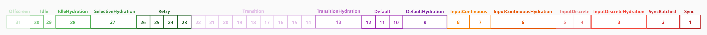
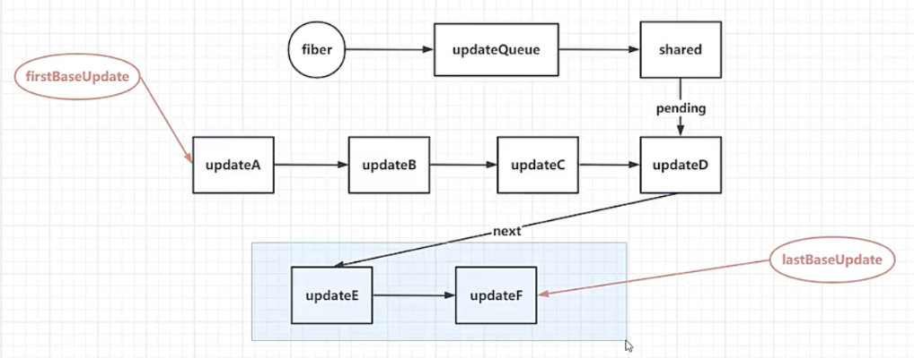

# React18.2 源码学习

## 1 scheduler.调度器

### 1.1 引入调度器对象-[src/react-reconciler/src/ReactFiberWorkLoop.js](../../public/react18-learn/src/react-reconciler/src/ReactFiberWorkLoop.js)

```js
import {
  scheduleCallback,
  NormalPriority as NormalSchedulerPriority,
  shouldYield,
} from './scheduler'
```

### 1.2 ensureRootIsScheduled-保证 root 已经被调度函数-[src/react-reconciler/src/ReactFiberWorkLoop.js](../../public/react18-learn/src/react-reconciler/src/ReactFiberWorkLoop.js)

```js
/**
 * description: 保证 root 已经被调度
 * @param {Fiber} root
 */
function ensureRootIsScheduled(root) {
  if (workInProgressRoot) return
  workInProgressRoot = root
  //告诉 浏览器要执行 performConcurrentWorkOnRoot
  scheduleCallback(
    NormalSchedulerPriority,
    performConcurrentWorkOnRoot.bind(null, root)
  )
}
```

### 1.3 commitRoot-root 提交函数-[src/react-reconciler/src/ReactFiberWorkLoop.js](../../public/react18-learn/src/react-reconciler/src/ReactFiberWorkLoop.js)

```js
/**
 * description: 提交 root
 * @param {Fiber} root
 */
function commitRoot(root) {
  // ...printFinishedWork(finishedWork)
  if (
    (finishedWork.subtr00Flags & Passive) !== NoFlags ||
    (finishedWork.flags & Passive) !== NoFlags
  ) {
    if (!rootDoesHavePassiveEffect) {
      rootDoesHavePassiveEffect = true
      scheduleCallback(NormalSchedulerPriority, flushPassiveEffect)
    }
  }
}
```

### 1.4 引入调度器对象-[src/scheduler/src/forks/Scheduler.js](../../public/react18-learn/src/scheduler/src/forks/Scheduler.js)

```js
import { push, peek, pop } from './SchedulerMinHeap'
import {
  NormalPriority,
  ImmediatePriority,
  UserBlockingPriority,
  LowPriority,
} from './SchedulerPriorities'
```

### 1.5 scheduleCallback-改：调度回调函数-打断点-[src/scheduler/src/forks/Scheduler.js](../../public/react18-learn/src/scheduler/src/forks/Scheduler.js)

```js
export function scheduleCallback(priorityLevel, callback) {
  debugger
}

// 源码中使用 setTimeout, 学习使用 requestIdleCallback
```

- 浏览器查看

## 2 scheduler.调度器

### 2.1 workLoop-改：工作循环函数-[src/scheduler/src/forks/Scheduler.js](../../public/react18-learn/src/scheduler/src/forks/Scheduler.js)

```js
function workLoop(startTime) {
  // ...
  while (currentTask !== null) {
    // 如果此任务的过期时间小于当前时间，也就是没有过期，并且需要放弃，时间片到期
    if (currentTask.expirationTime > currentTime && shouldYieldToHost()) {
      // 跳出工作循环
      break
    }
    // 取出当前的任务中的回调函数 performConcurrentWorkOnRoot
    const callback = currentTask.callback
    if (typeof callback === 'function') {
      currentTask.callback = null
      // 执行工作，如果返回新的函数，则表示当前的工作没有完成
      const didUserCallbackTimeout = currentTask.expirationTime <= currentTime
      const continuationCallback = callback(didUserCallbackTimeout)
      if (typeof continuationCallback === 'function') {
        currentTask.callback = continuationCallback
        return true // has more work
      }
      // 如果此任务已经完成，则不需要再继续执行，可以把此任务弹出
      if (currentTask === peek(taskQueue)) {
        // 取出堆顶的任务，即优先级最高的任务
        pop(taskQueue)
      }
    } else {
      pop(taskQueue)
    }
    // 如果循环结束还有未完成的任务，那就表示 hasMoreWork = true
    currentTask = peek(taskQueue)
  }
  // ...
}
```

### 2.2 performConcurrentWorkOnRoot-改：执行并发工作函数-添加断点-[src/react-reconciler/src/ReactFiberWorkLoop.js](../../public/react18-learn/src/react-reconciler/src/ReactFiberWorkLoop.js)

```js
function performConcurrentWorkOnRoot(root, tim00ut) {
  debugger
  // ...
}
```

- 超时时间
  - 排序使用，10s 超时后一定要出发吗?
  - 已达到时间，此时来了局长，超时大还是局长大?
  - 科员 -10s，局长 -1s，科员小，先执行科员的。
  - 一旦开始就无法停止
- 浏览器验证

## 3 二进制-[binary/1.js](../../public/react18-learn/binary/1.js)

```js
const TotalLanes = 31
// 无 0
const NoLanes = 0b0000000000000000000000000000000
const NoLane = 0b0000000000000000000000000000000
// 同步车道
const SyncLane = 0b0000000000000000000000000000001
// 输入连续水合赛道
const InputContinuousHydrationLane = 0b0000000000000000000000000000010
// 输入连续车道
const InputContinuousLane = 0b0000000000000000000000000000100
//默认水合车道
const DefaultHydrationLane = 0b0000000000000000000000000001000
//默认车道
const DefaultLane = 0b0000000000000000000000000010000
const TransitionHydrationLane = 0b0000000000000000000000000100000
const TransitionLanes = 0b0000000001111111111111111000000
const TransitionLane1 = 0b0000000000000000000000001000000
const TransitionLane2 = 0b0000000000000000000000010000000
const IdleHydrationLane = 0b0010000000000000000000000000000
const IdleLane = 0b0100000000000000000000000000000
const OffscreenLane = 0b1000000000000000000000000000000

/**
 * 获取最高优先级的车道
 * @param lanes 车道
 * 位操作效率最高
 */
function getHighestPriorityLane(lanes) {
  return lanes & -lanes
}
/**
 * 获取优先级最低的车道
 * @param lanes 车道
 * @desc 最左侧的 1
 * 31 个 lane + 0 = 32
 * 整数是 4 个字节表示，一个字节是 8 位，共 32 个字节
 */
function getLowestPriorityLane(lanes) {
  // React 此方法已删除？原因-无使用场景
  const index = 31 - Math.clz32(lanes)
  return 1 << index
}

let a = 0b00011000 // 16+8 24
console.log('getHighestPriorityLane(a):', getHighestPriorityLane(a)) // 8

console.log(5 & -5) // 1
// 00000101 5
// 10000101 -5 原码
// 11111010 -5 反码
// 11111011 -5 补码
// 00000101 5 补码
// 00000001 1

// << 左移，每一位向左移动一位，末尾补0，相当于 *2
let left = 0b0000010
//         0b0000100
console.log(left << 1) // 0b0000100

// 右移
// 有符号右移
// 移位时高位补的是符号位，整数补0，负数补1
let right = 0b0000011
console.log(right >> 1)
```

## 4 车道更新优先级

### 4.1 lane

- React 用 lane 来表示任务优先级
- 一共有 31 条优先级，数字越小优先级越高，某些车道的优先级相同
- clz32 函数返回开头的 0 的个数
- static.zhufengpeixun.com/che_dao_1645080741671.jpg
- 车道.lane.图示
- 

### 4.2 [binary/1.high.js](../../public/react18-learn/binary/1.high.js)

```js
const TotalLanes = 31
// 无 0
const NoLanes = 0b0000000000000000000000000000000
const NoLane = 0b0000000000000000000000000000000
// 同步车道
const SyncLane = 0b0000000000000000000000000000001
// 输入连续水合赛道
const InputContinuousHydrationLane = 0b0000000000000000000000000000010
// 输入连续车道
const InputContinuousLane = 0b0000000000000000000000000000100
//默认水合车道
const DefaultHydrationLane = 0b0000000000000000000000000001000
//默认车道
const DefaultLane = 0b0000000000000000000000000010000
const TransitionHydrationLane = 0b0000000000000000000000000100000
const TransitionLanes = 0b0000000001111111111111111000000
const TransitionLane1 = 0b0000000000000000000000001000000
const TransitionLane2 = 0b0000000000000000000000010000000
const IdleHydrationLane = 0b0010000000000000000000000000000
const IdleLane = 0b0100000000000000000000000000000
const OffscreenLane = 0b1000000000000000000000000000000

/**
 * 获取最高优先级的车道
 * @param lanes 车道
 * 位操作效率最高
 */
function getHighestPriorityLane(lanes) {
  return lanes & -lanes
}
/**
 * 获取优先级最低的车道
 * @param lanes 车道
 * @desc 最左侧的 1
 * 31 个 lane + 0 = 32
 * 整数是 4 个字节表示，一个字节是 8 位，共 32 个字节
 */
function getLowestPriorityLane(lanes) {
  // React 此方法已删除？原因-无使用场景
  const index = 31 - Math.clz32(lanes)
  return 1 << index
}

let a = 0b00011000 // 16+8 24
console.log('getHighestPriorityLane(a):', getHighestPriorityLane(a)) // 8

console.log(5 & -5) // 1
// 00000101 5
// 10000101 -5 原码
// 11111010 -5 反码
// 11111011 -5 补码
// 00000101 5 补码
// 00000001 1

// << 左移，每一位向左移动一位，末尾补0，相当于 *2
let left = 0b0000010
//         0b0000100
console.log(left << 1) // 0b0000100

// 右移
// 有符号右移
// 移位时高位补的是符号位，整数补0，负数补1
let right = 0b0000011
console.log(right >> 1)
```

### 4.3 车道举例

- 四个车道
  - 局长-同步车道 SyncLane
  - 科长-默认车道 DefaultLane
  - 科员-空闲车道 IdleLane
  - 临时工-离线车道 OffscreenLane
- Lane 优先级可以和 priority 优先级相互转化

### 4.4 [binary/2.三套优先级.md](../../public/react18-learn/binary/2.三套优先级.md)

````md
# 有二套

- 车道优先级 > 事件优先级 > scheduler 优先级
- 车道优先级与事件优先级归并使用，看成一套优先级

## 车道优先级

src/react/packages/react-reconciler/src/ReactFiberLane.old.js

```js
export const NoLanes = 0b0000000000000000000000000000000
export const NoLane = 0b0000000000000000000000000000000
// 同步车道
export const SyncLane = 0b0000000000000000000000000000001
// 输入连续水合赛道
export const InputContinuousHydrationLane = 0b0000000000000000000000000000010
```

## 事件优先级

src\react\packages\react-reconciler\src\ReactEventPriorities.old.js

```js
export const DiscreteEventPriority = SyncLane
export const ContinuousEventPriority = InputContinuousLane
export const DefaultEventPriority = DefaultLane
export const IdleEventPriority = IdleLane
```

## scheduler 优先级

src\react\packages\scheduler\src\SchedulerPriorities.js

```js
export const NoPriority = 0
export const ImmediatePriority = 1
export const UserBlockingPriority = 2
export const NormalPriority = 3
export const LowPriority = 4
```
````

### 4.5 [binary/3.js](../../public/react18-learn/binary/3.js)

```js
// 有符号右移
// 移位时高位补的是符号位，整数补0，负数补1
let c = -4
console.log(c >> 1) // 0b10000100 -> 0b10000010

// 无符号右移
// 右移时最高位始终补0
// 正数不变，负数变为正数
let d = 0b00000111
console.log('d:', d)
console.log(d >>> 1) // 3
let e = 0b10000111
console.log('e:', e)
console.log(e >>> 1) // 67
```

## 5 车道更新优先级

### 5.1 例子：无优先级-[queue/ReactFiberLane.js](../../public/react18-learn/queue/ReactFiberLane.js)

```js
const NoLanes = 0b00
const NoLane = 0b00
const SyncLane = 0b01 //1
const InputContinuousHydrationLane = 0b10 //2
function initializeUpdateQueue(fiber) {
  const queue = {
    shared: {
      pending: null,
    },
  }
  fiber.updateQueue = queue
}

function enqueueUpdate(fiber, update) {
  const updateQueue = fiber.updateQueue
  const sharedQueue = updateQueue.shared
  const pending = sharedQueue.pending
  if (pending === null) {
    update.next = update
  } else {
    update.next = pending.next
    pending.next = update
  }
  sharedQueue.pending = update
}

function processUpdateQueue(fiber) {
  const queue = fiber.updateQueue
  const pendingQueue = queue.shared.pending

  if (pendingQueue !== null) {
    queue.shared.pending = null
    let first = pendingQueue.next
    let currentState = fiber.memoizedState
    let update = first
    do {
      currentState = update.payload(currentState)
      update = update.next
    } while (update && update !== first)
    fiber.memoizedState = currentState
  }
}

// 新建 fiber
// 演示如何给 fiber 添加不同优先级的更新
// 在执行渲染的时候总是优先级最高的执行，跳过优先级低的执行
let fiber = { memoizedState: '' }
initializeUpdateQueue(fiber)
let updateA = { id: 'A', payload: (state) => state + 'A' }
enqueueUpdate(fiber, updateA)
let updateB = { id: 'B', payload: (state) => state + 'B' }
enqueueUpdate(fiber, updateB)
let updateC = { id: 'C', payload: (state) => state + 'C' }
enqueueUpdate(fiber, updateC)
let updateD = { id: 'D', payload: (state) => state + 'D' }
enqueueUpdate(fiber, updateD)
// 处理新队列
processUpdateQueue(fiber)
console.log('fiber.memoizedState:', fiber.memoizedState) // => fiber.memoizedState: ABCD
```

### 5.2 例子：有优先级-[queue/ReactFiberLane.js](../../public/react18-learn/queue/ReactFiberLane.js)

```js
const NoLanes = 0b00
const NoLane = 0b00
const SyncLane = 0b01 //1
const InputContinuousHydrationLane = 0b10 //2
function initializeUpdateQueue(fiber) {
  const queue = {
    baseState: fiber.memoizedState, // 本次更新当前fiber的状态，更新会与它进行计算
    firstBaseUpdate: null, // 上次跳过的更新链表头
    lastBaseUpdate: null, // 上次跳过的更新链表尾
    shared: {
      pending: null,
    },
  }
  fiber.updateQueue = queue
}

function enqueueUpdate(fiber, update) {
  const updateQueue = fiber.updateQueue
  const sharedQueue = updateQueue.shared
  const pending = sharedQueue.pending
  if (pending === null) {
    update.next = update
  } else {
    update.next = pending.next
    pending.next = update
  }
  sharedQueue.pending = update
}

function processUpdateQueue(fiber, renderLanes) {
  const queue = fiber.updateQueue
  const pendingQueue = queue.shared.pending
  if (pendingQueue !== null) {
    queue.shared.pending = null
    let first = pendingQueue.next
    let currentState = fiber.memoizedState
    let update = first
    do {
      if (renderLanes >= update.lane) {
        currentState = update.payload(currentState)
      }
      update = update.next
    } while (update && update !== first)
    fiber.memoizedState = currentState
  }
}

// 新建 fiber
// 演示如何给 fiber 添加不同优先级的更新
// 在执行渲染的时候总是优先级最高的执行，跳过优先级低的执行
let fiber = { memoizedState: '' }
initializeUpdateQueue(fiber)
let updateA = {
  id: 'A',
  payload: (state) => state + 'A',
  lane: InputContinuousHydrationLane,
}
enqueueUpdate(fiber, update1)
let updateB = { id: 'B', payload: (state) => state + 'B', lane: SyncLane }
enqueueUpdate(fiber, update2)
let updateC = {
  id: 'C',
  payload: (state) => state + 'C',
  lane: InputContinuousHydrationLane,
}
enqueueUpdate(fiber, updateC)
let updateD = { id: 'D', payload: (state) => state + 'D', lane: SyncLane }
enqueueUpdate(fiber, updateD)
// 处理新队列
processUpdateQueue(fiber, SyncLane)

console.log('fiber.memoizedState:', fiber.memoizedState)
// 此时会把 ABCD 这个链接放在 baseQueue 中
let updateE = {
  id: 'E',
  payload: (state) => state + 'E',
  lane: InputContinuousHydrationLane,
}
enqueueUpdate(fiber, updateE)
let updateF = { id: 'F', payload: (state) => state + 'F', lane: SyncLane }
enqueueUpdate(fiber, updateF)
// 先链接两个链表，再进行计算
processUpdateQueue(fiber, InputContinuousHydrationLane)
console.log('fiber.memoizedState:', fiber.memoizedState) // ABCDEF
```

- 链接两个链表进行计算图示: 

### 5.3 例子：有优先级-[queue/ReactFiberLane.js](../../public/react18-learn/queue/ReactFiberLane.js)

```js
function processUpdateQueue(fiber, renderLanes) {
  const queue = fiber.updateQueue
  // 老链表的头部
  let firstBaseUpdate = queue.firstBaseUpdate
  // 老链表的尾部
  let lastBaseUpdate = queue.lastBaseUpdate
  // 新链表的尾部
  const pendingQueue = queue.shared.pending
  if (pendingQueue !== null) {
    queue.shared.pending = null
    // 新链表的尾部
    const lastPendingUpdate = pendingQueue
    // 新链表的头部
    const firstPendingUpdate = lastPendingUpdate.next
    // 把老链表剪断，变成单链表
    lastPendingUpdate.next = null
    // 如果没有老链表
    if (lastBaseUpdate === null) {
      // 指向新的链表头
      firstBaseUpdate = firstPendingUpdate
    } else {
      lastBaseUpdate.next = firstPendingUpdate
    }
    lastBaseUpdate = lastPendingUpdate
  }
  // 如果不为空 firstBaseUpdate => lastBaseUpdate
  if (firstBaseUpdate !== null) {
    let currentState = fiber.memoizedState
    let update = firstBaseUpdate
    do {
      // 如果当前的渲染优先级比当前的更新优先级要小或相等，此更新就需要生效
      if (renderLanes >= update.lane) {
        currentState = update.payload(currentState)
      }
      update = update.next
    } while (update)
    fiber.memoizedState = currentState
  }
}
```

- 执行 JS 文件，打印 BDEF

### 5.4 例子：有优先级-[queue/ReactFiberLane.js](../../public/react18-learn/queue/ReactFiberLane.js)

```js
function processUpdateQueue(fiber, renderLanes) {
  const queue = fiber.updateQueue
  // 老链表的头部
  let firstBaseUpdate = queue.firstBaseUpdate
  // 老链表的尾部
  let lastBaseUpdate = queue.lastBaseUpdate
  // 新链表的尾部
  const pendingQueue = queue.shared.pending
  if (pendingQueue !== null) {
    queue.shared.pending = null
    // 新链表的尾部
    const lastPendingUpdate = pendingQueue
    // 新链表的头部
    const firstPendingUpdate = lastPendingUpdate.next
    // 把老链表剪断，变成单链表
    lastPendingUpdate.next = null
    // 如果没有老链表
    if (lastBaseUpdate === null) {
      // 指向新的链表头
      firstBaseUpdate = firstPendingUpdate
    } else {
      lastBaseUpdate.next = firstPendingUpdate
    }
    lastBaseUpdate = lastPendingUpdate
  }
  // 如果不为空 firstBaseUpdate => lastBaseUpdate
  if (firstBaseUpdate !== null) {
    // 上次跳过的更新前的状态
    let newState = queue.baseState
    // 尚未执行的更新的 lane
    let newLanes = NoLanes
    let newBaseState = null
    let newFirstBaseUpdate = null
    let newLastBaseUpdate = null
    let update = firstBaseUpdate // update4
    do {
      // 获取此更新车道
      const updateLane = update.lane
      // 如果优先级不够，需要保存跳过的更新到baseQueue
      if (!isSubsetOfLanes(renderLanes, updateLane)) {
        // 把此克隆一份
        const clone = {
          id: update.id,
          lane: updateLane,
          payload: update.payload,
        }
        // 说明新的跳过的 base 链表为空，说明当前这个更新是第一个跳过的更新
        if (newLastBaseUpdate === null) {
          // 让新的跳过的链表头和链表尾都指向这个第一次跳过的更新
          newFirstBaseUpdate = newLastBaseUpdate = clone
          // 计算保存新的baseState为此跳过更新时的state
          newBaseState = newState // ""
        } else {
          newLastBaseUpdate = newLastBaseUpdate.next = clone
        }
        newLanes = mergeLanes(newLanes, updateLane)
      } else {
        // 说明已经有跳过的更新了
        if (newLastBaseUpdate !== null) {
          const clone = {
            id: update.id,
            lane: NoLane,
            payload: update.payload,
          }
          newLastBaseUpdate = newLastBaseUpdate.next = clone
        }
        newState = getStateFromUpdate(update, newState)
      }
      update = update.next
    } while (update)
    // 如果没能跳过的更新的话
    if (!newLastBaseUpdate) {
      newBaseState = newState
    }
    queue.baseState = newBaseState
    queue.firstBaseUpdate = newFirstBaseUpdate
    queue.lastBaseUpdate = newLastBaseUpdate
    fiber.lanes = newLanes
    // 本次渲染完会判断，此 fiber 上还有没有不为 0 的 lane，如果有，会再次渲染
    fiber.memoizedState = newState
  }
}
function isSubsetOfLanes(set, subset) {
  return (set & subset) === subset
}
function mergeLanes(a, b) {
  return a | b
}
// function getStateFromUpdate(update, prevState) {
//   const payload = update.payload
//   let partialState = payload(prevState)
//   return Object.assign({}, prevState, partialState)
// }

function getStateFromUpdate(update, prevState) {
  return update.payload(prevState)
}
```

### 5.5 例子：有优先级-[queue/ReactFiberLane.js](../../public/react18-learn/queue/ReactFiberLane.js)

```js
console.log('updateQueue', printUpdateQueue(fiber.udpateQueue))

function printUpdateQueue(updateQueue) {
  const { baseState, firstBaseUpdate } = updateQueue
  let desc = baseState + '#'
  let update = firstBaseUpdate
  while (update) {
    desc += update.id + '=>'
    update = update.next
  }
  desc += 'null'
  return desc
}
```
