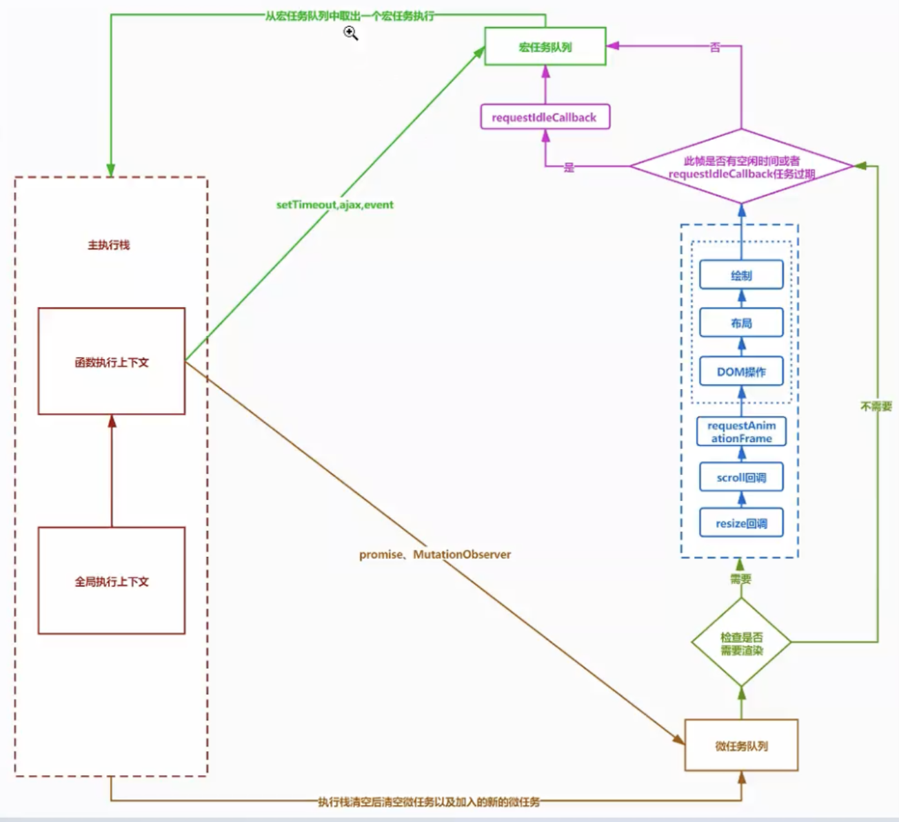
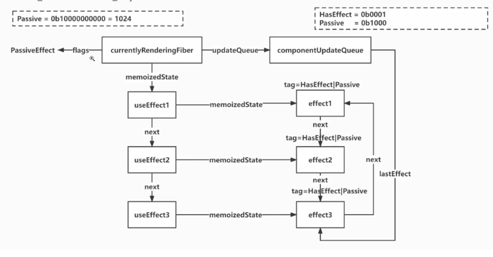

# React18.2 源码学习

## 1 dom-diff

### 1.1 updateTextNode-文本节点更新函数-[src/react-reconciler/src/ReactChildFiber.js](../../public/react18-learn/src/react-reconciler/src/ReactChildFiber.js)

```js
function updateTextNode(returnFiber, current, textContent) {
  if (current === null || current.tag !== HostText) {
    const created = createFiberFromText(textContent)
    created.return = returnFiber
    return created
  } else {
    const existing = useFiber(current, textContent)
    existing.return = returnFiber
    return existing
  }
}
```

### 1.2 updateFromMap-改: 从 map 中更新函数-[src/react-reconciler/src/ReactChildFiber.js](../../public/react18-learn/src/react-reconciler/src/ReactChildFiber.js)

```js
function updateFromMap(existingChildren, returnFiber, newIdx, newChild) {
  if (
    (typeof newChild === 'string' && newChild !== '') ||
    typeof newChild === 'number'
  ) {
    const matchedFiber = existingChildren.get(newIdx) || null
    return updateTextNode(returnFiber, matchedFiber, '' + newChild)
  }
  if (typeof newChild === 'object' && newChild !== null) {
    switch (newChild.$$typeof) {
      case REACT_ELEMENT_TYPE:
        const matchedFiber =
          existingChildren.get(newChild.key === null ? newIdx : newChild.key) ||
          null
        return updateElement(returnFiber, matchedFiber, newChild)
    }
  }
}
```

### 1.3 reconcileChildrenArray-改：子节点数组处理函数-[src/react-reconciler/src/ReactChildFiber.js](../../public/react18-learn/src/react-reconciler/src/ReactChildFiber.js)

```js
function reconcileChildrenArray(returnFiber, currentFirstFiber, newChildren) {
  // ...let nextOldFiber = null
  let lastPlacedIndex = 0 // 上一个不要移动的节点索引

  // 指定新的fiber存放位置，并且给lastPlacedIndex赋值
  lastPlacedIndex = placeChild(newFiber, lastPlacedIndex, newIdx)

  // ...const existingChildren = mapRemainingChildren(returnFiber, oldFiber)
  for (; newIdx < newChildren.length; newIdx++) {
    const newFiber = updateFromMap(
      existingChildren,
      returnFiber,
      newIdx,
      newChildren[newIdx]
    )
    if (newFiber !== null) {
      if (shouldTrackSideEffects) {
        // 如果要跟踪副作用，并且有老 fiber
        if (newFiber.alternate !== null) {
          existingChildren.delete(newFiber.key === null ? newIdx : newFiber.key)
        }
      }
    }
  }
  return resultingFirstChild
}
```

### 1.4 placeChild-子节点放置函数-[src/react-reconciler/src/ReactChildFiber.js](../../public/react18-learn/src/react-reconciler/src/ReactChildFiber.js)

```js
function placeChild(newFiber, lastPlacedIndex, newIdx) {
  // 指定新的fiber在新的挂载索引
  newFiber.index = newIdx
  // 如果不需要跟踪副作用
  if (!shouldTrackSideEffects) {
    return lastPlacedIndex
  }
  // 获取它的老fiber
  const current = newFiber.alternate
  // 如果有，说明这是一个更新的节点，有老的真实DOM
  if (current !== null) {
    const oldIndex = current.index
    // 如果找到的老 fiber 的索引比 lastPlacedIndex 小，说明老的 fiber 对应的 DOM 节点需要移动
    if (oldIndex < lastPlacedIndex) {
      newFiber.flags |= Placement
      return lastPlacedIndex
    } else {
      return oldIndex
    }
  } else {
    // 如果没有，说明这是一个新的节点，需要插入
    newFiber.flags |= Placement
  }
}
```

### 1.5 reconcileChildrenArray-改：子节点数组处理函数-设置 lastPlacedIndex-[src/react-reconciler/src/ReactChildFiber.js](../../public/react18-learn/src/react-reconciler/src/ReactChildFiber.js)

```js
function reconcileChildrenArray(returnFiber, currentFirstFiber, newChildren) {
  // ...
  // 指定新的 fiber 位置
  lastPlacedIndex = placeChild(newFiber, lastPlacedIndex, newIdx)
  // ...
}
```

## 2 dom-diff

### 2.1 reconcileChildrenArray-改:子节点数组处理函数-[src/react-reconciler/src/ReactChildFiber.js](../../public/react18-learn/src/react-reconciler/src/ReactChildFiber.js)

```js
function reconcileChildrenArray(returnFiber, currentFirstFiber, newChildren) {
  if (newIdx === newChildren.length) {
    // 删除剩下的老 fiber
    deleteRemainingChildren(returnFiber, oldFiber)
    return resultingFirstChild
  }
  if (oldFiber === null) {
    for (; newIdx < newChildren.length; newIdx++) {
      const newFiber = createChild(returnFiber, newChildren[newIdx])
      if (newFiber === null) continue
      lastPlacedIndex = placeChild(newFiber, lastPlacedIndex, newIdx)
      // ...
    }
  }
}
```

### 2.2 reconcileChildrenArray-改：子节点数组处理函数-[src/react-reconciler/src/ReactChildFiber.js](../../public/react18-learn/src/react-reconciler/src/ReactChildFiber.js)

```js
function reconcileChildrenArray(returnFiber, currentFirstFiber, newChildren) {
  // ...const existingChildren = mapRemainingChildren(returnFiber, oldFiber)
  for (; newIdx < newChildren.length; newIdx++) {
    const newFiber = updateFromMap(
      existingChildren,
      returnFiber,
      newIdx,
      newChildren[newIdx]
    )
    if (newFiber !== null) {
      if (shouldTrackSideEffects) {
        // 如果要跟踪副作用，并且有老 fiber
        if (newFiber.alternate !== null) {
          existingChildren.delete(newFiber.key === null ? newIdx : newFiber.key)
        }
      }
      // 指定新的fiber存放位置 ，并且给lastPlacedIndex赋值
      lastPlacedIndex = placeChild(newFiber, lastPlacedIndex, newIdx)
      if (previousNewFiber == null) {
        resultingFirstChild = newFiber // //这个newFiber就是大儿子
      } else {
        // 否则说明不是大儿子，就把这个newFiber添加上一个子节点后面
        previousNewFiber.sibling = newFiber
      }
      // 让newFiber成为最后一个或者说上一个子fiber
      previousNewFiber = newFiber
    }
  }
  if (shouldTrackSideEffects) {
    existingChildren.forEach((child) => deleteChild(returnFiber, child))
  }
  return resultingFirstChild
}
```

### 2.3 FunctionComponent-改:函数组件-[src/main.jsx](../../public/react18-learn/src/main.jsx)

```js
// 多节点 => 单节点
function FunctionComponent() {
  const [number, setNumber] = React.useState(0)
  return number === 0 ? (
    <ul onClick={() => setNumber(number + 1)} key="container">
      <li key="A">A</li>
      <li key="B" id="B">
        B
      </li>
      <li key="C" id="C">
        C
      </li>
      <li key="E" id="E">
        E
      </li>
      <li key="F" id="F">
        F
      </li>
    </ul>
  ) : (
    <ul onClick={() => setNumber(number + 1)} key="container">
      <li key="A">A2</li>
      <li key="C">C2</li>
      <li key="E">E2</li>
      <li key="B" id="b2">
        B2
      </li>
      <li key="G">G</li>
      <li key="D">D2</li>
    </ul>
  )
}
```

- 浏览器点击查看正确

### 2.4 getFlags-改：操作标记获取函数-[src/react-reconciler/src/ReactFiberWorkLoop.js](../../public/react18-learn/src/react-reconciler/src/ReactFiberWorkLoop.js)

````js
import { ChildDeletion } from './ReactFiberFlags'
function getFlags(fiber) {
  const { flags, deletions } = fiber
  switch (flags) {
    case Placement | Update:
      return '移动'
    // default:...
  }
}

### 2.5 -[xxx](../../public/react18-learn/xxx)

```js

````

## 3 useEffect

### 3.1 useEffect 介绍

- 在函数组件主体内(这里指在 React 清染阶段)改变 DOM、添加订阅、设置定时器、记录日志以及执行其他包含副作用的操作都是不被允许的，因为这可能会产生莫名其妙的 bug 并破坏 UI 的一致性
- 使用 useEffect 完成副作用操作，赋值给 useEfect 的函数会在组件渲染到屏幕之后执行，你可以把 effect 看作从 React 的纯函数式世界通往命令式世界的逃生通道
- useEffect 就是一个 Efect Hook，给函数组件增加了操作副作用的能力。它跟 class 组件中的 componentDidMount、componentDidUpdate 和 componentWilUnmount 具有相同的用途，只不过被合并成了一个 API
- 该 Hook 接收一个包含命令式、且可能有副作用代码的函数

### 3.2 FunctionComponent-改:函数组件-[src/main.jsx](../../public/react18-learn/src/main.jsx)

```js
function FunctionComponent() {
  const [number, setNumber] = React.useState(0)
  React.useEffect(() => {
    console.log('useEffect1')
    return () => {
      console.log('destroy useEffect1')
    }
  })
  React.useEffect(() => {
    console.log('useEffect2')
    return () => {
      console.log('destroy useEffect2')
    }
  })
  React.useEffect(() => {
    console.log('useEffect3')
    return () => {
      console.log('destroy useEffect3')
    }
  })
  return <button onClick={() => setNumber(number + 1)}>{number}</button>
}
```

- 渲染阶段，收集副作用
- 提交阶段，执行副作用

### 3.2 useLayoutEffect.图示

- 

### 3.3 useEffect-导出-[src/react/index.js](../../public/react18-learn/src/react/index.js)

```js
export {
  // ...
  useEffect,
} from './src/React'
```

### 3.4 useEffect-引入-[src/react/src/React.js](../../public/react18-learn/src/react/src/React.js)

```js
import { useReducer, useState, useEffect } from './ReactHooks'
import ReactSharedInternals from './ReactSharedInternals'
export {
  // ...
  useEffect,
}
```

### 3.5 useEffect-副作用执行函数-[src/react/src/ReactHooks.js](../../public/react18-learn/src/react/src/ReactHooks.js)

```js
/**
 * description: 副作用执行
 * @param {*} create
 * @example
    1.发送ajax请求
    2.设置订阅/启动定时器
    3.手动更改真实DOM
 */
export function useEffect(create, deps) {
  const dispatcher = resolveDispatcher()
  return dispatcher.useEffect(create, deps)
}
```

## 4 useEffect

### 4.1 HooksDispatcherOnMount & HooksDispatcherOnUpdate-组件挂载和更新时对象改-[src/react-reconciler/src/ReactFiberHooks.js](../../public/react18-learn/src/react-reconciler/src/ReactFiberHooks.js)

```js
/**
 * 组件挂载时执行 hook 调度的对象
 */
const HooksDispatcherOnMount = {
  useReducer: mountReducer,
  useState: mountState,
  useEffect: mountEffect,
}
/**
 * 组件更新时执行 hook 调度的对象
 */
const HooksDispatcherOnUpdate = {
  useReducer: updateReducer,
  useState: updateState,
  useEffect: updateEffect,
}
```

### 4.2 FunctionComponent-改:函数组件-[src/main.jsx](../../public/react18-learn/src/main.jsx)

```js
function FunctionComponent() {
  const [number, setNumber] = React.useState(0)
  React.useEffect(() => {
    console.log('setup timer')
    let timer = setInterval(() => {
      setNumber(number + 1)
    }, 1000)
    return () => {
      clearInterval(timer)
      console.log('destroy timer')
    }
  }, [1, 2, 3])
  return <button onClick={() => setNumber(number + 1)}>{number}</button>
}
```

- 加数组或 return 销毁方法；目的：防止定时器混乱；

### 4.3 mountEffect-副作用挂载函数-[src/react-reconciler/src/ReactFiberHooks.js](../../public/react18-learn/src/react-reconciler/src/ReactFiberHooks.js)

```js
import { Passive as PassiveEffect } from './ReactFiberFlags'
import {
  HasEffect as HookHasEffect,
  Passive as HookPassive,
} from './ReactHookEffectTags'

function mountEffect(create, deps) {
  return mountEffectImpl(PassiveEffect, HookPassive, create, deps)
}
```

### 4.4 Passive-消极执行标记-[src/react-reconciler/src/ReactFiberFlags.js](../../public/react18-learn/src/react-reconciler/src/ReactFiberFlags.js)

```js
export const Passive = 0b0000000000000010000000000 // 1024
```

### 4.5 Passive-[src/react-reconciler/src/ReactHookEffectTags.js](../../public/react18-learn/src/react-reconciler/src/ReactHookEffectTags.js)

```js
export const NoFlags = 0b0000
export const HasEffect = 0b0001 // 1
// useLayoutEffect 积极的，会在UI绘制前之前，类似于微任务
export const Layout = 0b0100 //4
// useEffect 消极的，会在UI绘制后执行，类似于宏任务
export const Passive = 0b1000 //8
```

## 5 useEffect

### 5.1 mountEffectImpl-副作用挂载实现函数-[src/react-reconciler/src/ReactFiberHooks.js](../../public/react18-learn/src/react-reconciler/src/ReactFiberHooks.js)

```js
function mountEffectImpl(fiberFlags, hookFlags, create, deps) {
  const hook = mountWorkInProgressHook()
  const nextDeps = deps === undefined ? null : deps
  // 给当前的函数组件 fiber 添加flags
  currentlyRenderingFiber.flags |= fiberFlags
  hook.memoizedState = pushEffect(
    HookHasEffect | hookFlags,
    create,
    undefined,
    nextDeps
  )
}
```

### 5.2 effect.循环链表图示



### 5.3 `|` 用法-[doc/16.or.js](../../public/react18-learn/doc/16.or.js)

```js
let a = 0b001
let b = 0b100
console.log(a | b) // 0b101
```

### 5.4 pushEffect-effect 链表添加函数-[src/react-reconciler/src/ReactFiberHooks.js](../../public/react18-learn/src/react-reconciler/src/ReactFiberHooks.js)

```js
/**
 * description: effect 链表添加
 * @param {*} tag - effect 标签
 * @param {*} create - 创建方法
 * @param {*} destroy - 销毁方法
 * @param {*} deps - 依赖数组
 */
function pushEffect(tag, create, destroy, deps) {
  const effect = {
    tag,
    create,
    destroy,
    deps,
    next: null,
  }
  let componentUpdateQueue = currentlyRenderingFiber.updateQueue
  if (componentUpdateQueue === null) {
    componentUpdateQueue = createFunctionComponentUpdateQueue()
    currentlyRenderingFiber.updateQueue = componentUpdateQueue
    componentUpdateQueue.lastEffect = effect
  } else {
    const lastEffect = componentUpdateQueue.lastEffect
    // effect 变动时改变 effect 链表内部的指向 next
    if (lastEffect === null) {
      componentUpdateQueue.lastEffect = effect.next = effect
    } else {
      const firstEffect = lastEffect.next
      lastEffect.next = effect
      effect.next = firstEffect
      componentUpdateQueue.lastEffect = effect
    }
  }
  return effect
}
```

### 5.5 createFunctionComponentUpdateQueue-函数组件更新队列创建函数-[src/react-reconciler/src/ReactFiberHooks.js](../../public/react18-learn/src/react-reconciler/src/ReactFiberHooks.js)

```js
function createFunctionComponentUpdateQueue() {
  return { lastEffect: null }
}
```

- useEffect 又要创建 effect 链表的原因？
- 一个可能使用了 50 个 hooks 但 effect 可能只用了一个，用的时候只需要遍历 effect 链表无需遍历 50 个 hooks
