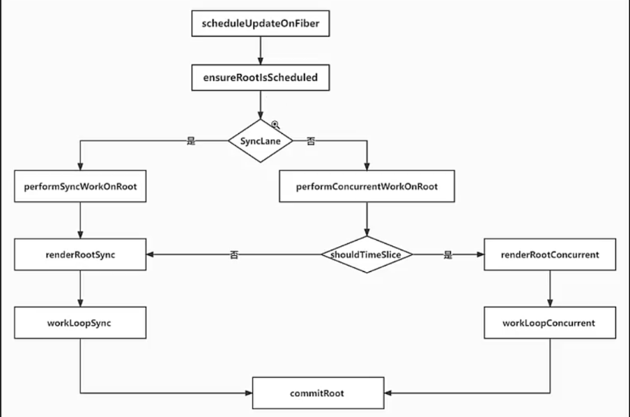

# React18.2 源码学习

## 1 lane.实现

### 1.1 prepareFreshStack-改：准备刷新栈-[src/react-reconciler/src/ReactFiberWorkLoop.js](../../public/react18-learn/src/react-reconciler/src/ReactFiberWorkLoop.js)

```js
// ...let rootWithPendingPassiveEffects = null
let workInProgressRootRenderLanes = NoLanes

/**
 * description: 准备刷新栈
 * @param {*} root
 */
function prepareFreshStack(root, renderLanes) {
  if (
    root !== workInProgressRoot ||
    workInProgressRootRenderLanes !== renderLanes
  ) {
    workInProgress = createWorkInProgress(root.current, null)
  }
  workInProgressRootRenderLanes = renderLanes
  finishQueueingConcurrentUpdates()
}
```

### 1.2 performUnitOfWork-改：执行单个工作单元-[src/react-reconciler/src/ReactFiberWorkLoop.js](../../public/react18-learn/src/react-reconciler/src/ReactFiberWorkLoop.js)

```js
function performUnitOfWork(unitOfWork) {
  // 获取新的 fiber 对应的老 fiber
  const current = unitOfWork.alternate
  // 完成当前 fiber 的子 fiber 链表构建后
  const next = beginWork(current, unitOfWork, workInProgressRootRenderLanes)
  // ...
}
```

### 1.3 beginWork-改：开始执行-[src/react-reconciler/src/ReactFiberBeginWork.js](../../public/react18-learn/src/react-reconciler/src/ReactFiberBeginWork.js)

```js
import {
  cloneUpdateQueue,
  processUpdateQueue,
} from './ReactFiberClassUpdateQueue'

export function beginWork(current, workInProgress, renderLanes) {
  // ...
  updateHostRoot(current, workInProgress, renderLanes)
  // ...
}

function updateHostRoot(current, workInProgress, renderLanes) {
  const nextProps = workInProgress.pendingProps
  cloneUpdateQueue(current, workInProgress)
  // 需要知道它的子虚拟 DOM，知道它的儿子的虚拟 DOM 信息
  processUpdateQueue(workInProgress, nextProps, renderLanes) // workInProgress.memoizedState={ element }
  // ...
}
```

### 1.4 cloneUpdateQueue-克隆更新队列-[src/react-reconciler/src/ReactFiberClassUpdateQueue.js](../../public/react18-learn/src/react-reconciler/src/ReactFiberClassUpdateQueue.js)

```js
export function cloneUpdateQueue(current, workInProgress) {
  const workInProgressQueue = workInProgress.updateQueue
  const currentQueue = current.updateQueue
  if (currentQueue === workInProgressQueue) {
    const clone = {
      base: currentQueue.baseState,
      firstBaseUpdate: currentQueue.firstBaseUpdate,
      lastBaseUpdate: currentQueue.lastBaseUpdate,
      shared: currentQueue.shared,
    }
    workInProgress.updateQueue = clone
  }
}
```

### 1.5 提交时取消车道-commitRoot-改：提交操作-[src/react-reconciler/src/ReactFiberWorkLoop.js](../../public/react18-learn/src/react-reconciler/src/ReactFiberWorkLoop.js)

```js
import {
  getCurrentUpdatePriority,
  lanesToEventPriority,
  DiscreteEventPriority,
  ContinuousEventPriority,
  DefaultEventPriority,
  IdleEventPriority,
} from './ReactEventPriorities'

function commitRoot(root) {
  const { finishedWork } = root
  workInProgressRoot = null
  workInProgressRootRenderLanes = null
  // ...
}
```

## 2 lane.实现

### 2.1 导出调度器对象-[src/react-reconciler/src/Scheduler.js](../../public/react18-learn/src/react-reconciler/src/Scheduler.js)

```js
import * as Scheduler from 'scheduler'
export const scheduleCallback = Scheduler.unstable_scheduleCallback
export const shouldYield = Scheduler.unstable_shouldYield
export const ImmediatePriority = Scheduler.unstable_ImmediatePriority
export const UserBlockingPriority = Scheduler.unstable_UserBlockingPriority
export const NormalPriority = Scheduler.unstable_NormalPriority
export const IdlePriority = Scheduler.unstable_IdlePriority
export const LowPriority = Scheduler.unstable_LowPriority
```

### 2.2 引入调度器对象-[src/react-reconciler/src/ReactFiberWorkLoop.js](../../public/react18-learn/src/react-reconciler/src/ReactFiberWorkLoop.js)

```js
import {
  scheduleCallback as Scheduler_scheduleCallback,
  shouldYield,
  ImmediatePriority as ImmediateSchedulerPriority,
  UserBlockingPriority as UserBlockingSchedulerPriority,
  NormalPriority as NormalSchedulerPriority,
  IdlePriority as IdleSchedulerPriority,
} from './Scheduler'
```

### 2.3 导出调度器对象-[src/scheduler/src/forks/Scheduler.js](../../public/react18-learn/src/scheduler/src/forks/Scheduler.js)

```js
export {
  scheduleCallback as unstable_scheduleCallback,
  shouldYieldToHost as shouldYield,
  ImmediatePriority as unstable_ImmediatePriority,
  UserBlockingPriority as unstable_UserBlockingPriority,
  NormalPriority as unstable_NormalPriority,
  LowPriority as unstable_LowPriority,
  IdlePriority as unstable_IdlePriority,
}
```

- 调试 prepareFreshStack 断点 debugger ==> renderLanes

### 2.4 performConcurrentWorkOnRoot-改：执行并发工作-[src/react-reconciler/src/ReactFiberWorkLoop.js](../../public/react18-learn/src/react-reconciler/src/ReactFiberWorkLoop.js)

```js
function performConcurrentWorkOnRoot(root, renderLanes) {
  // ...
  return null
}
```

### 2.5 processUpdateQueue-改：计算最新状态-[src/react-reconciler/src/ReactFiberClassUpdateQueue.js](../../public/react18-learn/src/react-reconciler/src/ReactFiberClassUpdateQueue.js)

```js
import { NoLanes, isSubsetOfLanes, mergeLanes } from './ReactFiberLane'

export function processUpdateQueue(workInProgress, nextProps, renderLanes) {
  const queue = workInProgress.updateQueue
  //老链表头
  let firstBaseUpdate = queue.firstBaseUpdate
  //老链表尾巴
  let lastBaseUpdate = queue.lastBaseUpdate
  //新链表尾部
  const pendingQueue = queue.shared.pending
  //合并新老链表为单链表
  if (pendingQueue !== null) {
    queue.shared.pending = null
    //新链表尾部
    const lastPendingUpdate = pendingQueue
    //新链表尾部
    const firstPendingUpdate = lastPendingUpdate.next
    //把老链表剪断，变成单链表
    lastPendingUpdate.next = null
    //如果没有老链表
    if (lastBaseUpdate === null) {
      //指向新的链表头
      firstBaseUpdate = firstPendingUpdate
    } else {
      lastBaseUpdate.next = firstPendingUpdate
    }
    lastBaseUpdate = lastPendingUpdate
  }
  //如果链表不为空firstBaseUpdate=>lastBaseUpdate
  if (firstBaseUpdate !== null) {
    //上次跳过的更新前的状态
    let newState = queue.baseState
    //尚未执行的更新的lane
    let newLanes = NoLanes
    let newBaseState = null
    let newFirstBaseUpdate = null
    let newLastBaseUpdate = null
    let update = firstBaseUpdate //updateA
    do {
      //获取此更新车道
      const updateLane = update.lane
      //如果说updateLane不是renderLanes的子集的话，说明本次渲染不需要处理过个更新，就是需要跳过此更新
      if (!isSubsetOfLanes(renderLanes, updateLane)) {
        //把此更新克隆一份
        const clone = {
          id: update.id,
          lane: updateLane,
          payload: update.payload,
        }
        //说明新的跳过的base链表为空,说明当前这个更新是第一个跳过的更新
        if (newLastBaseUpdate === null) {
          //让新的跳过的链表头和链表尾都指向这个第一次跳过的更新
          newFirstBaseUpdate = newLastBaseUpdate = clone
          //计算保存新的baseState为此跳过更新时的state
          newBaseState = newState // ""
        } else {
          newLastBaseUpdate = newLastBaseUpdate.next = clone
        }
        //如果有跳过的更新，就把跳过的更新所在的赛道合并到newLanes,
        //最后会把newLanes赋给fiber.lanes
        newLanes = mergeLanes(newLanes, updateLane)
      } else {
        //说明已经有跳过的更新了
        if (newLastBaseUpdate !== null) {
          const clone = {
            id: update.id,
            lane: 0,
            payload: update.payload,
          }
          newLastBaseUpdate = newLastBaseUpdate.next = clone
        }
        newState = getStateFromUpdate(update, newState)
      }
      update = update.next
    } while (update)
    //如果没能跳过的更新的话
    if (!newLastBaseUpdate) {
      newBaseState = newState
    }
    queue.baseState = newBaseState
    queue.firstBaseUpdate = newFirstBaseUpdate
    queue.lastBaseUpdate = newLastBaseUpdate
    workInProgress.lanes = newLanes
    //本次渲染完会判断，此fiber上还有没有不为0的lane,如果有，会再次渲染
    workInProgress.memoizedState = newState
  }
}
```

## 3 lane.实现

### 3.1 initialUpdateQueue-改：初始更新队列-[src/react-reconciler/src/ReactFiberClassUpdateQueue.js](../../public/react18-learn/src/react-reconciler/src/ReactFiberClassUpdateQueue.js)

```js
/**
 * description: 初始更新队列
 * @param {Fiber} fiber
 */
export function initialUpdateQueue(fiber) {
  // 创建一个新的更新队列
  // pending其实是一个循环链表
  const queue = {
    baseState: fiber.memoizedState, // 本次更新前，当前的 fiber 的状态，更新会基于它进行计算
    firstBaseUpdate: null, // 本次更新前该 fiber 上保存的上次跳过的更新链表头
    lastBaseUpdate: null, // 本次更新前该 fiber 上保存的上次跳过的更新链表尾
    shared: {
      pending: null,
    },
  }
  fiber.updateQueue = queue
}
```

### 3.2 enqueueUpdate-改：调度更新函数-[src/react-reconciler/src/ReactFiberClassUpdateQueue.js](../../public/react18-learn/src/react-reconciler/src/ReactFiberClassUpdateQueue.js)

```js
import { enqueueConcurrentClassUpdate } from './ReactFiberConcurrentUpdates'

/**
 * description: 调度更新函数
 * @param {Fiber} fiber 要更新的fiber
 * @param {object} update 更新函数
 * @param {number} lane 调度优先级
 */
export function enqueueUpdate(fiber, update, lane) {
  // 获取更新队列
  const updateQueue = fiber.updateQueue
  // 获取共享队列
  const sharedQueue = updateQueue.shared
  return enqueueConcurrentClassUpdate(fiber, sharedQueue, update, lane)
}
```

### 3.3 mergeLanes-[src/react-reconciler/src/ReactFiberLane.js](../../public/react18-learn/src/react-reconciler/src/ReactFiberLane.js)

```js
export function isSubsetOfLanes(set, subset) {
  return (set & subset) === subset
}
export function mergeLanes(a, b) {
  return a | b
}
```

### 3.4

### 3.5 getStateFromUpdate-改：根据老状态和更新计算新状态-[src/react-reconciler/src/ReactFiberClassUpdateQueue.js](../../public/react18-learn/src/react-reconciler/src/ReactFiberClassUpdateQueue.js)

```js
function getStateFromUpdate(update, prevState, nextProps) {
  switch (update.tag) {
    case UpdateState:
      const { payload } = update
      let partialState
      if (typeof payload === 'function') {
        partialState = payload.call(null, prevState, nextProps)
      } else {
        partialState = payload
      }
      return assign({}, prevState, partialState)
  }
}
```

## 4 lane.实现

### 4.1

### 4.2 scheduleUpdateOnFiber.初次渲染.图示

- 

### 4.3 入口文件改-[src/main.jsx](../../public/react18-learn/src/main.jsx)

```js
function FunctionComponent() {
  const [number, setNumber] = React.useState(0)
  return (
    <button onClick={() => setNumber((number) => number + 1)}>{number}</button>
  )
}
let element = <FunctionComponent />
```

### 4.4 dispatchSetState-[src/react-reconciler/src/ReactFiberHooks.js](../../public/react18-learn/src/react-reconciler/src/ReactFiberHooks.js)

```js
import { requestUpdateLane, scheduleUpdateOnFiber } from './ReactFiberWorkLoop'

/**
 * description:
 * @param {Fiber} fiber
 * @param {Array} queue
 * @param {Object} action
 */
function dispatchSetState(fiber, queue, action) {
  debugger
  // 获取当前的更新赛道 1
  const lane = requestUpdateLane()
  const update = {
    lane, // 本次更新优先级就是 1
    // ...
  }
  // ...
  const root = enqueueConcurrentHookUpdate(fiber, queue, update, lane)
  scheduleUpdateOnFiber(root, fiber, lane)
}
```

- enqueueConcurrentHookUpdate-[src/react-reconciler/src/ReactFiberConcurrentUpdates.js](../../public/react18-learn/src/react-reconciler/src/ReactFiberConcurrentUpdates.js)

```js
export function enqueueConcurrentHookUpdate(fiber, queue, update, lane) {
  enqueueUpdate(fiber, queue, update, lane)
  return getRootForUpdatedFiber(fiber)
}
```

### 4.5 dispatchDiscreteEvent-改：派发离散的事件的监听函数-[src/react-dom-bindings/src/events/ReactDOMEventListener.js](../../public/react18-learn/src/react-dom-bindings/src/events/ReactDOMEventListener.js)

```js
import {
  // ...
  getCurrentUpdatePriority,
  setCurrentUpdatePriority,
} from 'react-reconciler/src/ReactEventPriorities'

function dispatchDiscreteEvent(
  domEventName,
  eventSystemFlags,
  container,
  nativeEvent
) {
  // 在你是点击按钮的时候，需要设置更新优先级
  // 先获取当前老的更新优先级
  const previousPriority = getCurrentUpdatePriority()
  try {
    // 把当前的更新优先级设置为离散事件优先级 1
    setCurrentUpdatePriority(DiscreteEventPriority)
    dispatchEvent(domEventName, eventSystemFlags, container, nativeEvent)
  } finally {
    setCurrentUpdatePriority(previousPriority)
  }
}
```

## 5 lane.实现

### 5.1 ensureRootIsScheduled-[src/react-reconciler/src/ReactFiberWorkLoop.js](../../public/react18-learn/src/react-reconciler/src/ReactFiberWorkLoop.js)

```js
import {
  scheduleSyncCallback,
  flushSyncCallbacks,
} from './ReactFiberSyncTaskQueue'

function ensureRootIsScheduled(root) {
  // 获取当前优先级最高的车道
  const nextLanes = getNextLanes(root, NoLanes) // 16
  let newCallbackPriority = getHighestPriorityLane(nextLanes) // 16
  if (newCallbackPriority === SyncLane) {
    // 先把 performSyncWorkOnRoot 添回到同步队列中
    scheduleSyncCallback(performSyncWorkOnRoot.bind(null, root))
    // 再把 flushSyncCallbacks 放入微任务
    queueMicrotask(flushSyncCallbacks)
  } else {
    // ...
  }
  // ...
}
```

### 5.2 文件 ReactFiberSyncTaskQueue.js 创建-[src/react-reconciler/src/ReactFiberSyncTaskQueue.js](../../public/react18-learn/src/react-reconciler/src/ReactFiberSyncTaskQueue.js)

```js
// 同步队列
let syncQueue = null
//是否正在执行同步队列
let isFlushingSyncQueue = false
export function scheduleSyncCallback(callback) {}
export function flushSyncCallbacks() {}
```

### 5.3 scheduleSyncCallback-调度器同步队列回调函数执行函数-[src/react-reconciler/src/ReactFiberSyncTaskQueue.js](../../public/react18-learn/src/react-reconciler/src/ReactFiberSyncTaskQueue.js)

```js
/**
 * @desc 调度器同步队列回调函数执行函数
 * @param {Function} callback
 */
export function scheduleSyncCallback(callback) {
  if (syncQueue == null) {
    syncQueue = [callback]
  } else {
    syncQueue.push(callback)
  }
}
```

### 5.4 flushSyncCallbacks-刷新同步回调函数-[src/react-reconciler/src/ReactFiberSyncTaskQueue.js](../../public/react18-learn/src/react-reconciler/src/ReactFiberSyncTaskQueue.js)

```js
import {
  DiscreteEventPriority,
  getCurrentUpdatePriority,
  setCurrentUpdatePriority,
} from './ReactEventPriorities'

/**
 * description: 刷新同步回调函数
 * @param {Function} callback
 */
export function flushSyncCallbacks() {
  if (!isFlushingSyncQueue && syncQueue !== null) {
    isFlushingSyncQueue = true
    let i = 0
    // 暂存当前的更新优先级
    const previousUpdatePriority = getCurrentUpdatePriority()
    try {
      const isSync = true
      const queue = syncQueue
      // 把优先级设置为同步优先级
      setCurrentUpdatePriority(DiscreteEventPriority)
      for (; i < queue.length; i++) {
        let callback = queue[i]
        do {
          callback = callback(isSync)
        } while (callback !== null)
      }
      syncQueue = null
    } finally {
      setCurrentUpdatePriority(previousUpdatePriority)
    }
  }
}
```

### 5.5 renderRootSync-[src/react-reconciler/src/ReactFiberWorkLoop.js](../../public/react18-learn/src/react-reconciler/src/ReactFiberWorkLoop.js)

```js
/**
 * description: 渲染根同步
 * @param {Fiber} root
 */
function renderRootSync(root) {
  // 如果新的根和老的根不一样，或者新的渲染优先级和老的渲染优先级不一样
  if (
    root !== workInProgressRoot ||
    workInProgressRootRenderLanes !== renderLanes
  ) {
    prepareFreshStack(root, renderLanes)
  }
  workLoopSync()
}
```
