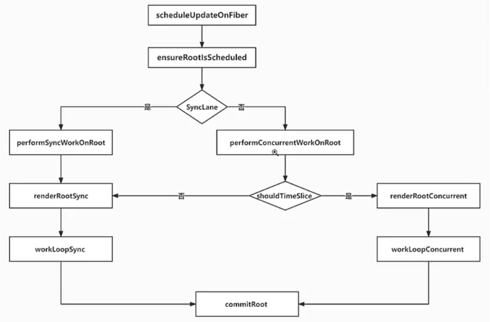

# React18.2 源码学习

## 1 lane.实现

### 1.1 更新队列方法完成更新函数调用-finishQueueingConcurrentUpdates-[src/react-reconciler/src/ReactFiberConcurrentUpdates.js](../../public/react18-learn/src/react-reconciler/src/ReactFiberConcurrentUpdates.js)

```js
export function finishQueueingConcurrentUpdates() {
  // ...
  while (i < endIndex) {
    const fiber = concurrentQueue[i++]
    const queue = concurrentQueue[i++]
    const update = concurrentQueue[i++]
    const lane = concurrentQueue[i++]
    // ...
  }
}
```

### 1.2 performSyncWorkOnRoot-在根上执行同步工作-[src/react-reconciler/src/ReactFiberWorkLoop.js](../../public/react18-learn/src/react-reconciler/src/ReactFiberWorkLoop.js)

```js
/**
 * description: 在根上执行同步工作
 * @param {*} root
 */
function performSyncWorkOnRoot(root) {
  // 获得最高优的 lane
  const lanes = getNextLanes(root)
  // 渲染新的 fiber 树
  renderRootSync(root, lanes)
  // 获取新渲染完成的 fiber 根节点
  const finishedWork = root.current.alternate
  root.finishedWork = finishedWork
  commitRoot(root)
  return null
}
```

### 1.3 commitRoot-改：提交根-[src/react-reconciler/src/ReactFiberWorkLoop.js](../../public/react18-learn/src/react-reconciler/src/ReactFiberWorkLoop.js)

```js
import {
  // ...
  setCurrentUpdatePriority,
} from './ReactEventPriorities'
// commitRootImpl 取代原先 commitRoot
function commitRoot(root) {
  const previousUpdatePriority = getCurrentUpdatePriority()
  try {
    setCurrentUpdatePriority(DiscreteEventPriority)
    commitRootImpl(root)
  } finally {
    // 完成提交
    setCurrentUpdatePriority(previousUpdatePriority)
  }
}
```

### 1.4 flushSyncCallbacks-[src/react-reconciler/src/ReactFiberSyncTaskQueue.js](../../public/react18-learn/src/react-reconciler/src/ReactFiberSyncTaskQueue.js)

```js
export function flushSyncCallbacks() {
  if (!isFlushingSyncQueue && syncQueue !== null) {
    // ...
    try {
      // ...
    } finally {
      setCurrentUpdatePriority(previousUpdatePriority)
      isFlushingSyncQueue = false
    }
  }
}
```

- 浏览器调试 dispatchSetState 断点中 fiber 数据

### 1.5 dispatchSetState-短路逻辑-[src/react-reconciler/src/ReactFiberHooks.js](../../public/react18-learn/src/react-reconciler/src/ReactFiberHooks.js)

```js
function dispatchSetState(fiber, queue, action) {
  const update = {
    action,
    hasEagerState: false, // 是否有急切的更新
    eagerState: null, //急切的更新状态
    next: null,
  }
  // 当你派发动作后，我立刻用上一次的状态和上一次的 reducer 计算新状态
  if (
    fiber.lanes === NoLanes &&
    (alternate == null || alternate.lanes == NoLanes)
  ) {
    const { lastRenderedReducer, lastRenderedState } = queue
    const eagerState = lastRenderedReducer(lastRenderedState, action)
    update.hasEagerState = true
    update.eagerState = eagerState
    if (Object.is(eagerState, lastRenderedState)) {
      return
    }
  }
  // 下面是真正的入队更新，并调度更新逻辑
  const root = enqueueUpdate(fiber, queue, update, lane)
  scheduleUpdateOnFiber(root, fiber, lane)
}
```

## 2 lane.实现

### 2.1 FiberNode-改：生成 fiber 节点-[src/react-reconciler/src/ReactFiber.js](../../public/react18-learn/src/react-reconciler/src/ReactFiber.js)

```js
export function FiberNode(tag, pendingProps, key) {
  // ...
  this.lanes = NoLanes
}
```

### 2.2 dispatchSetState-打断点-[src/react-reconciler/src/ReactFiberHooks.js](../../public/react18-learn/src/react-reconciler/src/ReactFiberHooks.js)

```js
function dispatchSetState(fiber, queue, action) {
  const update = {
    action,
    hasEagerState: false, // 是否有急切的更新
    eagerState: null, //急切的更新状态
    next: null,
  }
  debugger
}
```

### 2.3 mountReducer-改：挂载 reducer -[src/react-reconciler/src/ReactFiberHooks.js](../../public/react18-learn/src/react-reconciler/src/ReactFiberHooks.js)

```js
function mountReducer(reducer, initialArg) {
  // ...
  const queue = {
    // ...
    lastRenderedReducer: reducer,
    lastRenderedState: initialArg,
  }
  // ...
}
```

### 2.4 改：入口文件-[src/main.jsx](../../public/react18-learn/src/main.jsx)

```js
function FunctionComponent() {
  const [number, setNumber] = React.useState(0)
  // 默认渲染 16，点击事件 1，useEffect 16
  React.useEffect(() => {
    setNumber((number) => number + 1)
  }, [])
  return (
    <button onClick={() => setNumber((number) => number + 1)}>{number}</button>
  )
}
let element = <FunctionComponent />
```

### 2.5 ensureRootIsScheduled-改：确保根节点被调度-[src/react-reconciler/src/ReactFiberWorkLoop.js](../../public/react18-learn/src/react-reconciler/src/ReactFiberWorkLoop.js)

```js
function ensureRootIsScheduled(root) {
  // 获取当前优先级最高的车道
  const nextLanes = getNextLanes(root, NoLanes) // 16
  // 如果没有车道，则不进行调度
  if (nextLanes === NoLanes) {
    return
  }
  // 获取新的调度优先级
  let newCallbackPriority = getHighestPriorityForLanes(nextLanes) // 16
  // 新的回调任务
  let newCallbackNode
  if (newCallbackPriority === SyncLane) {
    // 先把 performSyncWorkOnRoot 添回到同步队列中
    scheduleSyncCallback(performSyncWorkOnRoot.bind(null, root))
    // 再把 flushSyncCallbacks 放入微任务
    queueMicrotask(flushSyncCallbacks)
    // 如果同步执行的话
    newCallbackNode = null
  } else {
    // ...
    newCallbackNode = Scheduler_scheduleCallback(
      schedulerPriorityLevel,
      performConcurrentWorkOnRoot.bind(null, root)
    )
  }
  // 在根节点的执行任务是 newCallbackNode
  root.callbackNode = newCallbackNode
  // ...
}
```

## 3 lane.实现

### 3.1 

### 3.2 performConcurrentWorkOnRoot-改：获取根节点上的任务-[src/react-reconciler/src/ReactFiberWorkLoop.js](../../public/react18-learn/src/react-reconciler/src/ReactFiberWorkLoop.js)

```js
function performConcurrentWorkOnRoot(root) {
  // 先获取当前根节点上的任务
  const originalCallbackNode = root.callbackNode
  // 获取当前优先级最高的车道
  const nextLanes = getNextLanes(root, NoLanes)
  if (nextLanes === NoLanes) {
    return null
  }
  // 如果不包含阻塞的车道，并且没有超时，就可以并行渲染,就是启用时间分片
  // 所以说默认更新车道是同步的，不能启用时间分片
  const shouldTimeSlice = !includesBlockingLane(root, lanes) && !didTimeout
  console.log('shouldTimeSlice:', shouldTimeSlice)

  // ...
}
```

### 3.3 includesBlockingLane-判断是否包含阻塞的车道-[src/react-reconciler/src/ReactFiberLane.js](../../public/react18-learn/src/react-reconciler/src/ReactFiberLane.js)

```js
import { allowConcurrentByDefault } from 'shared/ReactFeatureFlags'

/**
 * description: 判断是否包含阻塞的车道
 * @param {*} root
 * @param {*} lanes
 */
export function includesBlockingLane(root, lanes) {
  // 如果允许默认并行渲染
  if (allowConcurrentByDefault) {
    return false
  }
  const SyncDefaultLanes = InputContinuousLane | DefaultLane
  return (lanes & SyncDefaultLanes) !== NoLane
}
```

### 3.4 常量 allowConcurrentByDefault 创建 -[src/shared/ReactFeatureFlags.js](../../public/react18-learn/src/shared/ReactFeatureFlags.js)

```js
export const allowConcurrentByDefault = true
```

### 3.5 performConcurrentWorkOnRoot-[src/react-reconciler/src/ReactFiberWorkLoop.js](../../public/react18-learn/src/react-reconciler/src/ReactFiberWorkLoop.js)

```js
function performConcurrentWorkOnRoot(root) {
  // ...
  const shouldTimeSlice = !includesBlockingLane(root, lanes) && !didTimeout
  console.log('shouldTimeSlice:', shouldTimeSlice)
  const exitStatus = shouldTimeSlice
    ? renderRootConcurrent(root, lanes)
    : renderRootSync(root, lanes)

  // ...
}
```

## 4 lane.实现

### 4.1 构建 fiber 树正在进行中和已经完成的变量-[src/react-reconciler/src/ReactFiberWorkLoop.js](../../public/react18-learn/src/react-reconciler/src/ReactFiberWorkLoop.js)

```js
// let workInProgressRootRenderLanes ...

// 构建 fiber 树正在进行中
const RootInProgress = 0
//构建 fiber 树已经完成
const RootCompleted = 5
//当渲染工作结束的时候当前的 fiber 树处于什么状态,默认进行中
let workInProgressRootExitStatus = RootInProgress
```

### 4.2 performConcurrentWorkOnRoot-[src/react-reconciler/src/ReactFiberWorkLoop.js](../../public/react18-learn/src/react-reconciler/src/ReactFiberWorkLoop.js)

```js
function performConcurrentWorkOnRoot(root) {
  // ...
  const shouldTimeSlice = !includesBlockingLane(root, lanes) && !didTimeout
  console.log('shouldTimeSlice:', shouldTimeSlice)
  const exitStatus = shouldTimeSlice
    ? renderRootConcurrent(root, lanes)
    : renderRootSync(root, lanes)
  // 如果不是渲染中的话，那说明肯定渲染完了
  if (exitStatus !== RootInProgress) {
    const finishedWork = root.current.alternate
    root.finishedWork = finishedWork
    commitRoot(root)
  }
}
```

### 4.3 commitRootImpl-[src/react-reconciler/src/ReactFiberWorkLoop.js](../../public/react18-learn/src/react-reconciler/src/ReactFiberWorkLoop.js)

```js
function commitRootImpl(root) {
  // 先获取新的构建好的 fiber 树的根 fiber tag=3
  const { finishedWork } = root
  workInProgressRoot = null
  workInProgressRootRenderLanes = null
  root.callbackNode = null
}
```

### 4.4 performConcurrentWorkOnRoot-[src/react-reconciler/src/ReactFiberWorkLoop.js](../../public/react18-learn/src/react-reconciler/src/ReactFiberWorkLoop.js)

```js
function performConcurrentWorkOnRoot(root) {
  // ...
  const shouldTimeSlice = !includesBlockingLane(root, lanes) && !didTimeout
  console.log('shouldTimeSlice:', shouldTimeSlice)
  const exitStatus = shouldTimeSlice
    ? renderRootConcurrent(root, lanes)
    : renderRootSync(root, lanes)
  // 如果不是渲染中的话，那说明肯定渲染完了
  if (exitStatus !== RootInProgress) {
    const finishedWork = root.current.alternate
    root.finishedWork = finishedWork
    commitRoot(root)
  }
  // 说明任务没有完成
  if (root.callbackNode === originalCallbackNode) {
    // 把此函数返回，下次接着干
    return performConcurrentWorkOnRoot.bind(null, root)
  }
  return null
}
```

### 4.5 renderRootConcurrent-[src/react-reconciler/src/ReactFiberWorkLoop.js](../../public/react18-learn/src/react-reconciler/src/ReactFiberWorkLoop.js)

```js
function renderRootConcurrent(root, lanes) {
  // 因为在构建 fiber 树的过程中，此方法会反复进入，会进入多次
  // 只有在第一次进来的时候会创建新的 fiber 树，也就是新的 fiber 树
  if (workInProgressRoot !== root || workInProgressRootRenderLanes !== lanes) {
    prepareFreshStack(root, lanes)
  }
}
```

## 5 lane.实现

### 5.1 prepareFreshStack-[src/react-reconciler/src/ReactFiberWorkLoop.js](../../public/react18-learn/src/react-reconciler/src/ReactFiberWorkLoop.js)

```js
function prepareFreshStack(root, renderLanes) {
  workInProgress = createWorkInProgress(root.current, null)
  workInProgressRootRenderLanes = renderLanes
  workInProgressRoot = root
  finishQueueingConcurrentUpdates()
}
```

### 5.2 renderRootConcurrent-[src/react-reconciler/src/ReactFiberWorkLoop.js](../../public/react18-learn/src/react-reconciler/src/ReactFiberWorkLoop.js)

```js
function renderRootConcurrent(root, lanes) {
  // 因为在构建 fiber 树的过程中，此方法会反复进入，会进入多次
  // 只有在第一次进来的时候会创建新的 fiber 树，也就是新的 fiber 树
  if (workInProgressRoot !== root || workInProgressRootRenderLanes !== lanes) {
    prepareFreshStack(root, lanes)
  }
  // 在当前分配的时间片(5ms)内执行 fiber 树的构建或者说渲染
  workLoopConcurrent()
  // 如果 workInProgress 不为 null，说明 fiber 树的构建还没有完成
  if (workInProgress !== null) {
    return RootInProgress
  }
  // 如果 workInProgress 是null了说明渲染工作完全结束了
  return workInProgressRootExitStatus
}
```

### 5.3 completeUnitOfWork-[src/react-reconciler/src/ReactFiberWorkLoop.js](../../public/react18-learn/src/react-reconciler/src/ReactFiberWorkLoop.js)

```js
function completeUnitOfWork(unitOfWork) {
  // ...
  // 如果走到了这里，说明整个 fiber 树全部构建完毕,把构建状态设置为空成
  if (workInProgressRootExitStatus === RootInProgress) {
    workInProgressRootExitStatus = RootCompleted
  }
}
```

### 5.4 sleep-[src/react-reconciler/src/ReactFiberWorkLoop.js](../../public/react18-learn/src/react-reconciler/src/ReactFiberWorkLoop.js)

```js
function sleep(duration) {
  const timeStamp = new Date().getTime()
  const endTime = timeStamp + duration
  while (true) {
    if (new Date().getTime() > endTime) {
      return
    }
  }
}
```

### 5.5 workLoopConcurrent-[src/react-reconciler/src/ReactFiberWorkLoop.js](../../public/react18-learn/src/react-reconciler/src/ReactFiberWorkLoop.js)

```js
function workLoopConcurrent() {
  // 如果有下一个要构建的 fiber 并且时间片没有过期
  while (workInProgress !== null && !shouldYield()) {
    sleep(6)
    performUnitOfWork(workInProgress)
    console.log('shouldYield()', shouldYield(), workInProgress)
  }
}
```
